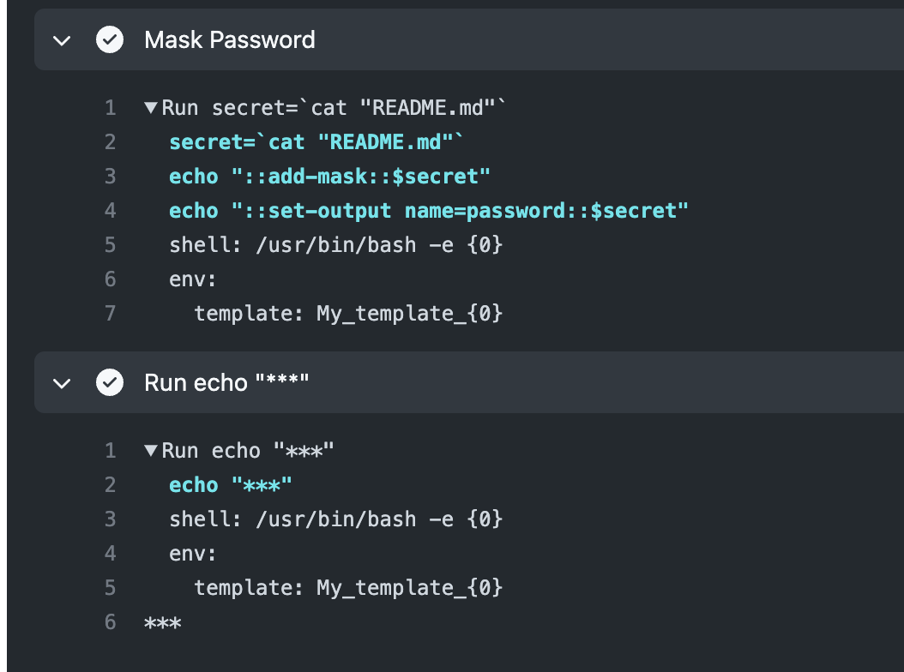

+++
title = "วิธีซ่อนค่า Secrets ใน GitHub Actions"

[taxonomies]
categories = [ "GitHub Actions" ]
tags = [ "GitHub Actions", "Secrets" ]

[extra]
id = "kauwjer"
+++

> หมายเหตุ บทความนี้ Draft ไว้ตั้งแต่วันที่ Apr 11, 2022 ถ้ามีเนื้อหาไหนที่ไม่ได้ Up-to-date ก็สามารถแจ้งได้เลยนะครับ

ปัญหาหลักที่เราพบคือการอ่านค่า Secrets จากไฟล์ที่เข้ารหัสแบบ SOPS และการซ่อนค่านี้ เรามีวิธีการแก้ไขในตัวอย่างต่อไปนี้ครับ

ในตัวอย่างนี้ เราจะใช้ไฟล์ README.md มาเป็นตัวอย่าง ซึ่งเป็นไฟล์ปกติ แล้วเราจะนำค่าของไฟล์นี้มาซ่อน

```yml
steps:
  - uses: actions/checkout@v2
  - name: Mask Password
    id: mark_password
    run: |
      secret=`cat "README.md"`
      echo "::add-mask::$secret"
      echo "::set-output name=password::$secret"
  - run: echo "${{ steps.mark_password.outputs.password }}"
```

ผลลัพธ์จากการทำงานข้างบนจะเป็นดังรูปภาพต่อไปนี้:



เราคิดว่าในขั้นตอนที่ใช้ `add-mask`` น่าจะเป็นวิธีให้ค่าที่เราซ่อนแสดงผลในคอนโซลได้ แบบที่เราไม่เห็นค่าจริงๆ

หวังว่าข้อมูลนี้จะมีประโยชน์และช่วยให้ท่านสามารถแก้ปัญหาที่เจอได้ครับ

อ้างอิง: https://github.com/actions/runner/issues/475#issuecomment-1092734499
