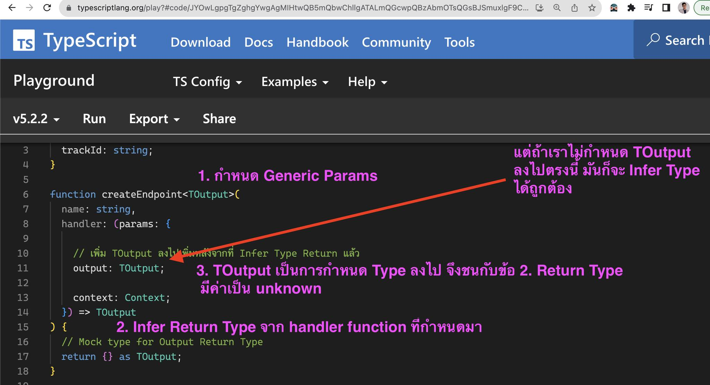

+++
title = "ระมัดระวัง Circular Generic Params ใน TypeScript จะทำให้การคาดเดา Type ไม่ได้"

[taxonomies]
categories = [ "TypeScript" ]
tags = [ "TypeScript", "Generic" ]

[extra]
id = "bcar2n8"
+++

บทความนี้จะพาเราสู่โลกที่ลึกลับของ TypeScript และ Generic Params ที่ทำให้โปรแกรมเมอร์เราสามารถเขียนโค้ดที่ยืดหยุ่นและมีประสิทธิภาพได้มากยิ่งขึ้น! 🚀


## การใช้ Generic Params ใน TypeScript

ก่อนที่เราจะลุกไปเริ่มต้น มาเริ่มจากการเข้าใจหลักการของ Generic Params กันก่อนนะครับ ใน TypeScript, Generic Params จะช่วยให้เราสร้างโค้ดที่ใช้งานได้กับหลายประเภท โดยที่ไม่ต้องระบุประเภทนั้นๆ ในระหว่างการเขียนโค้ด

```typescript
function identity<T>(arg: T): T {
  return arg;
}
```
ในตัวอย่างนี้ `T` คือ Generic Param ที่เราสามารถใช้กับประเภทใดๆ ก็ได้ โดยที่ไม่ต้องระบุประเภทไว้ล่วงหน้า

ตัวอย่างการใช้งาน 

```typescript
// สร้างตัวแปรแบบ string
const stringValue = identity("Hello");
//     ^? const stringValue: "Hello"

// สร้างตัวแปรแบบ number
const numberValue = identity(42);
//     ^? const numberValue: 42    

// สร้างตัวแปรแบบ object
const objectValue = identity({ key: "value" });
//     ^? const objectValue: { key: string; }
```

---

## การ Infer Type ใน Function

โดยปกติแล้ว TypeScript สามารถ Infer Type จาก Function Type ได้ 

```typescript
interface Context {
  id: string;
  trackId: string;
}

function createEndpoint<TOutput>(
  name: string,
  handler: (params: {
    context: Context;
  }) => TOutput
) {
  // Mock type for Output Return Type
  return {} as TOutput;
}
```

เช่น ในตัวอย่างข้างบน
`handler` จะรับ parameter ที่เป็น handler ที่มี Type แบบนี้

```typescript
(params: { context: Context; }) => TOutput
```

โดยที่เมื่อผู้ใช้งานกำหนด Function ใน `handler` Return Type ของ `handler` ตัวนั้น ก็จะได้ Type ของ `TOutput` เหมือนกัน

ในตัวอย่างนี้ มีการส่ง function เข้าไปใน `handler` params โดยมี Return Type เป็น `{ name: string }`
ดังนั้น `createEndpoint` ก็สามารถ infer Type ออกมาได้เหมือนกับ Return Type ของ `handler` เช่นเดียวกัน

```typescript
const myEndpoint = createEndpoint('helloWorld', ({ context }) => {
  console.log(`Running on context id: ${context.id}`);
  return {
    name: 'helloWorld',
  };
});
```

เมื่อเราเช็ค Type ของ `myEndpoint` ดูก็พบว่า Type จะตรงกับ Return Type กับ Handler เลย

```typescript
myEndpoint
// ^? const myEndpoint: {
//     name: string;
// }
```

## การเรียกใช้งานแบบ Circular

แต่มีข้อควรระวังในการใช้ Generic Params เวลาที่เราเรียกใช้งานแบบ Circular เช่นตัวอย่างนี้ `TOutput` เป็น Generic Params ที่จะ Infer Type มาจาก Return Type ของ `handler` ออกมา

ตัวอย่างการเรียก Generic Params แบบ Circular

```typescript
function createEndpoint<TOutput>(
  name: string,
  handler: (params: {
    // เพิ่ม TOutput ลงไปเพิ่มหลังจากที่ Infer Type Return แล้ว
    output: TOutput;
    context: Context;
  }) => TOutput
) {
  // Mock type for Output Return Type
  return {} as TOutput;
}

//... const myEndpoint = createEndpoint(...)

myEndpoint
// ^? const myEndpoint: unknown
```

โดยที่เมื่อเราพยายามใส่ `TOutput` ลงไปใน Type ของ `handler` ที่แท้จริงแล้ว Type จะมาจาก Return Type แล้ว Infer ออกมา แต่กลับ มีการเรียก Type Infer จาก Params ของ `handler` ด้วย กลับกลายเป็นว่า TypeScript ไม่สามารถคาดเดา Type ที่ถูกต้องกันได้ เพราะต่างฝ่ายต่างเรียกหากันเอง จึงทำให้ `myEndpoint` มีค่าเป็น `unknown` ไปเลย

หวังว่าจะเป็นประโยชน์นะครับ แล้วพบกันใหม่ สวัสดีครับ

## ทำไมถึงเรียกว่า Circular Problem

> ผมได้อธิบายไว้ใน [Post ของ Facebook ของเพจ ThaiType](https://www.facebook.com/photo?fbid=827932616003068&set=a.486562490140084)
> และลูกเพจ คุณ Kasama Chenkaow ได้อธิบายได้ดีเลยทีเดียว และผมได้อธิบายว่าถึงผมใช้คำว่า Circular Problem




โดยส่วนตัวผมคิดว่าเรียกกำหนด `createEndpoint` แบบไม่ระบุ Generic Params มันจะ Infer Generic Type มาจาก Param ที่ใส่เข้าไปใน Function ถูกมั้ยครับ

ดังนั้นเราก็จึงสามารถระบุ Generic Type ของ `createEndpoint` โดยการใส่ให้มัน เช่น `createEndpoint<{ title: string }>` แต่ถ้า Param ที่ใส่มา Type ไม่ตรง TypeScript ก็ TypeError ได้ ซึ่งก็เป็นเรื่องปกติ
ทีนี้มาดูสาเหตุที่ผลถึงเรียกมันว่า Circular Issues กันครับ (ผมอาจจะเรียกไม่ถูกก็ได้ นะครับ ถ้าผิดก็ขออภัย) แต่ถ้าเราดูจากลำดับการ Infer Type ของ Generic Params เราจะเห็นว่า มันเป็นลำดับ 1,2,3 ตามในรูป ใช่มั้ยครับ

ในข้อที่ 3. มันเกิด Conflict เนื่องด้วยมาจากที่มาจากการ Infer Type มาจากคนละ Source กัน

ในข้อ 3. Infer Type จะมาจากการกำหนด Type ที่รู้ล่วงหน้ามาก่อนแล้วว่าจะมี Type อะไรอยู่
ส่วนข้อ 2. จะ Infer Type มาจากการที่เราใส่ Params ลงไปใน function ของ Generics เพื่อให้ TypeScript คาดเดา Type

จากเหตุผลที่ว่า ทั้งข้อ 2,3 มาจาก source คนทิศทางกัน และในเมื่อมันมาบนจบกัน ซึ่งคือข้อ 2 จะ infer ไปหาข้อ 3. และข้อ 3. ก็จะ infer ไปหาข้อ 2.(ในกรณีที่ไม่ได้ระบุ Generic Type ให้กับ function ล่วงหน้าไว้ก่อน เช่น `createEndpoint(..)`)

จากเหตุการดังกล่าวทำให้เกิดสิ่งที่เรียกว่า Circular Generic Params (จริงๆ อาจจะมีคำที่ดีกว่านี้ แต่ผมยังคิดคำที่ดีกว่านี้ไม่ออก ซึ่งอาจจะเป็นคำอื่นก็ได้)

จึงเป็นที่มาของบทความนี้ครับ ว่าต้องการสื่อสารออกไปว่า บางครั้งเรามีการระบุ Type ของ Generic แบบ อ้างอิง Source เดียวกัน ซึ่ง TypeScript มีการ Infer Type แบบ Declarative Language ซึ่งเป็น common-problem ในทุกภาษา Declarative อยู่แล้วที่เราจะเจอ เช่นผมเขียน Terraform ผมก็ต้อง Avoid จุดๆ นี้ครบ

แต่ถ้าหากมีคำอื่นเรียกปรากฏการณ์นี้ที่ดีกว่า Circular ก็รบกวนแนะนำหน่อยครับ พอดีผมยืมคำมาจาก Error ของ Terraform ที่สื่อความหมายได้ตรงไปตรงมาดี