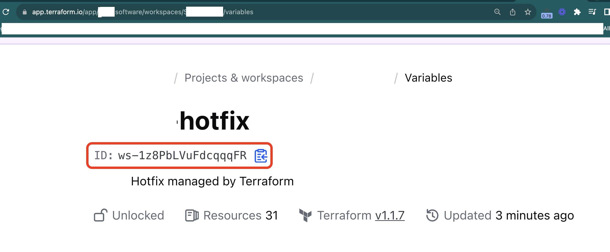
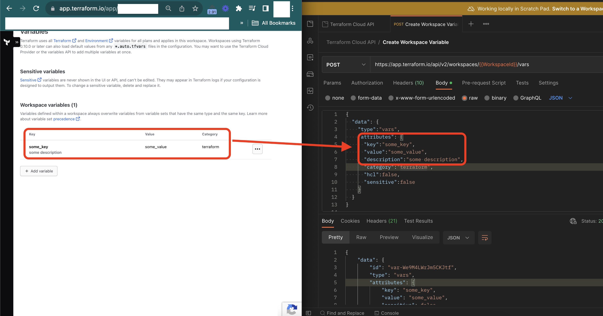

+++
title = "สร้างตัวแปร Terraform Cloud ผ่าน JavaScript และ Axios"

[taxonomies]
categories = [ "JavaScript" ]
tags = [ "JavaScript", "Terraform Cloud", "Axios" ]

[extra]
uuid = "jv881wo"
+++

การใช้งาน Terraform Cloud จะต้องใช้ User API Token เพื่อทำการจัดการ Workspace ของคุณ โดยคุณสามารถสร้าง Token ได้ที่ลิงก์ https://app.terraform.io/app/settings/tokens นี้

หลังจากที่ได้ User API Token แล้ว คุณต้องมี Workspace ID เพื่อทำการเข้าถึง Workspace ที่ต้องการ โปรดทราบว่า Workspace ที่ใช้ในตัวอย่างนี้



เพื่อสร้างตัวแปรใหม่ใน Workspace โดยใช้ Workspace API ตามลิงก์ https://developer.hashicorp.com/terraform/cloud-docs/api-docs/workspace-variables คุณสามารถทำได้โดยใช้โค้ดต่อไปนี้ที่เขียนด้วย JavaScript และใช้ Axios เพื่อส่งคำขอ:


```typescript
import axios from 'axios';

const workspaceId = 'ws-1z8PbLVuFdcqqqFR';
const token = 'MY-TOKEN';
const data = JSON.stringify({
  "data": {
    "type": "vars",
    "attributes": {
      "key": "some_key",
      "value": "some_value",
      "description": "some description",
      "category": "terraform",
      "hcl": false,
      "sensitive": false
    }
  }
});

const config = {
  method: 'post',
  url: `https://app.terraform.io/api/v2/workspaces/${workspaceId}/vars`,
  headers: { 
    'Content-Type': 'application/vnd.api+json', 
    'Authorization': 'Bearer ' + token,
  },
  data : data
};

try {
  const response = await axios(config);
  console.log(JSON.stringify(response.data));
} catch (error) {
  console.log(error);
}
```

อย่าลืมแทนค่า `workspaceId` และ `token` ด้วยค่าจริงที่คุณได้รับจาก Terraform Cloud นะครับ

นอกจากนี้ยังสามารถปรับแต่งค่าต่าง ๆ ในส่วนของตัวแปรที่ต้องการสร้างตามความเหมาะสมของโปรเจคของคุณได้

สุดท้าย, หลังจากการส่งคำขอสร้างตัวแปรเสร็จสิ้น, คุณจะได้รับข้อมูลการตอบกลับที่แสดงถึงสถานะการทำงานของคำขอ

หวังว่าบทความนี้จะมีประโยชน์สำหรับการจัดการและใช้งาน Terraform Cloud ของคุณครับ!

## ตัวอย่างการใช้ Postman

