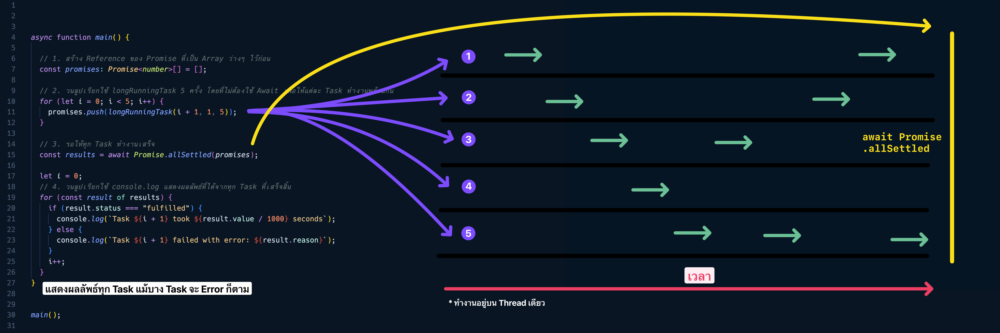

+++
title = "เขียน Concurrency ใน TypeScript ด้วย Promise allSettled"

[taxonomies]
categories = [ "Concurrency" ]
tags = [ "Concurrency", "TypeScript", "Node.js" ]

[extra]
id = "ko0ecz1"
+++

การทำงานแบบ concurrency หรือการทำงานพร้อมกันหลายๆ งานที่ต้องใช้เวลานานใน TypeScript สามารถทำได้ง่ายๆ ด้วย `Promise.allSettled` ซึ่งช่วยให้เราสามารถรัน Promise หลายๆ ตัวพร้อมกันและรับผลลัพธ์ทั้งหมดได้ไม่ว่า Promise ตัวไหนจะสำเร็จหรือไม่สำเร็จก็ตาม



## ตัวอย่างการใช้งาน
ในตัวอย่างนี้ เราจะมีฟังก์ชัน main ที่ใช้ `Promise.allSettled` เพื่อรัน Promise หลายๆ ตัวที่แทนงานที่ต้องใช้เวลานาน เช่นการเรียกใช้ API, การดึงข้อมูลจากฐานข้อมูล, หรือการประมวลผลข้อมูลที่มีขนาดใหญ่

```typescript

async function main() {
  
   // 1. สร้าง Reference ของ Promise ที่เป็น Array ว่างๆ ไว้ก่อน
  const promises: Promise<number>[] = [];

  // 2. วนลูปเรียกใช้ longRunningTask 5 ครั้ง โดยที่ไม่ต้องใช้ Await เพื่อให้แต่ละ Task ทำงานพร้อมกัน
  for (let i = 0; i < 5; i++) {
    promises.push(longRunningTask(i + 1, 1, 5));
  }

  // 3. รอให้ทุก Task ทำงานเสร็จ
  const results = await Promise.allSettled(promises);
  console.log("--------------------------------------------------");
  console.log("All tasks finished");
  let i = 0;

   // 4. วนลูปเรียกใช้ console.log แสดงผลลัพธ์ที่ได้จากทุก Task ที่เสร็จสิ้น
  for (const result of results) {
    if (result.status === "fulfilled") {
      console.log(`Task ${i + 1} took ${result.value / 1000} seconds`);
    } else {
      console.log(`Task ${i + 1} failed with error: ${result.reason}`);
    }
    i++;
  }
}

main();
```

## การทำงานของ Promise.allSettled

เมื่อเรียกใช้ `Promise.allSettled` จะได้ผลลัพธ์เป็น `PromiseSettledResult<T>[]` โดย T คือประเภทข้อมูลที่ Promise ส่งกลับ


```typescript
const results = await Promise.allSettled(promises);
// PromiseSettledResult<number>[]
```

โค้ดนี้ใช้ interface PromiseFulfilledResult และ PromiseRejectedResult ในการบอกสถานะของ Promise ว่าสำเร็จหรือไม่สำเร็จ

```typescript
interface PromiseFulfilledResult<T> {
    status: "fulfilled";
    value: T;
}

interface PromiseRejectedResult {
    status: "rejected";
    reason: any;
}

type PromiseSettledResult<T> = PromiseFulfilledResult<T> | PromiseRejectedResult;
```

สังเกตุในโค๊ดตรงนี้จะเห็นได้ว่า `result` จะมี type เป็น `PromiseSettledResult<number>` 
ดังนั้นเราสามารถ guard type (ลดความเป็นไปได้ของ Type) นั่นคือ
- ถ้ามี `status` เท่ากับ `"fulfilled"` หมายความว่า TypeScript จะรู้ว่ามันคือ Type `PromiseFulfilledResult<number>` อัตโนมัติ ซึ่งก็ึคือมี key `value` ที่มี Type เป็น `number` นั่นเอง
- แต่ถ้ามี `status` ไม่เท่ากับ `"fulfilled"` (Else Condition) หมายความว่า TypeScript จะรู้ว่ามันคือ Type `PromiseRejectedResult<number>` อัตโนมัติ (เพราะมีโอกาสแค่ 2 แบบ ถ้าไม่ใช่แบบแรก ก็จะเป็นแบบที่ 2 ทันที)  ซึ่งก็ึคือมี key `reason` ที่มี Type เป็น `any` นั่นเอง

```typescript
//... Loop in `results` array then....
if (result.status === "fulfilled") {
  console.log(`Task ${i + 1} took ${result.value / 1000} seconds`);
} else {
  console.log(`Task ${i + 1} failed with error: ${result.reason}`);
}
```


## ตัวอย่างของฟังก์ชันที่รันนาน

ในตัวอย่างนี้ เราจำลองการทำงานที่ใช้เวลานานด้วยฟังก์ชัน longRunningTask ที่ทำการจำลองการทำงานและผลลัพธ์ที่สามารถเป็นไปได้

```typescript
function longRunningTask(
  taskId: number,
  minDurationSec: number,
  maxDurationSec: number
): Promise<number> {
  const minDuration = minDurationSec * 1000;
  const maxDuration = maxDurationSec * 1000;
  const delay =
    Math.ceil(
      (Math.floor(Math.random() * (maxDuration - minDuration + 1)) +
        minDuration) /
        1000
    ) * 1000;
  console.log(`Task ${taskId} started, will take ${delay / 1000} seconds`);
  let currentTime = 0;
  const interval = setInterval(() => {
    currentTime += 1000;
    console.log(
      `Task ${taskId} in progress, current time: ${currentTime / 1000} seconds`
    );
  }, 1000);
  return new Promise((resolve, reject) => {
    setTimeout(() => {
      clearInterval(interval);
      if (Math.random() < 0.5) {
        console.log(`Task ${taskId} failed`);
        reject(`Task ${taskId} failed`);
      } else {
        console.log(`Task ${taskId} finished`);
        resolve(delay);
      }
    }, delay);
  });
}
```

ผลลัพธ์จะแสดงข้อความเกี่ยวกับการทำงานที่รันนานและผลลัพธ์ของแต่ละงานที่สำเร็จหรือไม่สำเร็จ

ด้วยการใช้ `Promise.allSettled` ใน TypeScript เราสามารถทำงาน concurrency ได้อย่างมีประสิทธิภาพและปรับให้เหมาะกับลำดับการทำงานที่ต้องการในแต่ละบล็อกของโปรแกรมของเราได้อย่างง่ายดาย

## ตัวอย่างการทำงานของโปรแกรม

```
Task 1 started, will take 4 seconds
Task 2 started, will take 4 seconds
Task 3 started, will take 5 seconds
Task 4 started, will take 4 seconds
Task 5 started, will take 2 seconds
Task 1 in progress, current time: 1 seconds
Task 2 in progress, current time: 1 seconds
Task 3 in progress, current time: 1 seconds
Task 4 in progress, current time: 1 seconds
Task 5 in progress, current time: 1 seconds
Task 5 failed
Task 1 in progress, current time: 2 seconds
Task 2 in progress, current time: 2 seconds
Task 3 in progress, current time: 2 seconds
Task 4 in progress, current time: 2 seconds
Task 1 in progress, current time: 3 seconds
Task 2 in progress, current time: 3 seconds
Task 3 in progress, current time: 3 seconds
Task 4 in progress, current time: 3 seconds
Task 1 finished
Task 2 finished
Task 4 failed
Task 3 in progress, current time: 4 seconds
Task 3 failed
--------------------------------------------------
All tasks finished
Task 1 took 4 seconds
Task 2 took 4 seconds
Task 3 failed with error: Task 3 failed
Task 4 failed with error: Task 4 failed
Task 5 failed with error: Task 5 failed
```