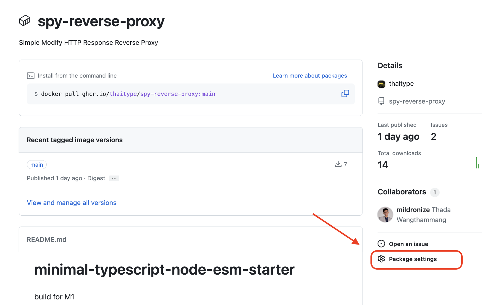

+++
title = "Publishing Docker Image on GitHub Package Publicly with Github Actions"

[taxonomies]
categories = [ "Docker Image" ]
tags = [ "Docker Image", "Github Package", "Github Actions" ]

[extra]
uuid = "6wrk7rh"
+++

Greetings, readers! If you've been using Docker Hub for managing your Docker images, did you know that GitHub offers an alternative with GitHub Package? In this blog post, we'll walk through the process of publishing your Docker images on GitHub Package, leveraging the power of GitHub Actions. This is particularly beneficial if you're already hosting your code on GitHub. Let's dive into the details and explore how to seamlessly integrate Docker image publishing into your GitHub workflows.


## Setting Up GitHub Actions Workflow

To get started, create a GitHub Actions workflow file and configure it to build and publish your Docker image whenever changes are pushed to the main branch. We'll be using GitHub Container Registry (ghcr.io) for our image hosting. Below is the workflow file that you can use as a template, adopted from the [GitHub Official Documentation](https://docs.github.com/en/actions/publishing-packages/publishing-docker-images#publishing-images-to-github-packages):

```yml
name: Create and publish a Docker image

# Configures this workflow to run every time a change is pushed to the branch called `release`.
on:
  push:
    branches:
      - main

# Defines two custom environment variables for the workflow. These are used for the Container registry domain, and a name for the Docker image that this workflow builds.
env:
  REGISTRY: ghcr.io
  IMAGE_NAME: ${{ github.repository }}

# There is a single job in this workflow. It's configured to run on the latest available version of Ubuntu.
jobs:
  build-and-push-image:
    runs-on: ubuntu-latest
    # Sets the permissions granted to the `GITHUB_TOKEN` for the actions in this job.
    permissions:
      contents: read
      packages: write
      # 
    steps:
      - name: Checkout repository
        uses: actions/checkout@v4
      # Uses the `docker/login-action` action to log in to the Container registry registry using the account and password that will publish the packages. Once published, the packages are scoped to the account defined here.
      - name: Log in to the Container registry
        uses: docker/login-action@65b78e6e13532edd9afa3aa52ac7964289d1a9c1
        with:
          registry: ${{ env.REGISTRY }}
          username: ${{ github.actor }}
          password: ${{ secrets.GITHUB_TOKEN }}
      # This step uses [docker/metadata-action](https://github.com/docker/metadata-action#about) to extract tags and labels that will be applied to the specified image. The `id` "meta" allows the output of this step to be referenced in a subsequent step. The `images` value provides the base name for the tags and labels.
      - name: Extract metadata (tags, labels) for Docker
        id: meta
        uses: docker/metadata-action@9ec57ed1fcdbf14dcef7dfbe97b2010124a938b7
        with:
          images: ${{ env.REGISTRY }}/${{ env.IMAGE_NAME }}
      # This step uses the `docker/build-push-action` action to build the image, based on your repository's `Dockerfile`. If the build succeeds, it pushes the image to GitHub Packages.
      # It uses the `context` parameter to define the build's context as the set of files located in the specified path. For more information, see "[Usage](https://github.com/docker/build-push-action#usage)" in the README of the `docker/build-push-action` repository.
      # It uses the `tags` and `labels` parameters to tag and label the image with the output from the "meta" step.
      - name: Build and push Docker image
        uses: docker/build-push-action@v5
        with:
          context: .
          push: true
          tags: ${{ steps.meta.outputs.tags }}
          labels: ${{ steps.meta.outputs.labels }}
          cache-from: type=gha
```

This workflow file is designed to run on every push to the `main` branch, ensuring that your Docker image is automatically built and published when changes occur.

## Executing the Workflow

Once your workflow is set up, any push to the main branch will trigger the GitHub Actions workflow. Keep an eye on the Actions tab in your GitHub repository to monitor the progress and results.


## Exploring the Published Docker Image
Visit the GitHub Package page to view details about your published Docker image, including tags and labels.


## Making Your Package Public
Before pulling the image publicly, you need to make sure your GitHub Package is set to public. Easily change the visibility in the package settings.



Navigate to the settings, locate the option to change visibility, and switch it to public.


## Pulling the Image

Once your package is public, pulling the image becomes straightforward. Use the following Docker command, replacing `<username>`, `<repository>`, and `<tag>` with your specific details:

```bash
docker pull ghcr.io/<username>/<repository>:<tag>
```

For instance, pulling the `ghcr.io/thaitype/spy-reverse-proxy:main` image would look like this:

```bash
docker pull ghcr.io/thaitype/spy-reverse-proxy:main
```

You can also see the [full example repo here](https://github.com/thaitype/spy-proxy/releases/tag/v0.0.0).

Feel free to adapt the workflow and Docker image tags to align with your versioning strategy and project requirements.

## In Summary
Congratulations! You've successfully set up GitHub Actions to publish your Docker images on GitHub Package. This seamless integration provides a convenient way to manage your images within the GitHub ecosystem. If you ever need to update your images or adopt a different versioning strategy, you can easily modify the workflow to suit your needs.

Thank you for joining us on this GitHub Actions journey. We hope this guide enhances your understanding of Docker image publishing and GitHub Package integration. Happy coding!

Happy coding, and until next time!