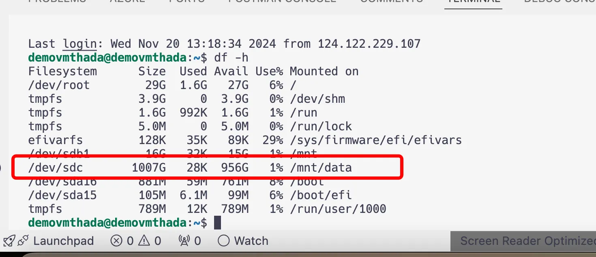

+++
title = "[DevOps][Azure] วิธีการ Mount Disk ใน Ubuntu VM บน Azure"

[taxonomies]
categories = [ "Ubuntu" ]
tags = [ "Ubuntu", "Azure", "Virtual Machine", "DevOps" ]

[extra]
uuid = "1vecxum"
+++

สวัสดีครับเพื่อนๆ วันนี้จะมาแชร์วิธี Mount Disk บน VM ที่สร้างใน Azure กันครับ 🖥️ หลายคนอาจเคยเพิ่ม Disk เข้าไปใน VM แล้วงงว่า “ทำไม Disk ยังไม่มาโชว์ใน Path ที่ต้องการ?” ไม่ต้องห่วงครับ เดี๋ยวพาไล่ Step-by-Step แบบง่ายๆ ทำตามได้เลย!

---

### **ผลลัพธ์ที่ได้จากการอ่าน Blog นี้**

หลังจากอ่าน Blog นี้ คุณจะสามารถ:

- ตรวจสอบ Disk ใหม่ใน VM ได้
- สร้าง Partition และ Format Disk เพื่อใช้งาน
- Mount Disk ไปยัง Path ที่ต้องการใน Linux
- ตั้งค่าให้ Disk Mount อัตโนมัติทุกครั้งที่รีบูต VM

---

### **สิ่งที่ควรเตรียมมาก่อน (Prerequisite)**

ก่อนเริ่มทำตาม Blog นี้ ให้เตรียมสิ่งต่อไปนี้:

1. **VM ที่พร้อมใช้งานใน Azure**
    - ต้องมีสิทธิ์เข้าถึง VM (ผ่าน SSH หรือ Console)
2. **Disk ที่ถูกเพิ่มเข้า VM เรียบร้อย**
    - สามารถเพิ่ม Disk ได้จาก Azure Portal หรือ CLI
3. **พื้นฐานคำสั่ง Linux**
    - เช่น การใช้ **`lsblk`**, **`fdisk`**, **`sudo`** และการแก้ไขไฟล์ด้วย **`nano`**

ถ้าพร้อมแล้ว ลุยกันเลยครับ! 🚀

### **1. เช็ค Disk ก่อน**

เริ่มจากเช็คว่า Disk ใหม่ของเราถูก detect แล้วหรือยัง และมี partitions หรือยัง ด้วยคำสั่งนี้:

```bash
lsblk
```

จาก output เราเห็นว่า Disk **`sdc`** ยังไม่มี partitions (TYPE ยังเป็น **`disk`** เปล่าๆ) ดังนั้นเราต้องมาจัดการ partition และ format ก่อนครับ

### **2. สร้าง Partition**

ใช้คำสั่ง **`fdisk`** เพื่อสร้าง partition ใหม่:

```bash
sudo fdisk /dev/sdc

```

ใน **`fdisk`**:

1. กด **`n`** เพื่อสร้าง partition ใหม่
2. กด Enter เพื่อเลือก default options
3. สุดท้าย กด **`w`** เพื่อบันทึกและออก

---

### **3. Format Disk**

เมื่อสร้าง partition เสร็จแล้ว (เช่น **`/dev/sdc1`**) ก็ต้อง format เป็นไฟล์ระบบ (filesystem) ก่อน mount:

```bash
sudo mkfs.ext4 /dev/sdc1
```

---

### **4. สร้าง Mount Point**

สร้าง directory ที่เราจะใช้ mount disk:

```bash
sudo mkdir -p /mnt/data
```

---

### **5. Mount Disk**

Mount partition เข้าที่ path **`/mnt/data`**:

```bash
sudo mount /dev/sdc1 /mnt/data
```

---

### **6. ตรวจสอบว่า Mount สำเร็จ**

เช็คด้วยคำสั่งนี้:

```bash
df -h
```

ถ้าเจอ **`/mnt/data`** พร้อมพื้นที่ disk โชว์อยู่ แปลว่าสำเร็จแล้วครับ 🎉

---

### **7. ตั้งค่าให้ Mount อัตโนมัติหลัง Reboot**

ถ้าอยากให้ disk mount เองทุกครั้งหลังรีบูต ทำตามนี้:

1. หาค่า UUID ของ disk:
    
    ```bash
    sudo blkid
    ```
    
    สมมติได้ output แบบนี้:
    
    ```bash
    /dev/sdc1: UUID="abcd-1234" TYPE="ext4"
    ```
    
2. แก้ไขไฟล์ **`/etc/fstab`**:
    
    ```bash
    sudo nano /etc/fstab
    ```
    
    แล้วเพิ่มบรรทัดนี้เข้าไป:
    
    ```bash
    UUID=abcd-1234 /mnt/data ext4 defaults 0 2
    ```
    
3. บันทึกไฟล์แล้วลองทดสอบด้วย:
    
    ```bash
    sudo mount -a
    ```
    

ถ้าไม่มี error ก็เรียบร้อยครับ! 🎊

---

### ผลลัพธ์ที่คาดหวัง



### **สรุป**

เสร็จแล้วครับ! เพียงไม่กี่ขั้นตอน Disk ของเราก็พร้อมใช้งานใน Path **`/mnt/data`** ได้เลย ใครลองแล้วติดปัญหาตรงไหนมาคุยกันได้นะครับ 😊
