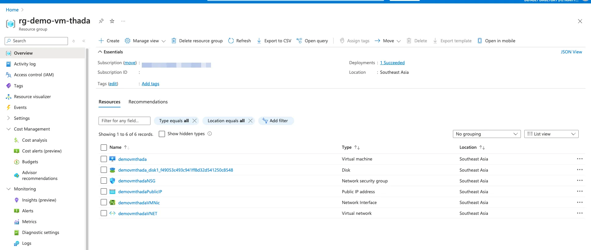
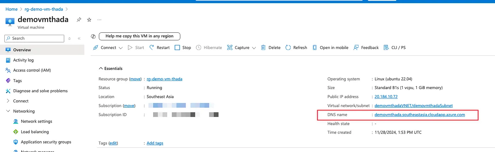

+++
title = "สร้างและจัดการ Virtual Machine บน Azure ด้วย TypeScript (Bun)"
date = "2024-11-29"

[taxonomies]
categories = [ "Azure" ]
tags = [ "Azure", "TypeScript", "Bun", "Virtual Machine", "DevOps" ]
+++

สวัสดีครับ! วันนี้เราจะมาพูดถึงการสร้าง Virtual Machine (VM) บน Microsoft Azure โดยใช้ TypeScript ซึ่งเป็น Runtime ที่เร็วมากสำหรับ JavaScript และ TypeScript และในบทความนี้ เราจะอธิบายการเขียนสคริปต์ทีละส่วน พร้อมกับสอนการติดตั้งและการใช้งาน TypeScript แบบง่าย ๆ

**คุณสมบัติเด่นที่คุณจะได้จากการรันสคริปต์นี้**
- สร้าง Virtual Machine (VM) พร้อมกำหนดค่าต่าง ๆ เช่น ชื่อเครื่อง ขนาด และระบบปฏิบัติการ
- เปิดพอร์ต 22 สำหรับ SSH อัตโนมัติ
- ติดตั้ง Ansible บน VM พร้อมใช้งาน
- กำหนด DNS ให้ VM เพื่อการเข้าถึงที่ง่ายขึ้น
- ทุกขั้นตอนจัดการผ่าน CLI โดยใช้คำสั่ง Azure CLI ผ่าน Bun

# **การติดตั้ง Bun และการเตรียมสภาพแวดล้อม**

# **1. ติดตั้ง Bun**

ก่อนอื่น คุณต้องติดตั้ง Bun ในระบบของคุณ:

```
curl https://bun.sh/install | bash
```

หลังจากติดตั้งเสร็จ ให้ตรวจสอบว่า Bun ทำงานได้ด้วยคำสั่ง

```
bun -v
```

# **2. สร้างโปรเจกต์ใหม่ด้วย `bun init`**

```
bun init
```

คำสั่งนี้จะสร้างไฟล์ `package.json` พร้อมโครงสร้างโปรเจกต์พื้นฐานให้คุณ

# **Script และการทำงานในแต่ละส่วน**

# **Script ทั้งหมด**

ด้านล่างเป็นโค้ดทั้งหมดที่เราจะอธิบายทีละส่วน:

```ts
/**
 *@ref https://learn.microsoft.com/en-us/azure/virtual-machines/linux/mac-create-ssh-keys
 */

import { $ } from "bun";
import fs from "fs";

// Edit these variables
const RESOURCE_GROUP = "rg-demo-vm-thada";
const LOCATION = "southeastasia";
const VM_NAME = "demovmthada";
const IMAGE = "Ubuntu2204"; // Get value from `az vm image list --output table`
const SIZE = "Standard_B1s"; // 1 Core/Ram 1 GB, Get value from `az vm list-sizes --location ${LOCATION} --output table`
const ADMIN_USER = "azureuser";
const SSH_PUBLIC_KEY_PATH = `${process.env.HOME}/.ssh/demovmthada/id_rsa.pub`;
const SSH_KEY_PATH = `${process.env.HOME}/.ssh/demovmthada/id_rsa.pem`;

await createAzureVirtualMachine({
  resourceGroup: RESOURCE_GROUP,
  location: LOCATION,
  vmName: VM_NAME,
  image: IMAGE,
  size: SIZE,
  adminUser: ADMIN_USER,
  sshPublicKeyPath: SSH_PUBLIC_KEY_PATH,
  sshKeyPath: SSH_KEY_PATH,
});

async function createAzureVirtualMachine({
  resourceGroup,
  location,
  vmName,
  image,
  size,
  adminUser,
  sshPublicKeyPath,
  sshKeyPath,
}: {
  resourceGroup: string;
  location: string;
  vmName: string;
  image: string;
  size: string;
  adminUser: string;
  sshPublicKeyPath: string;
  sshKeyPath: string;
}) {
  // Check if SSH key exists
  if (!fs.existsSync(sshKeyPath)) {
    console.error(`SSH key not found at ${sshKeyPath}. Please generate one using ssh-keygen.`);
    process.exit(1);
  }
  if (!fs.existsSync(sshPublicKeyPath)) {
    console.error(`SSH public key not found at ${sshPublicKeyPath}. Please generate one using ssh-keygen.`);
    process.exit(1);
  }

  console.log(`Creating resource group ${resourceGroup} in location ${location}...`);
  await $`az group create --name ${resourceGroup} --location ${location}`;
  console.log(`Creating VM ${vmName} in resource group ${resourceGroup}...`);
  await $`az vm create --resource-group ${resourceGroup} --name ${vmName} --image ${image} --size ${size} --admin-username ${adminUser} --ssh-key-values ${sshPublicKeyPath}`;
  console.log(`Opening port 22 for SSH on VM ${vmName}...`);
  await $`az vm open-port --port 22 --resource-group ${resourceGroup} --name ${vmName}`;

  const vmIp = (await $`az vm list-ip-addresses --resource-group ${resourceGroup} --name ${vmName} --query "[0].virtualMachine.network.publicIpAddresses[0].ipAddress" -o tsv`).stdout.toString().trim();

  console.log(`VM public IP: ${vmIp}`);

  // Assign DNS name
  const FQDN = await assignDnsName({ dnsLabel: vmName, resourceGroup: resourceGroup, vmName: vmName });

  await $`ssh -o StrictHostKeyChecking=no -i ${sshKeyPath} ${adminUser}@${FQDN} sudo apt update`;
  await $`ssh -o StrictHostKeyChecking=no -i ${sshKeyPath} ${adminUser}@${FQDN} sudo apt install -y ansible`;

  console.log(`Ansible has been installed. You can SSH into the VM using: ssh -i ${sshKeyPath} ${adminUser}@${FQDN}`);
}

async function assignDnsName({
  dnsLabel,
  resourceGroup,
  vmName,
}: {
  dnsLabel: string;
  vmName: string;
  resourceGroup: string;
}): Promise<string> {

  // Retrieve the public IP resource associated with the VM
  console.log(`Retrieving public IP resource for VM: ${vmName}...`);
  const publicIpName = (await $`az vm list-ip-addresses --resource-group ${resourceGroup} --name ${vmName} --query "[0].virtualMachine.network.publicIpAddresses[0].name" -o tsv`).stdout.toString().trim();

  if (!publicIpName) {
    console.error(`Unable to find public IP resource for VM '${vmName}'.`);
    process.exit(1);
  }

  // Check if the fqdn is already assigned
  const assignedFqdn = (await $`az network public-ip show --resource-group ${resourceGroup} --name ${publicIpName} --query "dnsSettings.fqdn" -o tsv`).stdout.toString().trim();
  if (assignedFqdn) {
    console.log(`Public IP already has DNS name assigned: ${assignedFqdn}`);
    return assignedFqdn;
  }

  // Check if the DNS label is already in use
  console.log(`Checking availability of DNS label: ${dnsLabel}...`);
  const dnsAvailability = (await $`az network public-ip list --query "[?dnsSettings.domainNameLabel=='${dnsLabel}']" -o tsv`).stdout.toString().trim();

  if (dnsAvailability) {
    console.error(`DNS label '${dnsLabel}' is already in use. Please choose a different label.`);
    process.exit(1);
  }

  // Update the public IP with the DNS label
  console.log(`Assigning DNS label '${dnsLabel}' to public IP: ${publicIpName}...`);
  await $`az network public-ip update --resource-group ${resourceGroup} --name ${publicIpName} --dns-name ${dnsLabel}`;

  // Display the fully qualified domain name (FQDN)
  const fqdn = (await $`az network public-ip show --resource-group ${resourceGroup} --name ${publicIpName} --query "dnsSettings.fqdn" -o tsv`).stdout.toString().trim();
  console.log(`DNS name assigned! You can now access your VM at: ${fqdn}`);

  return fqdn;
}
```

# **การกำหนดค่าพื้นฐาน**

```ts
const RESOURCE_GROUP = "rg-demo-vm-thada";
const LOCATION = "southeastasia";
const VM_NAME = "demovmthada";
const IMAGE = "Ubuntu2204";
const SIZE = "Standard_B1s";
const ADMIN_USER = "azureuser";
const SSH_PUBLIC_KEY_PATH = `${process.env.HOME}/.ssh/demovmthada/id_rsa.pub`;
const SSH_KEY_PATH = `${process.env.HOME}/.ssh/demovmthada/id_rsa.pem`;
```

ในส่วนนี้ เราได้กำหนดค่าต่าง ๆ ที่จำเป็นสำหรับการสร้าง VM เช่น:

- `RESOURCE_GROUP`: ชื่อ Resource Group ใน Azure
- `LOCATION`: ตำแหน่งภูมิศาสตร์ของ VM
- `VM_NAME`: ชื่อของ VM
- `IMAGE`: ระบบปฏิบัติการของ VM
- `SIZE`: ขนาดของ VM

ฟังก์ชันนี้ช่วยกำหนด DNS ให้กับ VM ทำให้สามารถเข้าถึงได้ด้วยชื่อที่จำง่ายขึ้น เช่น `demovmthada.southeastasia.cloudapp.azure.com`

# **วิธีการใช้งาน**

1. แก้ไขค่าต่าง ๆ เช่น `RESOURCE_GROUP`, `LOCATION` และ `VM_NAME` ตามที่ต้องการ
2. รันสคริปต์ด้วยคำสั่ง:

```
bun run script.ts
```

หลังจากรันสำเร็จ คุณจะได้รับ IP และ DNS สำหรับการเชื่อมต่อ VM

เย้ ได้ Azure VM มาแล้ววว ใน 1 Command



ไหนๆๆ ลองเช็คซิ DNS ของ VM มามั้ย มาเรียบร้อย



DNS มาแว้วว

หลังจากนั้นก็ทดสอบ Login กับ DNS ได้เลย

```
ssh -i ~/.ssh/demovmthada/id_rsa.pem adminuser@demovmthada.southeastasia.cloudapp.azure.com
```

# **สรุป**

บทความนี้แสดงให้เห็นถึงการสร้างและจัดการ Virtual Machine บน Azure อย่างมีประสิทธิภาพโดยใช้ TypeScript และ Azure CLI คุณสามารถปรับแต่งสคริปต์ตามความต้องการ เช่น เพิ่มการติดตั้งซอฟต์แวร์เพิ่มเติม หรือเปลี่ยนค่าต่าง ๆ เพื่อให้เหมาะกับโปรเจกต์ของคุณ!

ลองทำดู แล้วคุณจะพบว่า TypeScript (Bun) เป็นเครื่องมือที่เร็วและใช้ง่ายมากสำหรับงาน Automation! ที่สำคัญคือ Type Safe ด้วยนะเออ

อ้อ ลง Ansible ได้แว้วว จากนั้น ก็แท็กมือต่อจากใช้ Ansible ลุยต่อได้เยยย

จบ ล่ะ บุย
