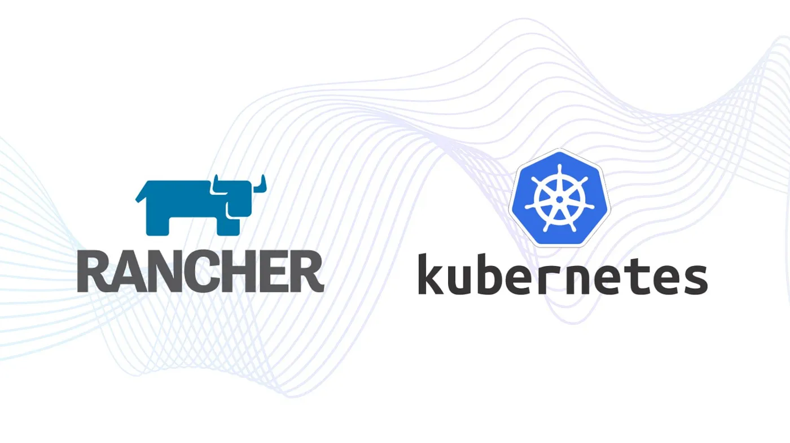

+++
title = "ทำความรู้จัก RKE2 (Rancher) ตัวช่วยจัดการ Kubernetes Cluster ที่ง่ายและสบายขึ้น"
date = "2024-12-02"

[taxonomies]
categories = [ "Kubernetes" ]
tags = [ "Rancher", "RKE2", "RKE","Kubernetes", "DevOps" ]
+++

เวลาที่เราพูดถึง **Kubernetes** มันจะมีสองมุมเสมอครับ ด้านหนึ่งคือฝั่ง **Admin** ที่ต้องคอย Setup และดูแล Cluster ตั้งแต่การติดตั้ง, การจัดการโหนด, ไปจนถึงการอัปเดตระบบ ส่วนอีกด้านคือฝั่ง **Dev** ที่ใช้ `kubectl` หรือเครื่องมือ CI/CD เพื่อ deploy แอปพลิเคชันโดยไม่ต้องสนใจเบื้องหลังของคลัสเตอร์ สำหรับบทความนี้ ผมจะพาเรามาโฟกัสที่ฝั่ง Admin โดยเฉพาะ และแนะนำเครื่องมือที่ช่วยให้การสร้างและจัดการ Kubernetes Cluster ง่ายขึ้นอย่าง **Rancher**

Rancher ถูกออกแบบมาเพื่อลดความยุ่งยากและซับซ้อนของการ Setup Cluster ทำให้ Admin สามารถสร้างและจัดการ Kubernetes ได้โดยไม่ต้องปวดหัวกับรายละเอียดที่ซับซ้อน ไม่ว่าคุณจะเป็นมือใหม่หรือผู้มีประสบการณ์ Rancher จะช่วยให้การทำงานของเราคล่องตัวขึ้น มารู้จัก Rancher ไปด้วยกัน แล้วคุณจะเห็นว่าการดูแล Kubernetes Cluster สามารถเป็นเรื่องง่ายได้จริงๆ



# **Kubernetes เข้ามาแก้ปัญหาอะไร**

Kubernetes หรือที่หลายคนเรียกสั้นๆ ว่า “K8s” เป็นแพลตฟอร์มจัดการ Container ที่ช่วยให้เราสามารถปรับใช้ (deploy), ขยายขนาด (scale), และจัดการแอปพลิเคชันที่รันอยู่ใน Container ได้อย่างอัตโนมัติและมีประสิทธิภาพ เหมือนเป็น “ผู้จัดการทีม” ที่คอยดูแลให้ทุกอย่างในระบบทำงานได้ราบรื่น Kubernetes เหมาะสำหรับคนที่ต้องการบริหารระบบขนาดใหญ่หรือแอปฯ แบบ microservices ที่ต้องการความยืดหยุ่นและเสถียรภาพครับ

ผมอยากพูดถึงปัญหาที่ Kubernetes ถูกออกแบบมาเพื่อแก้ไข และทำให้การจัดการแอปพลิเคชันและระบบ IT ของเราง่ายขึ้น มีประสิทธิภาพมากขึ้น และตอบสนองความต้องการในยุคปัจจุบัน

**1. ความพร้อมใช้งานตลอดเวลา (Availability)**

ในยุคนี้ ทุกคนคาดหวังว่าแอปฯ จะต้องพร้อมใช้งานตลอด 24 ชั่วโมง ไม่มีคำว่า “ดาวน์ไทม์” Kubernetes จัดการเรื่องนี้โดยการวางแผนการรันคอนเทนเนอร์ในหลายๆ โหนด และใช้แนวคิด “desired state” เทียบกับ “actual state” ถ้ามีการล่มหรือขัดข้อง ระบบจะมองว่ามันคือ “ความต่าง” ที่ต้องแก้ไข และจะจัดการปรับสถานะให้กลับมาเป็นเหมือนที่ต้องการ

**2. การพัฒนาและส่งมอบที่รวดเร็ว (CI/CD)**

จากเดิม การพัฒนาแอปฯ มักเป็นแบบ monolithic ที่ใช้เวลาหลายเดือนในการปล่อยเวอร์ชันใหม่ๆ Kubernetes ช่วยทำให้กระบวนการ DevOps เป็นจริงได้ โดยใช้ไฟล์คอนฟิกและ desired state ในการตั้งค่าและรันงาน ซึ่งช่วยให้ทีมพัฒนาสามารถทดสอบและส่งมอบแอปฯ ได้อย่างต่อเนื่อง ทำให้ “พลาดเร็ว แก้เร็ว” ได้จริง

**3. ความคุ้มค่าและประสิทธิภาพ (Efficiency)**

ในอดีต การเตรียมระบบ IT มักมีค่าใช้จ่ายสูง เช่น ต้องมีเซิร์ฟเวอร์สำรองหลายตัวเพื่อรองรับการทำงาน Kubernetes ทำให้เราสร้างสภาพแวดล้อมใหม่ๆ ได้ง่าย เพียงแค่สร้าง namespace ทดสอบงาน และลบเมื่อเสร็จงาน ช่วยลดการใช้ทรัพยากรที่ไม่จำเป็น

**4. การปรับขนาดอัตโนมัติ (Automate Scaling)**

การขยายระบบในอดีตมักใช้เวลานาน ตั้งแต่เพิ่มเซิร์ฟเวอร์ ติดตั้งแอปฯ และตั้งค่าต่างๆ Kubernetes ทำให้การเพิ่มหรือลดขนาดระบบง่ายขึ้น เช่น หากเราต้องการเพิ่ม pod จาก 2 เป็น 3 ก็แค่เปลี่ยนจำนวน replicas แล้วระบบจะจัดการเพิ่ม pod ให้เอง และด้วย Horizontal Pod Autoscaler (HPA) Kubernetes สามารถเพิ่มหรือลด pod ตามเมตริก เช่น CPU, memory หรือ response time ของแอปฯ ได้แบบอัตโนมัติ นอกจากนี้ยังมี Vertical Pod Autoscaler (VPA) และ Node Scaling ที่ช่วยปรับทรัพยากรของ pod และโหนดในคลัสเตอร์ให้เหมาะสมโดยอัตโนมัติ เช่น ช่วงกลางวันระบบอาจใช้ 10 โหนด แต่ตอนกลางคืนอาจเหลือแค่ 1 โหนด เพื่อประหยัดค่าใช้จ่าย

ทั้งหมดนี้ทำให้ Kubernetes ไม่เพียงช่วยให้เราจัดการระบบได้ง่ายขึ้น แต่ยังช่วยลดต้นทุนและเพิ่มความยืดหยุ่นให้กับระบบของเราอีกด้วยครับ

# **Rancher คืออะไร?**

ผมอยากเล่าให้ฟังว่า **Rancher** คืออะไร และมันเชื่อมโยงกับ **Kubernetes** ยังไง

Rancher คือแพลตฟอร์มบริหารจัดการ Kubernetes ที่ช่วยให้เราสามารถสร้างและจัดการคลัสเตอร์ Kubernetes ได้ทุกที่ ไม่ว่าจะเป็นคลาวด์ เช่น GKE (Google Kubernetes Engine), AKS (Azure Kubernetes Service), หรือ EKS (Amazon Elastic Kubernetes Service) หรือแม้แต่บนเซิร์ฟเวอร์ของเราเอง Rancher สามารถช่วยเราติดตั้ง Kubernetes ลงบนโหนด หรือแม้กระทั่งนำเข้าคลัสเตอร์ Kubernetes ที่มีอยู่แล้วเข้ามาจัดการในระบบ Rancher

จุดเด่นของ Rancher คือการเพิ่มคุณค่าบน Kubernetes ที่มีอยู่แล้ว ตัวอย่างเช่น:

- **การรวมระบบยืนยันตัวตนและการควบคุมสิทธิ์ (RBAC)**: Rancher ให้เราจัดการสิทธิ์การเข้าถึงคลัสเตอร์ทั้งหมดจากศูนย์กลาง เช่น ใช้ Active Directory สำหรับล็อกอิน หรือกำหนดนโยบายความปลอดภัยในทุกคลัสเตอร์ได้ในที่เดียว
- **การมอนิเตอร์และการแจ้งเตือน**: Rancher ช่วยเราติดตามสุขภาพของคลัสเตอร์และทรัพยากรต่างๆ รวมถึงส่ง log ไปยังระบบภายนอกได้
- **การผสาน Helm และ DevOps Tools**: Rancher มี Application Catalog ที่เชื่อมต่อกับ Helm และยังสามารถทำงานร่วมกับระบบ CI/CD ภายนอก หรือใช้ Fleet ของ Rancher เองในการ deploy และอัปเดต workloads แบบอัตโนมัติ

Rancher เป็นเครื่องมือที่ช่วยให้ DevOps และ IT ทำงานได้ง่ายขึ้น ตัวอย่างเช่น:

- สำหรับ DevOps: Rancher มีอินเทอร์เฟซที่ใช้งานง่าย ไม่ต้องมีความรู้ลึกเกี่ยวกับ Kubernetes ก็สามารถบริหารจัดการ workloads ได้ และยังมีเครื่องมือเสริมอย่าง Rancher Catalog ที่รวม DevOps tools ไว้ให้พร้อมใช้งาน
- สำหรับ IT: Rancher ช่วยให้แอดมินดูสถานะและกำลังการทำงานของคลัสเตอร์ทั้งหมดได้จากหน้าจอเดียว และตั้งค่าความปลอดภัยหรือ enforce นโยบายต่างๆ ได้ทั่วทั้งองค์กร

พูดง่ายๆ คือ Rancher เป็นตัวช่วยสำคัญที่ทำให้ Kubernetes พร้อมใช้งานในระดับโปรดักชัน และทำให้ทีม DevOps ของเราทำงานได้คล่องตัวขึ้น โดยที่ยังตอบโจทย์ข้อกำหนดของ IT ได้ครบถ้วนครับ

# **แนวคิดหลักของ Rancher**

ผมอยากจะเล่าให้ฟังเกี่ยวกับแนวคิดหลักของ Rancher ซึ่งเป็นซอฟต์แวร์ที่ช่วยบริหารจัดการ Kubernetes ได้แบบมีประสิทธิภาพและยืดหยุ่นมาก แนวคิดที่เป็นหัวใจสำคัญของ Rancher มีอยู่หลายอย่างที่น่าสนใจครับ

## **เปิดกว้างด้วย Open Source**

Rancher ถูกสร้างขึ้นบนพื้นฐานของโอเพ่นซอร์ส ทุกส่วนของโค้ดและบริการที่เกี่ยวข้องล้วนเปิดให้เข้าถึงได้ฟรี ทำให้เกิดชุมชนขนาดใหญ่ที่มีทั้งผู้ใช้งานและผู้พัฒนาช่วยกันปรับปรุง แบ่งปันไอเดีย และสร้างเอกสารเพื่อช่วยเหลือกัน

## **ไม่มีการผูกมัด (No Lock-ins)**

Rancher ออกแบบมาเพื่อไม่ให้เราต้องติดอยู่กับเทคโนโลยีใดเทคโนโลยีหนึ่ง หรือแม้แต่ตัว Rancher เอง เช่น เราสามารถถอด Rancher ออกจากระบบได้โดยไม่กระทบกับคลัสเตอร์ที่ใช้งานอยู่ เพราะ Rancher เปิดทางให้เราจัดการคลัสเตอร์ได้โดยตรง

## **ทุกอย่างคือ Kubernetes Object**

ตั้งแต่ Rancher เวอร์ชัน 2.0 เป็นต้นมา Rancher เปลี่ยนมาเก็บข้อมูลทุกอย่างในรูปแบบ Kubernetes Object แทนฐานข้อมูล MySQL เดิม ซึ่งช่วยเพิ่มความสามารถในการขยายระบบ และทำให้เราสามารถเข้าถึงข้อมูลผ่าน API ของ Kubernetes ได้เลย

## **Stateless และยืดหยุ่น**

เนื่องจาก Rancher ทุกส่วนเป็น Stateless หมายความว่า ถ้า Pod ของ Rancher ล่มหรือถูกทำลาย Kubernetes ก็สามารถสร้าง Pod ใหม่ขึ้นมาแทนได้โดยไม่กระทบกับการทำงาน

## **Controller Model**

ทุกบริการของ Rancher ถูกออกแบบให้ทำงานบนแนวคิดของ Kubernetes Controller ซึ่งคอยตรวจสอบสถานะของระบบและปรับให้ตรงกับสถานะที่เราต้องการเสมอ นี่ช่วยให้ Rancher สามารถทำงานต่อเนื่องได้แม้จะเกิดความล้มเหลวในบางส่วน

แนวคิดเหล่านี้ทำให้ Rancher เป็นเครื่องมือที่ตอบโจทย์สำหรับการจัดการ Kubernetes ของเราได้อย่างคล่องตัวและมั่นใจครับ

# **RKE คืออะไร**

การสร้าง Kubernetes Cluster แบบดั้งเดิมนั้นถือเป็นงานที่ซับซ้อนและใช้เวลามาก เรียกกันว่า **“K8s the hard way”** เพราะเราต้องทำหลายขั้นตอน เช่น การสร้างใบรับรอง (Certificates), การติดตั้งและตั้งค่า etcd, การเชื่อมต่อบริการต่างๆ อย่าง kube-apiserver, kube-controller-manager และ kube-scheduler รวมถึงการตั้งค่า worker nodes เพื่อเข้าร่วมคลัสเตอร์ กระบวนการนี้ซับซ้อนและเปลี่ยนแปลงได้ตามการพัฒนา Kubernetes จนผู้ใช้งานต้องเขียนสคริปต์หรือ Ansible Playbooks เพื่อช่วยจัดการ ซึ่งยังต้องอัปเดตอยู่เรื่อยๆ ตามการเปลี่ยนแปลงของ Kubernetes

**RKE (Rancher Kubernetes Engine)** เกิดขึ้นมาเพื่อลดความยุ่งยากเหล่านี้ Rancher ต้องการให้การสร้าง Kubernetes Cluster เป็นเรื่องง่ายทั้งสำหรับผู้ใช้งานทั่วไปและ Rancher Server เอง โดย RKE คือเครื่องมือสำหรับการจัดการและสร้างคลัสเตอร์ Kubernetes ที่ได้รับการรับรองจาก CNCF (Cloud Native Computing Foundation)

# **RKE ทำงานอย่างไร?**

RKE ใช้หลักการสำคัญที่ทุกอย่างในคลัสเตอร์ Kubernetes จะถูกรันใน Docker Containers แทนการติดตั้งไบนารีลงบนระบบปฏิบัติการโดยตรง ซึ่งหมายความว่า RKE ไม่สนใจว่าระบบปฏิบัติการเป็นอะไร ตราบใดที่สามารถรัน Docker ได้

กระบวนการเริ่มต้นใช้งาน RKE คือการสร้างไฟล์ `cluster.yml` เพื่อกำหนดค่าคลัสเตอร์ เช่น จำนวนโหนดและการตั้งค่าของแต่ละส่วน จากนั้น RKE จะใช้ไฟล์นี้เพื่อรันคอนเทนเนอร์ที่จำเป็นสำหรับคลัสเตอร์ เช่น etcd, kube-apiserver, kube-controller-manager, และ kube-scheduler ทั้งหมดนี้ช่วยลดขั้นตอนที่ซับซ้อนและทำให้การสร้างคลัสเตอร์ง่ายขึ้น

**RKE เหมาะกับใคร?** RKE เหมาะสำหรับผู้ที่ต้องการสร้าง Kubernetes Cluster ได้อย่างรวดเร็วและยืดหยุ่น โดยไม่ต้องจัดการกับขั้นตอนที่ซับซ้อนของการติดตั้งและตั้งค่าแบบเดิม นอกจากนี้ RKE ยังรองรับการใช้งานบนหลายแพลตฟอร์มและเหมาะสำหรับการปรับแต่งการตั้งค่าต่างๆ อย่างเต็มที่ครับ

# **RKE2 คืออะไร?**

RKE2 หรือที่รู้จักในชื่อ **RKE Government** เป็นโซลูชัน Kubernetes รุ่นใหม่จาก Rancher ที่พัฒนาขึ้นเพื่อแก้ไขข้อจำกัดของ RKE เดิม และเพิ่มความง่ายในการตั้งค่าจากแนวคิดของ K3s โดย RKE2 ได้รับการรับรองจาก CNCF ว่าเป็น Kubernetes Distribution เต็มรูปแบบ และถูกออกแบบมาเพื่อตอบสนองความต้องการพิเศษขององค์กรรัฐบาลสหรัฐฯ โดยเฉพาะ เช่น การให้ระบบปลอดภัยสูงตั้งแต่เริ่มต้น

## **อะไรที่ทำให้ RKE2 พิเศษกว่ารุ่นเดิม?**

**1) ความปลอดภัยที่ออกแบบมาให้พร้อมใช้งาน (Secure by Default)**

- ใน RKE เราจำเป็นต้องตั้งค่าตาม *hardening guide* ด้วยขั้นตอนที่ยุ่งยากเพื่อให้ผ่านมาตรฐาน CIS แต่ RKE2 ออกแบบมาให้ปลอดภัยตั้งแต่เริ่มต้น โดยแทบไม่ต้องตั้งค่าเพิ่มเติม
- รองรับ FIPS (Federal Information Processing Standards) ซึ่งเป็นข้อกำหนดที่สำคัญสำหรับลูกค้ารัฐบาลสหรัฐฯ

**2) รองรับระบบ ARM64 และการผสมผสานระหว่างสถาปัตยกรรม**

- RKE2 รองรับทั้ง ARM64 และ AMD64 เช่นเดียวกับ K3s ทำให้เราสามารถใช้ RKE2 บน Raspberry Pi หรือโหนดที่ใช้พลังงานต่ำได้
- เราสามารถสร้างคลัสเตอร์ที่มีโหนดแบบผสม (ARM64 และ AMD64) และรัน workloads อย่าง multi-arch builds ได้อย่างง่ายดาย

**3) การจัดการแบบ Self-Bootstrapping**

- ใน RKE เดิม เราต้องนิยามคลัสเตอร์ด้วย YAML และใช้ไบนารี RKE เพื่อสร้างและจัดการ แต่ใน RKE2 โหนดใหม่สามารถเข้าร่วมคลัสเตอร์ได้ง่ายๆ โดยใช้ *registration endpoint* ที่โหนดหลัก โดยต้องการเพียง Load Balancer ภายนอกหรือ Round-robin DNS

**4) รองรับ Helm ในตัว**

- RKE2 สร้างขึ้นเพื่อรองรับ Rancher Fleet ซึ่งช่วยให้บริการต่างๆ ในคลัสเตอร์ เช่น *cert-manager* และ *OPA Gatekeeper* ถูกติดตั้งอัตโนมัติผ่าน Helm

**5) เปลี่ยนจาก Docker ไปใช้ containerd**

- RKE2 เลิกพึ่งพา Docker และเปลี่ยนไปใช้ containerd ทำให้ K8s components เช่น etcd และ kube-apiserver ถูกรันในรูปแบบ *static pods* ซึ่งจัดการโดย kubelet โดยตรง สิ่งนี้ช่วยให้การดูแลและแก้ไขปัญหาทำได้ง่ายขึ้น

**6) โอเพ่นซอร์สเต็มรูปแบบ**

- เช่นเดียวกับผลิตภัณฑ์อื่นๆ ของ Rancher, RKE2 เป็นโอเพ่นซอร์สแบบ 100% ไม่มีค่าใช้จ่ายหรือข้อจำกัดในการใช้งาน

## **ทำไม RKE2 ถึงเหมาะกับเรา?**

RKE2 เป็นทางเลือกที่เหมาะสำหรับใครก็ตามที่ต้องการสร้างคลัสเตอร์ Kubernetes ที่มีความปลอดภัยสูง ใช้งานง่าย และสามารถปรับตัวกับความต้องการที่หลากหลายได้ดี ไม่ว่าจะเป็นองค์กรทั่วไปหรือรัฐบาล RKE2 ก็ช่วยให้เราบริหารจัดการ Kubernetes ได้สะดวกและมีประสิทธิภาพมากขึ้นครับ!

# **Rancher vs. RKE: แตกต่างกันยังไง?**

เวลาที่เราใช้ Rancher ในการจัดการ Kubernetes Cluster เรามักจะได้ยินคำว่า **Rancher**, **RKE**, และ **Custom Cluster** ซึ่งสำหรับมือใหม่อาจจะสับสนได้ง่ายว่าความแตกต่างและบทบาทของแต่ละส่วนคืออะไร ผมจะอธิบายให้เข้าใจง่ายๆ ว่าแต่ละตัวช่วยอะไรเราได้บ้าง

## **Rancher คืออะไร?**

อย่างที่เคยอธิบายไปข้างบนแล้วว่า Rancher คือเครื่องมือที่ช่วยให้เราสร้างและบริหาร Kubernetes Cluster ได้อย่างครบวงจร เหมือนเป็น “ผู้ช่วยจัดการ Kubernetes-as-a-Service” Rancher สามารถ:

- **สร้าง, อัปเกรด, และบริหาร Cluster** ได้ง่ายผ่าน Web UI หรือ API
- **ทำงานร่วมกับ Kubernetes Providers ต่างๆ** เช่น GKE, AKS, EKS หรือแม้กระทั่งนำเข้า Cluster ที่มีอยู่แล้ว
- **รองรับ Authentication และ Access Control** ช่วยให้การบริหารสิทธิ์ผู้ใช้เป็นเรื่องง่าย
- **มีฟีเจอร์เสริมในตัว** เช่น ระบบแจ้งเตือน, Logging, และ Pipeline สำหรับ CI/CD

Rancher ถูกออกแบบให้ติดตั้งง่ายในรูปแบบ Docker Container ซึ่งเราสามารถเริ่มต้นได้ด้วยคำสั่ง:

```
docker run -d -p 80:80 -p 443:443 rancher/rancher
```

แต่สำหรับ Production ควรใช้ Rancher แบบ High Availability (HA) โดยติดตั้ง Rancher บน Kubernetes Cluster ที่สร้างด้วย RKE เพื่อให้มั่นใจในความเสถียรและป้องกันการล่ม

## **RKE คืออะไร?**

เพื่อให้เข้าใจง่ายขึ้นก็คือ RKE (Rancher Kubernetes Engine) เป็นเครื่องมือ CLI ของ Rancher ที่ใช้สำหรับสร้างและบริหาร Kubernetes Cluster โดย RKE จะช่วยจัดการทุกอย่างตั้งแต่การติดตั้ง Kubernetes Components เช่น etcd, kube-apiserver, และ network add-ons ตามค่าที่เรากำหนดในไฟล์ `cluster.yml`

ข้อควรเข้าใจคือ **RKE ไม่ได้ติดตั้ง Rancher ให้เรา** แต่ RKE ใช้สร้าง Kubernetes Cluster ที่ Rancher สามารถนำไปบริหารต่อได้

**สิ่งที่ต้องการสำหรับใช้งาน RKE:**

- โหนดแต่ละตัวต้องมี SSH Key และ Docker ติดตั้งอยู่
- สามารถเข้าถึง Docker Socket (`/var/run/docker.sock`) ได้

หลังจากที่ RKE สร้าง Cluster เสร็จ มันจะสร้างไฟล์ kubeconfig ซึ่งเราสามารถใช้กับ `kubectl` เพื่อบริหาร Cluster ได้

## **Rancher ทำงานร่วมกับ RKE ยังไง?**

Rancher ใช้ RKE ในการสร้าง Kubernetes Cluster อยู่เบื้องหลัง โดยมี 2 วิธีหลัก:

1. **Rancher Launched Kubernetes: ใช้โหนดจาก Infrastructure Provider**Rancher สามารถเชื่อมต่อกับผู้ให้บริการ เช่น AWS หรือ Azure เพื่อสร้างโหนดผ่าน Docker Machine Driver และกำหนดบทบาทของโหนดผ่าน Node Pools
2. **Custom Cluster: ใช้โหนดของเราเอง**เราสามารถเพิ่มโหนดที่เรามีอยู่แล้วในระบบ โดยเพียงแค่ติดตั้ง Docker และรันคำสั่งที่ Rancher ให้มา โหนดเหล่านี้จะถูกเพิ่มเข้าไปใน Cluster พร้อมบทบาทที่กำหนด

## **สรุปความแตกต่างระหว่าง Rancher กับ RKE**

- **Rancher**: เป็นเครื่องมือบริหาร Kubernetes Cluster ผ่าน UI, API, และมีฟีเจอร์เสริมในตัว
- **RKE**: เป็น CLI สำหรับสร้างและอัปเดต Kubernetes Cluster โดยตรง

ทั้งสองทำงานร่วมกันได้อย่างลื่นไหล Rancher ใช้ RKE เพื่อสร้าง Cluster และเพิ่มฟีเจอร์การจัดการเพิ่มเติม เช่น การควบคุมสิทธิ์, การมอนิเตอร์, และ CI/CD ทำให้การใช้งาน Kubernetes Cluster ง่ายและครบวงจรมากขึ้นครับ

# **บทส่งท้าย**

ทั้งหมดที่ผมเล่ามาคือภาพรวมของ **RKE2 (Rancher)** และความเกี่ยวข้องกับ Kubernetes ที่ช่วยให้เราจัดการคลัสเตอร์ได้ง่ายและสบายขึ้นมาก ไม่ว่าจะเป็นการเริ่มต้นจากศูนย์ด้วย RKE2, การใช้ Rancher เพื่อรวมศูนย์การจัดการ, หรือการเข้าใจความแตกต่างระหว่าง Rancher กับ RKE ทั้งหมดนี้ช่วยให้เราประหยัดเวลา ลดความซับซ้อน และเพิ่มประสิทธิภาพในการทำงาน

Rancher และ RKE2 ไม่ได้เป็นแค่เครื่องมือ แต่มันเป็น “ตัวช่วย” ที่ทำให้เราโฟกัสกับสิ่งสำคัญได้เต็มที่ ไม่ว่าจะเป็นการพัฒนาแอปพลิเคชัน หรือการจัดการระบบในระดับโปรดักชัน ผมหวังว่าบทความนี้จะช่วยให้เรามองเห็นว่า RKE2 และ Rancher สามารถเข้ามาเป็นส่วนหนึ่งในการทำงานของเราได้ยังไง

สุดท้ายนี้ หากใครกำลังมองหาวิธีทำให้ Kubernetes Cluster ของตัวเองเบาขึ้น ง่ายขึ้น และมีประสิทธิภาพมากขึ้น ผมแนะนำให้ลองใช้งาน RKE2 และ Rancher แล้วเราจะเข้าใจว่าทำไมมันถึงเป็นตัวเลือกที่ดีในยุคของ Kubernetes ครับ!

แล้วเจอกันใหม่ สวัสดีครับ

# **อ้างอิงและอ่านเพิ่มเติม**

- [Rancher Deep Dive by Matthew Mattox](https://www.amazon.com/Rancher-Deep-Dive-enterprise-Kubernetes/dp/180324609X)
- Rancher: <https://ranchermanager.docs.rancher.com/>
- RKE: <https://rke.docs.rancher.com/>
- RKE2: <https://docs.rke2.io/>
- Rancher vs. RKE: What Is the Difference?: <https://www.suse.com/c/rancher_blog/rancher-vs-rke-what-is-the-difference/>