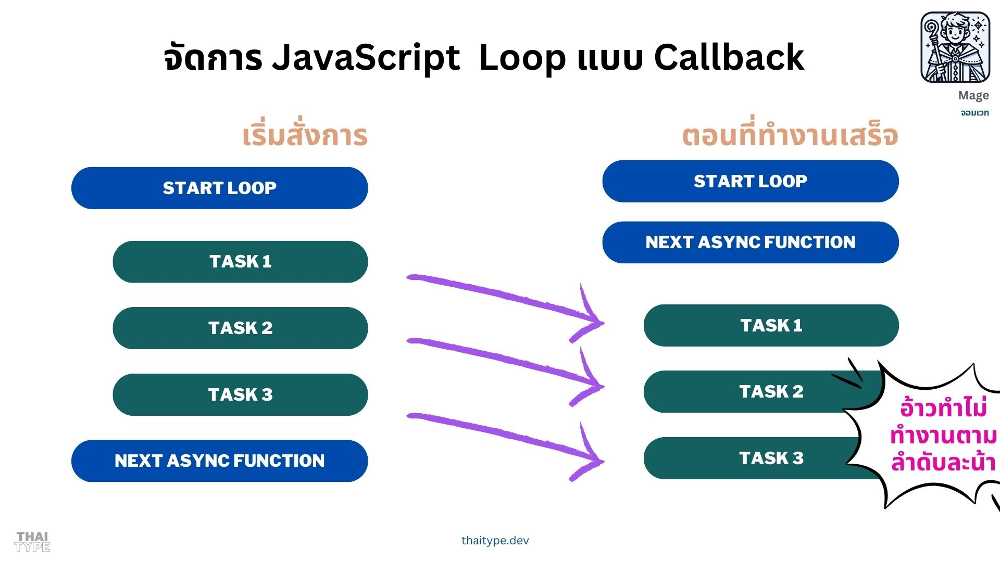

+++
title = "จัดการการวน Loop ของ Callback ใน JavaScript"
date = "2024-12-27"

[taxonomies]
categories = [ "JavaScript" ]
tags = [ "JavaScript", "Callback", "Promise", "Async", "TypeScript" ]

[extra]
id = "jwof8mf"
+++


สวัสดีครับ วันนี้เรามาจัดการเรื่องที่น่าปวดหัวของ JavaScript กัน ซึ่งถ้าใครเขียน Promise อยู่บ่อยๆ อยู่แล้ว ก็คงไม่ค่อยเจอกับปัญหาพวกนี้เท่าไหร่แล้วเนอะ แต่ถ้าคนที่เขียน JavaScript ยุคสมัยของ Callback อยู่ ก็คงเจอปัญหานี้บ่อยๆ แล้ว ซึ่งจะต้องเข้าใจการทำงานของ JavaScript Event Loop ก่อน



โดยเจ้า Callback เนี่ยแหละสร้างความปวดหัวในการทำงาน สำหรับคนที่คุ้นเคยกับเขียนแบบ Async/Await มากๆ เลย เพราะมันไม่ได้ทำงานตามลำดับที่เราคิด แต่มันจะเอาไปทำงานหลังบ้าน แล้วก็เสร็จเมื่อไหร่ก็ไม่รู้เลย 555+ น้ำตาจิไหล


ถึงแม้บทความนี้จะเขียนพฤติกรรมของ JavaScript แต่จะใช้ภาษา TypeScript ในการเขียนตัวอย่าง ใครที่อยากจะลองรันตาม
แนะนำใช้ [bun](https://bun.sh/)

```bash
mkdir -p demo-callback && cd demo-callback && bun init -y
```

จากนั้นมันจะสร้างไฟล์ index.ts ให้เรา แล้วเราก็เริ่มเขียนโค้ดตามตัวอย่างได้เลย
โดยให้รันด้วยคำสั่ง `bun run index.ts`


เรามาดูตัวอย่างของจริงกัน อย่างเช่น ปัญหา Classic อย่างเจ้า timeout กันก่อน

```typescript
setTimeout(() => console.log('Timeout 1'), 1000);
console.log('Start');
```

ถ้าเรามองผ่านๆ เราอาจจะคิดว่ามันจะทำตามลำดับ ก็คือเริ่มด้วย `Timeout 1` แต่จริงๆ แล้วมันจะทำงานแบบนี้

```
Start
Timeout 1
```

หมายความว่า มันจะทำงาน `Start` ก่อนแล้วค่อยทำ `Timeout 1` หลังจาก 1 วินาที ซึ่งถ้าเราไม่เข้าใจหลักการของ Event Loop นี้เราจะทำให้เราอ่านโค๊ดแล้วไม่เข้าใจ ถ้าเราต้องการทำงานตามลำดับ ให้ใช้ Promise หรือ Async/Await ก็ได้

```typescript
const timeout = (fn: () => void, ms: number) => {
  return new Promise((resolve) => {
    setTimeout(() => {
      fn();
      resolve();
    }, ms);
  });
};

console.log('Start');
await timeout(() => console.log('Timeout 1'), 1000);
```

เราก็จัดการแปลงเจ้า `setTimeout` ให้เป็น Promise แล้วเรียกใช้งานด้วย `await` แล้วก็จะทำงานตามลำดับที่เราคิด

## ปัญหาของเราของการจัดการ Loop ใน Callback

อย่างเขียนไปตรงหัวข้อว่า เรื่องของจัดการการวน Loop ของ Callback ใน JavaScript นั้น 
ซึ่งถ้าเป็น Modern JavaScript เรามักจะใช้ Promise เป็นมาตรฐานในการจัดการ Async แล้ว
แต่เราก็อาจจะต้องทำงานกับบาง Library หรือโค้ดที่เขียนแบบ Callback อยู่ ซึ่งเราก็จะต้องเข้าใจการทำงานของ JavaScript Event Loop ก่อน

ผมเองก็ได้มีโอกาสใช้ Library ตัวนึง สำหรับทำ Search แบบ Lightweight ชื่อ [Flexsearch](https://github.com/nextapps-de/flexsearch) มาลองดูตัวอย่างกัน

```typescript
import FlexSearch from 'flexsearch';

const index = new FlexSearch.Document({
  // Index configuration
});

// Somehow we add data into index
// Export the index

index.export(
  (key, data) => fs.writeFileSync(path.join(searchIndexPath, `${key}.json`), JSON.stringify(data ?? {})),
);
```

เราจะเห็นว่าเราจะใช้ `index.export` ในการ Export ข้อมูลออกมา แต่เราจะเจอปัญหาเรื่องการวน Loop ของ Callback ที่เราไม่รู้ว่าเมื่อไหร่จะเสร็จ แล้วเราจะทำอย่างไร แล้วมันเป็นปัญหายังไง มาดูตัวอย่างที่ทำให้เกิดปัญหากัน

สมมติว่าต้องการเก็บว่าเจ้า method ที่ชื่อ `export` มีค่าของ `key` อะไรบ้าง ซึ่งเราไม่มีทางรู้ได้เลยใช่มั้ยว่ามันค่าอะไรบ้าง ดังนั้นเราจึงต้อง
หาอะไรมาเก็บมัน เช่น

```typescript
const keys: string[] = [];

index.export(
  (key, data) => {
    fs.writeFileSync(path.join(searchIndexPath, `${key}.json`), JSON.stringify(data ?? {}));
    keys.push(key);
  },
);

console.log('Exported keys:', keys);
```

คำถามคือ บรรทัดสุดท้ายที่แสดงค่าของ `keys` ออกมา จะแสดงค่าอะไรออกมา
คำตอบคือ มันจะแสดงค่าว่า `[]` ก็คือไม่มีค่่าอะไรเลย ซึ่งหมายความว่ามัน `export` เสร็จหลังจากที่เราแสดงค่าออกมาแล้ว

แล้วถ้าเราใส่ Async/Await ลงไปใน callback function ดูล่ะ จะเป็นยังไง

```typescript
index.export(
  async(key, data) => {
    await fs.writeFile(path.join(searchIndexPath, `${key}.json`), JSON.stringify(data ?? {}));
    keys.push(key);
  },
);
```

แบบนี้มีผลเหมือนเดิม ก็คือ ถึงแม้ว่าแต่ใน Callback จะเป็น Async แล้ว แต่ระหว่างการทำงานของ Callback นั้น มันจะไม่รอให้เสร็จก่อน แล้วค่อยทำต่อ แต่มันจะทำงานต่อไปเลย แล้วค่อยทำ Callback ต่อไป ซึ่งเราจะเห็นว่า `keys` จะยังเป็น `[]` อยู่เหมือนเดิม

## วิธีการแก้ปัญหาการวน Loop ของ Callback

วิธีนี้เราควรจะรู้จำนวนที่แน่นอนว่า Callback นั้นจะทำงานกี่ครั้ง ซึ่งในกรณีนี้ผมจะสังเกตุพฤติกรรมของ `index.export` ว่ามันจะเรียก Callback กี่ครั้ง แล้วเราจะใช้ Promise ในการจัดการ

ซึ่งแนวคิดก็คือ เราจะสร้าง function ขึ้นมา 3 function ซึ่งทำหน้าที่ควบคุมการทำงานของ Callback และคอยตรวจสอบ
ว่าเจ้า Callback จะทำเสร็จเมื่อไหร่

1. function แรก ก็คือเราจะกำหนดก่อนว่า callback นั้นจะทำงานกี่ครั้ง 
2. function ที่สอง เราจะสร้างเป็น High-Order Function ที่จะรับ callback แล้วคอยเรียก callback นั้น และเมื่อ Callback นั้นทำงานเสร็จให้ลบ Counter ที่มาจาก Function แรกลง
3. เขียน Promise ที่จะรอให้ Counter ที่มาจาก Function แรก ถูกลบหมด แล้วค่อย resolve

จากขั้นตอนพวกนี้ เพื่อให้เห็นภาพมากขึ้น ผมจะเริ่มเขียนโค๊ดให้ดู

### Function ที่ 1: สร้าง Object ของ CallbackWaiter

สำหรับกำหนดจำนวนครั้งที่ Callback จะทำงาน

```typescript
const totalIndexFiles = 15 // ตรงนี้เรารู้จำนวนที่แน่นอนว่ามันจะทำงานกี่ครั้ง
const callbackWaiter = new CallbackWaiter(totalIndexFiles);
```

จะเห็นได้ว่าเราจะสร้าง Object ขึ้นมาเพื่อกำหนดว่า Callback จะทำงานกี่ครั้ง โดยกำหนดชื่อ Class ว่า `CallbackWaiter` 

### Function ที่ 2: สร้าง High-Order Function สำหรับ Callback

จากตรงนี้เราจะเห็นว่า เจ้า `index.export` ไม่ได้จัดการให้เลยว่าเราจะรันยังไง รันไปกี่รอบแล้ว แล้วจะเสร็จเมื่อไหร่
แสดงว่าเราต้องหากลไกภายนอกมาควบคุมการทำงานของมันแทน โดยใช้ Class ที่เราสร้างขึ้นมา

โดย method ที่ว่า `execute` จะรับ callback แล้วคอยเรียก callback นั้น และเมื่อ Callback นั้นทำงานเสร็จให้ลบ Counter ที่มาจาก Function แรกลง เพื่อคอยตรวจสอบว่าเสร็จหรือยัง

```typescript
index.export(
  (key, data) => callbackWaiter.execute(
    () => {
      fs.writeFileSync(path.join(searchIndexPath, `${key}.json`), JSON.stringify(data ?? {}));
    })
);
```

### Function ที่ 3: สร้าง Promise สำหรับรอให้ Callback ทำงานเสร็จ

จากตรงนี้เราจะเห็นว่าเราจะสร้าง Promise ขึ้นมาเพื่อรอให้ Counter ที่มาจาก Function แรก ถูกลบหมด 
เมื่อทำงานเสร็จแล้วเราจึงปล่อยให้ทำงานอื่นต่อไป

```typescript
await callbackWaiter.wait();
```

จากตรงนี้เราจะเห็นว่าเราจะรอให้ Callback ทำงานเสร็จก่อน แล้วค่อยทำงานต่อไป

## สรุปภาพรวม

เพื่อให้เข้าใจง่ายขึ้น ผมจะเขียนโค๊ดทั้งหมดให้ดู

```typescript
const totalIndexFiles = 15 // ตรงนี้เรารู้จำนวนที่แน่นอนว่ามันจะทำงานกี่ครั้ง
const callbackWaiter = new CallbackWaiter(totalIndexFiles);

index.export(
  (key, data) => callbackWaiter.execute(
    () => {
      fs.writeFileSync(path.join(searchIndexPath, `${key}.json`), JSON.stringify(data ?? {}));
    })
);

await callbackWaiter.wait();
```

จากตรงนี้เราจะเห็นว่าเราจะรอให้ Callback ทำงานเสร็จก่อน แล้วค่อยทำงานต่อไป 
และมั่นใจว่าเราจะทำงานตามลำดับที่เราคิด 

และเพื่อให้เข้าใจมากขึ้น ผมจะเขียน Class ที่เราสร้างขึ้นมาให้ดู

```typescript
export class CallbackWaiter {
  private numberOfCallbackCalled: number;

  // Function ที่ 1: สร้าง Object ของ CallbackWaiter
  constructor(totalCallback: number) {
    this.numberOfCallbackCalled = totalCallback
  }

  // Function ที่ 2: สร้าง High-Order Function สำหรับ Callback 
  // และเมื่อ Callback นั้นทำงานเสร็จให้ลบ Counter ที่มาจาก Function แรกลง
  public execute(fn: () => any) {
    fn();
    this.numberOfCallbackCalled--;
  }

  // Function ที่ 3: สร้าง Promise สำหรับรอให้ Callback ทำงานเสร็จ
  // ซึ่งจะคอยเข้าไปตรวจสอบค่าของ Counter ที่มาจาก Function แรก ว่าถึง 0 หรือยัง
  // โดยจะเข้าไปตรวจสอบทุกๆ 100 ms
  // ถ้าเสร็จแล้ว ค่อย resolve เป็นอันเสร็จ
  public async wait(delay: number = 100): Promise<void> {
    return new Promise((resolve) => {
      const interval = setInterval(() => {
        if (this.numberOfCallbackCalled <= 0) {
          clearInterval(interval);
          resolve();
        }
      }, delay);
    });
  }
}
```

ใครอยากดูโค๊ดทั้งหมด สามารถดูได้ที่ เพื่อให้เห็นภาพรวมตัวอย่างการใช้งานลองดูที่ Github ผมได้เลยนะ [mildronize/blog-v8](https://github.com/mildronize/blog-v8/blob/fcac407eb275da4e448834b334e5c8c94f71db66/snippets/src/libs/search/search-index-file.ts#L14-L36)

## ทิ้งท้าย

เป็นยังไงกันบ้าง ถ้าเราเข้าใจหลักการของ JavaScript Event Loop ก็จะทำให้เราเข้าใจการหยุดรอการทำงานของ JavaScript
รวมถึงการเขียน Promise ครอบ Callback เพื่อให้เราทำงานตามลำดับที่เราคิด แต่ถ้าเราต้องทำงานกับ Callback ที่ไม่รู้ว่าจะทำงานกี่ครั้ง 
จะทำได้มั้ยน้าาา 🤔 เอาเป็นว่าถ้าใครนึกออกว่าต้องเขียนยังไง ลองพิมพ์คอมมเมนต์มาดูนะครับ 

ถ้าใครชอบอย่าลืมกด Like หรือ Share ให้เพื่อนๆ ด้วยนะครับ แล้วเจอกันใหม่ในบทความต่อไปครับ