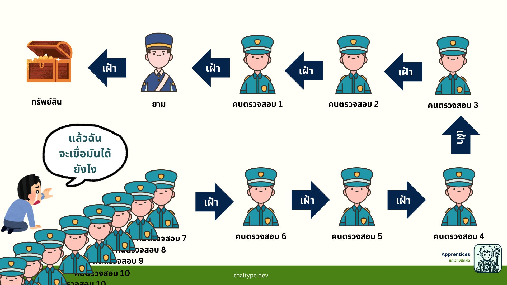

+++
title = "ใครเฝ้ายาม? แล้วใครเฝ้ายามของยาม?"
date = "2025-03-14"

[taxonomies]
categories = [ "Security" ]
tags = [ "Security", "System Design" ]

+++

ช่วงนี้กำลังออกแบบระบบ Security อยู่ ตอนแรกคิดว่าไม่น่าจะยาก แค่ต้อง **Encrypt ข้อมูลใน Vault** ก็พอ แต่พอเริ่มทำจริงๆ เจอปัญหาคลาสสิกขึ้นมาเลย

- ถ้าผม Encrypt Vault ผมต้องเก็บ **Key** ไว้ที่ไหน?
- ถ้าผมมีที่เก็บ Key ผมต้อง Encrypt มันมั้ย? แล้ว Key ของตัวที่เก็บ Key ล่ะ?
- ถ้าผมมี Key ของตัวที่เก็บ Key แล้ว ผมจะเก็บมันที่ไหน?

วนลูปไปเรื่อยๆ แบบไม่มีจุดสิ้นสุด

### ปัญหา "ใครเฝ้ายาม?"

เรื่องนี้ทำให้นึกถึงตอนเรียน Computer Security สมัยมหาลัย อาจารย์ชอบยกตัวอย่างว่า

- ถ้ามี **ทรัพย์สิน (Vault)** แล้วเราจ้าง **ยาม** มาเฝ้า
- แล้วเราต้องให้ **ยามอีกคน** มาเฝ้ายาม
- แล้วต้องมี **ยามอีกคน** เฝ้ายามของยาม
- แล้วก็ต้องมี **ยามอีกคน** เฝ้ายามของยามของยาม

แบบนี้ไปเรื่อยๆ ไม่มีที่สิ้นสุด แล้วสุดท้าย...ใครจะเฝ้าคนสุดท้าย?

### เราจะแก้ปัญหานี้ยังไง?

ใน Security เรามีหลายวิธีแก้ปัญหานี้ ขึ้นอยู่กับบริบทของระบบที่ออกแบบ

### 1. **ใช้ Root of Trust**

- ปัญหาจะจบลงเมื่อเรากำหนด "ต้นทางที่เชื่อถือได้" หรือ **Root of Trust**
- ตัวอย่างเช่น **HTTPS และ SSL/TLS Certificates** ที่มี Root Certificate Authority (CA) เป็นผู้ที่เราเชื่อถืออยู่แล้ว ทำให้ไม่มีการวนลูปของความเชื่อถือ

### 2. **ใช้ Hardware Security Module (HSM)**

- แทนที่จะเก็บ Key ไว้ในซอฟต์แวร์ที่ต้อง Encrypt ซ้ำไปมา เราใช้ **Hardware Security Module (HSM)** ที่ออกแบบให้เก็บ Key อย่างปลอดภัย
- HSM มีฟังก์ชันที่ป้องกันการเข้าถึงโดยไม่ได้รับอนุญาต และทำให้เราไม่ต้อง Encrypt ซ้ำไปซ้ำมา อย่างเช่น Azure Key Vault ก็มีบริการที่เป็น [Managed HSM Service](https://learn.microsoft.com/en-us/azure/key-vault/managed-hsm/overview?wt.mc_id=MVP_396631) ด้วยเหมือนกัน ถ้าเราโฟกัสเรื่อง Security ที่มากขึ้นก็ลองไปดูเพิ่มได้ 

### 3. **ใช้ Multi-Party Approval & Split Knowledge**

- ระบบสำคัญบางอย่างอาจใช้แนวทางให้ **หลายคนต้องอนุมัติ** ก่อนเข้าถึงข้อมูล
- ตัวอย่างเช่น **ในธนาคาร การโอนเงินที่เกินจำนวนหนึ่งจะต้องได้รับการอนุมัติจากผู้จัดการ 2 คน** ก่อนที่เงินจะถูกโอนจริง
- หรือในระบบ Security บางระบบ เราใช้ **Shamir’s Secret Sharing** เพื่อแบ่ง Key ออกเป็นหลายส่วน แล้วให้แต่ละส่วนอยู่กับคนละฝ่าย ทำให้ไม่มีใครสามารถใช้ Key ได้โดยลำพัง ซึ่ง HashiCorp Vault เองก็ใช้ [Shamir's Secret Sharing](https://developer.hashicorp.com/vault/docs/concepts/seal#shamir-seals)

### 4. **ใช้ Zero Trust Architecture**

- แทนที่จะสร้างความเชื่อถือเป็นชั้นๆ ไปเรื่อยๆ เราใช้หลัก **“เชื่อถือเป็นศูนย์” (Never Trust, Always Verify)**
- ทุกครั้งที่มีการเข้าถึงข้อมูลสำคัญ ต้องมีการตรวจสอบสิทธิ์ใหม่เสมอ ไม่ว่าจะเป็น Admin หรือ System Process ก็ตาม

### 5. **ใช้ Immutable Logging & Auditing**

- แทนที่จะมีคนเฝ้ากันไปเรื่อยๆ เราใช้ **ระบบตรวจสอบย้อนหลังที่แก้ไขไม่ได้** เช่น **Blockchain-based Audit Logs หรือ SIEM (Security Information and Event Management)**
- ตัวอย่างเช่น **ในระบบ Blockchain การแก้ไขย้อนหลังเป็นไปไม่ได้ เพราะทุกธุรกรรมต้องได้รับฉันทามติจากโหนดที่เกี่ยวข้อง**

## แนวคิดการออกแบบระบบความปลอดภัย

การเพิ่มระบความปลอดภัยของ Security **ไม่ใช่แค่การเพิ่ม Layer ไปเรื่อยๆ** แต่ควรออกแบบให้ถูกต้อง

- ถ้าเราต้องเฝ้ากันเป็นชั้นๆ โดยไม่มีจุดสิ้นสุด แสดงว่ามีบางอย่างผิดพลาดในการออกแบบ
- การสร้าง Layer ที่ซับซ้อนเกินไป อาจทำให้ระบบ **ยากต่อการดูแล และยังมีช่องโหว่จากความผิดพลาดของมนุษย์** เช่น
    - การตั้งค่าผิดพลาด
    - การจัดการ Key ที่ยุ่งยาก
    - การเปิดสิทธิ์มากเกินไปเพื่อ "ความสะดวก"

Security ที่เหมาะสมคือการ **กำหนด Root of Trust และใช้หลัก Zero Trust เพื่อไม่ต้องพึ่ง Layer ที่ซับซ้อนเกินไป** และขึ้นอยู่กับความสามารถยอมรับและความเสี่ยงของ Security ที่รับได้

## บทเรียนจากเรื่องนี้

1. **Security ที่เหมาะสมต้องมีจุดเริ่มต้นที่ชัดเจน** เช่น Root of Trust หรือ Hardware Security Module
2. **Security ควรถูกออกแบบให้เรียบง่าย** ไม่ใช่แค่เพิ่ม Layer ป้องกันที่ซับซ้อน
3. **Automation & Monitoring สำคัญกว่าการให้คนเฝ้ากันไปเรื่อยๆ** ควรใช้ Immutable Logs และ AI-Based Security Monitoring
4. **ความผิดพลาดของมนุษย์คือจุดอ่อนที่ใหญ่ที่สุดของ Security** ดังนั้น การออกแบบที่ลดการพึ่งพามนุษย์ให้มากที่สุดจะช่วยลดความเสี่ยงได้

## สุดท้าย Security ที่เหมาะสมสำหรับผม ก็คือ 

การออกแบบที่เหมาะสม ความสามารถในยอมรับจากการประเมินความเสี่ยง ทรัพยากรที่ต้องเสียไปกับการที่ทำให้ระบบแข็งแรงขึ้น มันคุ้มค่ากับของที่ต้องปกป้องมั้ย และการลดการใช้มนุษย์บางขั้นตอน อาจจะนำ AI หรือ ระบบคอมพิวเตอร์เข้ามาช่วยตรวจด้วยก็ได้

ก่อนจะจากกันประเด็นเรื่อง Security เป็นประเด็นที่ยากมากสำหรับผมที่เขียนให้แล้วไม่ถูกวิพากษ์วิจารณ์ ถ้าสิ่งที่ผมเขียนไม่ถูกต้องอย่างไร อยากให้หยิบขึ้นมาประเด็นที่ถกเถียงกันด้วยเหตุและผล ผมเป็นเพียงคนจุดประเด็นเรื่องขึ้นมาพูดคุย ถ้าจุดไหนผมกล่าวผิดไป จะหยิบนำไปปรับปรุงต่อไป

ขอบคุณที่อ่านและติดตามนะครับ 