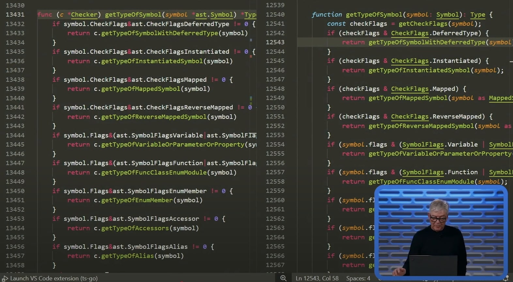

+++
title = "ทำไม Microsoft เลือก Go ในการพัฒนา TypeScript Compiler แทนที่ของเดิม"
date = "2025-03-15"

[taxonomies]
categories = [ "TypeScript" ]
tags = [ "TypeScript", "Design Choice", "tsc", "golang" ]

[extra]
id = "8odujuo"
+++

ตอนนี้เรื่อง TypeScript กำลังจะย้าย Compiler ไปใช้ Go แทน JavaScript กำลังเป็นประเด็นร้อน มีคนดังหลายคนในวงการออกมาวิเคราะห์กันเพียบ อย่าง Theo, Matt Pocock, และ Maximilian Schwarzmüller ซึ่งแน่นอนว่ามันต้องถึงเวลาของเพจ Thaitype แล้วแหละ แต่ว่าจะไม่ได้ดังอะไรขนาดนั้น 5555+ แต่เรื่องนี้น่าสนใจมากๆ 

## ทำไมไม่ใช้ Rust หรือ C#?

หลังจากที่ Microsoft ออกมาประกาศเรื่องนี้ บอกเลยว่าเกิดเสียงวิพากษ์วิจารณ์สนั่น หลายคนถามว่า "ทำไมไม่ใช้ Rust?" หรือแม้แต่ "C# ที่เป็นเรือธงของ Microsoft ทำไมไม่ใช้?" เพราะ Rust เป็นภาษาที่กำลังมาแรงโดยเฉพาะในสาย Tooling และ C# ก็เป็นภาษาที่ Microsoft ภูมิใจนำเสนอมากที่สุดอยู่แล้ว การเลือก Go ทำให้หลายคนตั้งคำถามว่ามันเหมาะสมจริงหรือไม่?

## ทำไมต้องเป็น Go?

เรื่องนี้ Anders Hejlsberg ซึ่งเป็น Co-creator ของ TypeScript และ Technical Fellow ของ Microsoft ออกมาอธิบายเหตุผลหลายข้อที่ฟังแล้วต้องบอกว่า Make sense มากๆ

### ✅ **การพัฒนาแบบ Port ไม่ใช่ Rewrite**

TypeScript Compiler เดิมเขียนด้วย JavaScript และเป้าหมายหลักของการเปลี่ยนแปลงครั้งนี้คือการ **Port** ไปยังภาษาใหม่โดยยังคง **โครงสร้างเดิม** ให้มากที่สุด เพื่อลดความเสี่ยงในการเกิด Bug และเพื่อให้การเปลี่ยนแปลงราบรื่น ซึ่ง Go มี Syntax และ Paradigm ที่ใกล้เคียง JavaScript มากที่สุดในบรรดาภาษาที่พวกเขาพิจารณา

### ✅ **Go รองรับ Garbage Collection ซึ่งจำเป็นต่อ TypeScript Compiler**

ตัว Compiler ของ TypeScript ใช้ **Cyclic Data Structures** เยอะมาก (เช่น AST Nodes มีการอ้างอิง Parent-Child ไปมา) ซึ่งเป็นปัญหาใหญ่สำหรับ Rust เพราะ Rust ไม่มี Garbage Collection โดยธรรมชาติ ถ้าจะใช้ Rust จะต้องเปลี่ยน Data Structure ใหม่ทั้งหมด ซึ่งจะทำให้การ Port กลายเป็นการ Rewrite ไปเลย

### ✅ **Rust อาจจะทำให้เร็วกว่า แต่ต้องใช้เวลานานมาก**

Microsoft ทดลองเขียน Prototype ใน Rust, Go และ C# มาแล้ว ซึ่ง Rust มีปัญหาด้านการจัดการ Memory ที่ต้องใช้ Borrow Checker ซึ่งทำให้การแปลง Code ที่เดิมเขียนแบบ Dynamic ไปเป็น Rust ยุ่งยากขึ้นหลายเท่า ถ้าจะ Rewrite ใหม่ทั้งหมดใน Rust อาจใช้เวลา "หลายปี" กว่าที่จะทำให้มันเสถียร

### ✅ **Parallelism & Shared Memory Concurrency**

Go มี **Goroutines** และรองรับ **Shared Memory Concurrency** ทำให้สามารถรันการตรวจสอบ Type ได้หลาย Process พร้อมกัน ซึ่งช่วยให้ Compiler เร็วขึ้นแบบเห็นได้ชัด ในขณะที่ JavaScript ต้องใช้ Web Workers ซึ่งไม่สามารถแชร์ Memory ได้โดยตรง ทำให้การทำ Parallel Processing มี Overhead สูงกว่า

### ✅ **Community พยายามทำ Rust TypeScript Compiler มานาน แต่ยังไม่สำเร็จ**

ก่อนหน้านี้มีโปรเจคอย่าง **stc (Speedy TypeScript Compiler)** ที่พยายามเขียน TypeScript Compiler ใหม่ด้วย Rust แต่มันไม่เคยได้รับความนิยมในวงกว้าง และไม่ได้ไปถึงจุดที่สามารถแทน TSC ตัวปัจจุบันได้ การที่ Microsoft พยายาม Port ไป Rust อาจจะเจอปัญหาแบบเดียวกันและต้องเสียเวลาไปอีกหลายปี

## แนวคิดการเลือกเครื่องมือให้เหมาะกับงาน

Anders Hejlsberg สรุปประเด็นนี้ไว้ได้ชัดเจนว่า **"นี่ไม่ใช่การเลือกภาษาที่ดีที่สุด แต่เป็นการเลือกภาษาที่เหมาะสมที่สุดกับโปรเจคนี้"** Microsoft ไม่ได้มองว่า Go ดีกว่า Rust ในทุกแง่ แต่เพราะ TypeScript Compiler เป็นโครงการที่ลงทุนมานานกว่า 10 ปี (คิดเป็น **100 man-years of investment**) การเลือกเครื่องมือที่ช่วยให้การเปลี่ยนแปลงเป็นไปอย่างราบรื่นและรวดเร็วที่สุดจึงเป็นเรื่องสำคัญกว่า

## ความเห็นส่วนตัวของผม

หลังจากศึกษาเรื่องนี้ ผมเห็นด้วยกับการตัดสินใจของทีม TypeScript มากๆ การเลือก Go มัน Make sense เพราะ:

- **มันเร็วขึ้น 10x** โดยไม่ต้อง Rewrite ใหม่ทั้งหมด
- **มันใช้เวลาพัฒนาได้เร็วกว่า Rust** ซึ่งถ้าเลือก Rust อาจต้องใช้ "หลายปี" กว่าจะเสร็จ
- **Go มี Community ที่ใหญ่และ Performance ดี** ไม่ได้เป็นภาษาแย่ๆ แต่อย่างใด

สิ่งที่ Matt Pocock พูดไว้ก็น่าสนใจ

> We're on version 5.8 now - so by the current cadence 7.0 will be around 33 months away.

คืออีก **3 ปี** กว่า TypeScript 7.0 จะพร้อมใช้จริง ถ้าพวกเขาเลือก Rust ที่ต้อง Rewrite ใหม่ทั้งหมด เราอาจต้องรอไปอีกกี่ปีกัน?

### **สรุปง่ายๆ: การเลือก Go คือการเลือกที่ดีที่สุดสำหรับตอนนี้**

แม้มันจะไม่ใช่ภาษาที่ทุกคนอยากให้ใช้ แต่ถ้ามองจากมุมมองของวิศวกรรมซอฟต์แวร์ การเลือกเครื่องมือที่ "เหมาะสมกับบริบทของโปรเจค" สำคัญกว่า

สุดท้ายแล้ว ถ้ามันเร็วขึ้น 10 เท่า และยังคงความเสถียรเหมือนเดิม ใช้ได้โดยความสามารถเท่าเดิม แค่นี้ผมก้ Happy มากๆ แล้วนะละ

## อ้างอิงต่างๆ 
- Official Post Annoucement byAnders : "A 10x Faster TypeScript": https://devblogs.microsoft.com/typescript/typescript-native-port/
- Official Video Announcement by Anders: [https://www.youtube.com/watch?v=pNlq-EVld70](https://www.youtube.com/watch?v=pNlq-EVld70)
- Anders Hejlsberg: [https://github.com/microsoft/typescript-go/discussions/411#discussioncomment-12476436](https://github.com/microsoft/typescript-go/discussions/411#discussioncomment-12476436)
-  TypeScript is being ported to Go | interview with Anders Hejlsberg: [https://www.youtube.com/watch?v=10qowKUW82U](https://www.youtube.com/watch?v=10qowKUW82U)
- Maximilian Schwarzmüller : [https://www.youtube.com/watch?v=tRiIcCOhN6A](https://www.youtube.com/watch?v=tRiIcCOhN6A)
- Theo: [https://www.youtube.com/watch?v=3-W95H5_lX0](https://www.youtube.com/watch?v=3-W95H5_lX0)
- Matt Pocock: [https://www.totaltypescript.com/typescript-announces-go-rewrite](https://www.totaltypescript.com/typescript-announces-go-rewrite)
