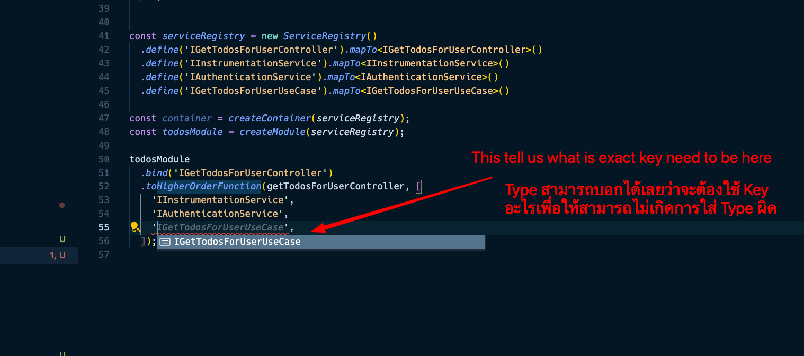

+++
title = "บันทึกการแก้ปัญหา ioctopus และการทำให้ Type-Safe ผ่าน TypeScript โดยใช้ AI"
date = "2025-03-19"

[taxonomies]
categories = [ "TypeScript" ]
tags = [
  "TypeScript",
  "ioctopus",
  "DI",
  "AI",
  "Type-Safe",
  "inversify"
]

[extra]
id = "ud63sjg"
+++


## แรงจูงใจ: ทำไมถึงอยากใช้ ioctopus?

ช่วงที่ทำระบบ Dependency Injection (DI) ต้องการหา Runtime Agnostic Library ที่รองรับ Edge Runtime ของ Vercel หรือ Runtime อื่นๆ ได้ โดยที่ไม่ต้องใช้ [Reflection API](https://www.npmjs.com/package/reflect-metadata) ซึ่งเป็นข้อจำกัดของ [Inversify](https://github.com/inversify/InversifyJS) ทำให้ได้ลองใช้ [@evyweb/ioctopus](https://github.com/Evyweb/ioctopus) ซึ่งถูกออกแบบมาเพื่อลดความซับซ้อนและช่วยให้โค้ดสะอาดขึ้น 

> version ของ @evyweb/ioctopus ณ ตอนนี้เป็นเวอร์ชั่น 1.2.0

จริงๆ ไม่ใช่เฉพาะ Inversify นะ พวก DI ดังๆ อย่าง [Tsyringe](https://github.com/microsoft/tsyringe), [Typedi](https://github.com/typestack/typedi) เองก็มีปัญหาเดียวกัน ที่ไม่สามารถใช้งานได้บน Edge Runtime ได้ สามารถไปดูจากวิดิโอและ github ของทางผู้สร้าง from [YouTube](https://www.youtube.com/watch?v=Yliaah4oiZY) และ [Next.js Clean Architecture PR](https://github.com/nikolovlazar/nextjs-clean-architecture/pull/11)

อ่านเพิ่มเติมเรื่อง Refection API ได้ที่นี่นะ [TypeScript’s Reflect Metadata: What it is and How to Use it](https://blog.bitsrc.io/typescripts-reflect-metadata-what-it-is-and-how-to-use-it-fb7b19cfc7e2)


โดยปกติแล้ว ioctopus มีการใช้งานดังนี้:

```ts
export type CurriedFunctionWithDependencies = (name: string) => string;
export const curriedFunctionWithDependencies =
    (dep1: string): CurriedFunctionWithDependencies => (name: string) => `Hello ${name} with ${dep1}`;


// Step 1: สร้าง DI เป็น Symbol
export const DI: InjectionTokens = {
    DEP1: Symbol('DEP1'),
    DEP2: Symbol('DEP2'),
    HIGHER_ORDER_FUNCTION_WITH_DEPENDENCIES: Symbol('HIGHER_ORDER_FUNCTION_WITH_DEPENDENCIES'),
};

// Step 2: สร้าง Container
const container = createContainer();

// Step 3: เริ่มผูกความสัมพันธ์ของ Dependencies ว่าแต่ละ Dependencies จะไปหาในไหน
container.bind(DI.DEP1).toValue('dependency1');
container.bind(DI.DEP2).toValue(42);
container.bind('CURRIED_FUNCTION_WITH_DEPENDENCIES')
  .toCurry(curriedFunctionWithDependencies, [DI.DEP1]);

// Step 4: ใช้งาน Dependencies ผ่าน Container 
// ตรงนี้เราจะได้ Data จาก Dependencies ที่ผูกไว้ก่อนหน้า และเอาไปใช้งานได้จริง
const myService = container.get<MyServiceInterface>(DI.HIGHER_ORDER_FUNCTION_WITH_DEPENDENCIES);
```

แต่ปัญหาของ [@evyweb/ioctopus](https://github.com/Evyweb/ioctopus) พบว่าเราไม่สามารถทำให้เกิด Type Safety ได้เลย
เพราะไม่ว่าเราจะ Bind หรือตอนที่เราใช้ `toCurry` ใน dependencies เราใส่ Symbol แต่เราต้องใส่อะไรเข้าไปบ้าง ไม่มีการระบุ Type ของ Dependencies ที่เราใช้งาน ดังนั้นใน [@thaitype/ioctopus](https://github.com/thaitype/ioctopus/pull/2/file)

โดยที่มีเป้าหมายให้ Type-safety โดย จะเปลี่ยนเป็น

```ts
// Step 1: สร้าง serivceRegistry และกำหนด Type ของแต่ละ Dependencies โดยที่ไม่ต้องสร้าง Symbol เอง เพราะ serviceRegistry จะทำการ Map ให้เอง
export const serviceRegistry = new ServiceRegistry()
    .define('DEP1').mapTo<string>()
    .define('DEP2').mapTo<number>()
    .define('CURRIED_FUNCTION_WITH_DEPENDENCIES').mapTo<CurriedFunctionWithDependencies>()

// Step 2: สร้าง Container โดยที่รับ serviceRegistry เข้าไป
const container = createContainer(serviceRegistry);
container.bind('DEP1').toValue('dependency1');
container.bind('DEP2').toValue(42);
container.bind('CURRIED_FUNCTION_WITH_DEPENDENCIES')
  .toCurry(curriedFunctionWithDependencies, ['DEP1']);

// Step 3: ใช้งาน Dependencies ผ่าน Container 
const myService = container.get('CURRIED_FUNCTION_WITH_DEPENDENCIES');
```

ถ้าสังเกตุจากโค๊ด เราจะเห็นว่าเราไม่ต้องมี `DI` object แล้ว และเราสามารถกำหนด Type ของ Dependencies ได้ใน `serviceRegistry` และเราสามารถใช้งาน Dependencies ได้ผ่าน `container.get` โดยที่ไม่ต้องใช้ Symbol อีกต่อไป และเราจะรู้เลยว่าเราใส่ค่าถูกต้องหรือไม่ เพราะมันจะบอก Type ให้เราทันที

เช่น ตอนที่เราใช้แบบนี้ มันจะ Error เพราะว่า `curriedFunctionWithDependencies` ต้องการ DEP1 เป็น string แต่เราใส่เป็น number
```ts
container.bind('CURRIED_FUNCTION_WITH_DEPENDENCIES')
  .toCurry(curriedFunctionWithDependencies, ['DEP2']);
```

> หมายเหตุ: ณ เวลาที่เขียน function `toCurry` ใน @thaitype/ioctopus ยังบอก type ผิดอยู่ แต่ถ้าใช้ `toHigherOrderFunction` จะบอก Type ถูก เดี๋ยวจะแก้อีกทีนะ

ตัวอย่าง Type-safety



## กลับมาที่โจทย์ของวันนี้กัน

เนื่องจากอาจจะตามกันไม่ทัน สามารถไปดูตัวอย่างโค๊ดเต็มๆ ได้ที่นี่ <https://github.com/thaitype/ioctopus/pull/2/files>

คือการเปลี่ยนโค้ดจาก:

```ts
const myService = container.get<MyServiceInterface>(
    serviceRegistry.get('HIGHER_ORDER_FUNCTION_WITH_DEPENDENCIES')
);
```

มาเป็นรูปแบบที่อ่านง่ายขึ้นแบบนี้ และ Type-safe โดยรับแค่ key ของ serviceRegistry มาเท่านั้น:

```ts
const myService = container.get('HIGHER_ORDER_FUNCTION_WITH_DEPENDENCIES');
```

เพราะ `createContainer(serviceRegistry)` ได้รับ serviceRegistry อยู่แล้ว เลยไม่จำเป็นต้อง `serviceRegistry.get(...)` ก่อนเรียก `container.get(...)`

และเพื่อให้เห็นภาพมากขึ้นเราลองมาดูตัวอย่างโค๊ดกัน 

```ts
export function createContainer<Services extends Record<string, unknown> = {}>(
    serviceRegistry: ServiceRegistry<Services>
): Container<Services> {
    // 📌 A
    console.log('serviceRegistry (before get):', serviceRegistry.keyMap);
    // ...
    const get = <T>(dependency: DependencyKeyType<Services>): T => {
        // 📌 B
        console.log('serviceRegistry (after get):', serviceRegistry.keyMap);
        const dependencyKey = serviceRegistry.get(dependency);
        if(!dependencyKey) {
            throw new Error(`No key found for dependency: ${dependencyKey}`);
        }
       
       // ...
    }
    // ...
    return { get };
}
```

🔥 ปัญหาที่เจอ: Unit Test ไม่ผ่าน เพราะ `serviceRegistry.get(...)` คืนค่า undefined

> ป.ล. ใน Class ServiceRegistry จะมี field ที่ชื่อ keyMap ที่เก็บ key ของ service ทั้งหมดไว้ ดูที่โค๊ด <https://github.com/thaitype/ioctopus/blob/master.type-safe.container-get-type-safe/src/service-registry.ts#L2>

หลังจากเปลี่ยนโค้ดและรัน Unit Test บน Jest / Vitest กลับพบว่า:
 - `serviceRegistry.keyMap` ตอนเริ่มต้น มีค่า (ตรง 📌 A)
 - แต่ตอน `get(...)` ค่า `serviceRegistry.get(dependency)` กลับ `undefined` (ตรง 📌 B)
 - ทำให้เกิด Error:

```
Error: No key found for dependency: undefined
```

ตอนแรก คิดว่าเป็นปัญหาจาก Jest / Vitest Runtime เพราะใน AI ก็บอกมาแบบนั้น แต่เมื่อไปรันบน Node.js ตรงๆ กลับพบว่า ไม่เกี่ยวเลย! จากที่เคยเข้าใจว่า 

> แต่ตอน get(...) ค่า serviceRegistry.get(dependency) กลับ undefined (ตรง 📌 B)

เราดันไปเข้าใจว่า `serviceRegistry.keyMap` มันเป็น object ว่าง เกิดจาที่ AI บอกว่า serviceRegistry มากกว่าหนึ่งตัว แต่จริงๆ แล้วมันมีแค่ตัวเดียว และเราก็ไม่ได้มีปัญหาเรื่อง Duplicate Imports หรือ Circular Dependency ด้วย

ปัญหาที่แท้จริงคือ container เรียก `get(...)` หลายรอบ โดยที่ไม่ได้เข้าใจกลไกของโค๊ดทั้งหมด และในการเรียกซ้ำ มันใช้ Symbol ที่ resolve มาแล้วแทน String Key เดิม ซึ่งทำให้ `serviceRegistry.get(...)` ไม่สามารถหา Symbol ได้ เพราะใน serviceRegistry มันเก็บเป็น String Key ไม่ใช่ Symbol ของ Key

## จุดที่เข้าใจผิด: คิดว่าปัญหาคือ serviceRegistry ถูกสร้างซ้ำ

ช่วงแรกมั่นใจมากว่า ปัญหาคือมี serviceRegistry มากกว่าหนึ่งตัว เพราะ AI (GPT-4 o1) พยายามตอบไปในทางนั้นซ้ำๆ ว่า:

> “Ensure every place references the same instance (imported from a single path, with no duplicates or circular imports).”

แต่จริงๆ แล้ว:
 - serviceRegistry ถูกสร้าง แค่ครั้งเดียว
 - ไม่มีปัญหาเรื่อง Duplicate Imports
 - ไม่มีปัญหาเรื่อง Circular Dependency

ซึ่งทำให้เสียเวลามากกว่าที่ควรจะเป็น เพราะต้องคุยกับ AI หลาย Prompt จนกว่ามันจะเสนอคำตอบอื่นที่ใกล้เคียงกับปัญหาจริง

## จุดที่เจอหลังรันบน Node.js

หลังจากลอง Debug บน Node.js โดยไม่ผ่าน Jest / Vitest ก็พบว่า:

1.	ตอน `get(...)` ครั้งแรก: `container.get('DEP1');`
    - ระบบเอา `"DEP1"` ไปหา `Symbol(‘DEP1’)` จาก serviceRegistry.keyMap

2.	แต่พอ `get(...)` ครั้งต่อมา: `container.get(Symbol('DEP1'));`

    - มันใช้ `Symbol(‘DEP1’)` ที่ได้มาแล้ว ไปหาใน `serviceRegistry.keyMap`
    - แต่ `keyMap` เก็บเป็น `String Key (“DEP1”)` ไม่ใช่ Symbol Key
    - เลยหาไม่เจอ ทำให้ `serviceRegistry.get(...)` คืนค่า undefined

## วิธีแก้: ใช้ฟังก์ชัน resolveDependencyKey(...)

เพื่อแก้ปัญหานี้ จึงเพิ่มฟังก์ชัน resolveDependencyKey(...) ขึ้นมา เพื่อให้แน่ใจว่า ทุกครั้งที่เรียก get(...) จะใช้ String Key ก่อนเสมอ:

```ts
export function createContainer<Services extends Record<string, unknown> = {}>(
    serviceRegistry: ServiceRegistry<Services>
): Container<Services> {
    // ... 
    const resolveDependencyKey = (dependency: DependencyKeyType<Services>) => {
        let dependencyKey: symbol | undefined;

        if (typeof dependency === 'symbol') {
            // ถ้าเป็น Symbol อยู่แล้ว ใช้ไปเลย
            dependencyKey = dependency;
        } else {
            // ถ้าเป็น String ให้ Lookup จาก serviceRegistry ก่อน
            dependencyKey = serviceRegistry.get(dependency);
        }

        return dependencyKey;
    };
    

    const get = <T>(dependency: DependencyKeyType<Services>): T => {
        const dependencyKey = resolveDependencyKey(dependency);
        if (!dependencyKey) {
            throw new Error(`No key found for dependency: ${dependency.toString()}`);
        }
        // ... 
    };
}
```

### ผลลัพธ์หลังแก้ไข:
 - ไม่ว่า `container.get(...)` จะถูกเรียกด้วย String หรือ Symbol ก็ทำงานได้ถูกต้อง
 - `serviceRegistry.get(...)` ไม่คืนค่า undefined อีกแล้ว
 - Unit Test ผ่าน ✅

## บทเรียนจากการใช้ AI Model GPT-4 o1
1.	AI บางครั้งมั่นใจเกินไป
    - Model พยายามตอบว่า “มี serviceRegistry ซ้ำกัน” ถึง 10 ครั้ง ซึ่งเป็น สมมติฐานผิด
    - ต้องกดดัน AI ด้วยหลาย Prompt จนกว่ามันจะให้คำตอบที่ต่างออกไป
2.	ต้อง Debug ข้อมูลเอง อย่าเชื่อ AI 100%
    - AI วิเคราะห์ปัญหาได้ดีในหลายกรณี แต่ก็พลาดง่ายๆ ในจุดที่ มนุษย์ คิดออกทันที
    - ใช้ AI เป็น เครื่องมือช่วยคิด ไม่ใช่ เครื่องมือคิดแทน
3.	อย่าหลงประเด็นของ AI นานเกินไป
    - ถ้า AI ตอบแนวเดิมซ้ำๆ ลอง หยุดเชื่อ AI แล้วกลับมาไล่โค้ดเอง
    - ในเคสนี้ AI ย้ำเรื่อง Multiple Instances ทั้งที่ปัญหาจริงคือ Key Type Mismatch

## สรุป

การตั้งสมมติฐานควรตั้งอย่างใจเย็น ค่อยๆ ลดความเป็นไปได้ลง อย่าเชื่อ AI เยอะ แม้ว่าจะเป็น Model ที่ฉลาดๆ อย่าง o1 ก็ตาม
เพราะบริบทที่เข้าใจของ AI อาจจะไม่ตรงกับบริบทที่เราเข้าใจ และอาจจะทำให้เสียเวลาไปมากกว่าที่ควรจะเป็น

ถ้าใครเคยเจอปัญหาแนวนี้ มาแชร์กันได้ในคอมเมนต์เลยครับ 
