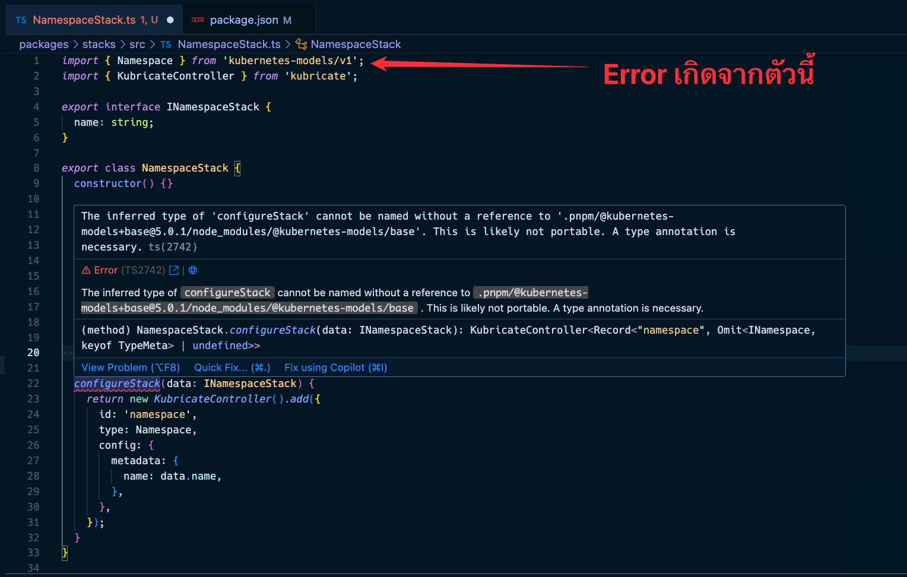

+++
title = "เจอปัญหา Error Type ของ TypeScript แบบแปลก ๆ เพราะไม่ได้ติดตั้ง dependency?"
date = "2025-03-27"

[taxonomies]
categories = [ "TypeScript" ]
tags = [ "TypeScript" ]

[extra]
id = "67b3z7y"
+++


ช่วงนี้ผมกำลังทำ npm package สำหรับจัดการ stack ต่าง ๆ ใน Kubernetes โดยใช้ไลบรารี `kubernetes-models` ร่วมกับระบบ controller ที่ผมเขียนเองชื่อว่า `kubricate` ซึ่งทุกอย่างดูจะโอเคดี แต่พอเขียนเป็น class และมี method ที่เรียกใช้ `new KubricateController().add(...)` แล้วคืนค่าออกมา TypeScript ก็เริ่มร้อง

---

## ปัญหาที่เจอ

ตัวอย่างจากรูปเลยนะ



TypeScript แจ้งว่า:

> The inferred type of configureStack cannot be named without a reference to `.pnpm/@kubernetes-models+base@5.0.1/node_modules/@kubernetes-models/base` . This is likely not portable. A type annotation is necessary.

ในตอนแรก ผมงงมาก เพราะผมไม่ได้ import `@kubernetes-models/base` โดยตรง แต่ใช้แค่ `kubernetes-models` ที่ดูเหมือนจะครบแล้ว ทำให้ TypeScript ไม่สามารถ resolve type ได้แบบ portable และคิดว่ามันอาจจะมีปัญหาเวลาใช้งานข้ามโปรเจกต์หรือ publish เป็น package

ผมลองแก้หลายแบบ:

- ใส่ return type ด้วย `ReturnType<...>` ก็ทำให้ type หาย ไม่ตรงกับที่ต้องการ
- แยก method ออกมาเป็นฟังก์ชันข้างนอก class ก็ยังไม่ได้
- เปลี่ยนเป็น static method ก็ยังเจอ error เดิม

สุดท้ายสิ่งที่เวิร์กที่สุดกลับง่ายกว่าที่คิด

---

## วิธีที่แก้ได้จริง

หลังจากสังเกตข้อความดี ๆ จาก Error: มันมีการพูดถึง package ตัวนึงที่ไม่คุ้นเคยเลย `@kubernetes-models/base`

ผมเริ่มสงสัยว่ามันพยายามจะ reference ไปที่ `@kubernetes-models/base` โดยตรง ซึ่ง TypeScript ใช้ในการ resolve ชนิดของ object ที่ return ออกมา แต่พอลองเข้าไปเช็กจริง ๆ ใน `node_modules` กลับไม่เจอ path นี้อยู่เลย

ตรงนี้ทำให้แน่ใจว่า package `@kubernetes-models/base` ไม่ได้ถูกติดตั้งอยู่ในระบบจริง ๆ แม้ว่า `kubernetes-models` จะใช้งานได้ก็ตาม พอเพิ่ม dependency ที่ขาดหายไปเข้าไปให้ครบ ก็ไม่มีปัญหาอีกต่อไป

ผมลองติดตั้ง `@kubernetes-models/base` โดยตรงเพิ่มเข้าไปในโปรเจกต์ด้วยคำสั่ง:

```bash
pnpm add @kubernetes-models/base
```

ทันทีที่ติดตั้งเสร็จ TypeScript ก็หยุดร้อง ไม่มี error ใด ๆ อีกเลย ทั้ง ๆ ที่ผมไม่ได้ใช้ @kubernetes-models/base โดยตรงในไฟล์นั้นด้วยซ้ำ

## สรุป
ปัญหานี้เกิดจาก TypeScript พยายาม infer ชนิดของค่าที่ได้จากไลบรารี ซึ่งเบื้องหลังจริง ๆ แล้วไปอิง type ที่อยู่ใน @kubernetes-models/base แต่เราไม่ได้ติดตั้งไว้ มันเลยโยน warning ว่า type ไม่สามารถใช้งานแบบ portable ได้

ถ้าใครเจอปัญหาคล้าย ๆ กัน โดยเฉพาะเวลาใช้ไลบรารีที่มี dependency ซ้อนกันหลายชั้น และ TypeScript เริ่มพูดถึง inferred type แบบ "cannot be named without a reference..." ให้ลองเช็กดูว่าไลบรารีที่เกี่ยวข้องจริง ๆ ถูกติดตั้งไว้หรือยัง

การติดตั้งไลบรารีที่ขาดหายไปอาจเป็นวิธีที่ง่ายที่สุดและถูกต้องที่สุดในการแก้ปัญหาแบบนี้

> ป.ล. ปัญหานี้ไปถาม GPT ละ มันก็ตอบไม่ได้เหมือนกัน 555 เลยเอามาเขียนเป็นบทความ น่าจะเป็นประโยชน์กับใครที่เจอปัญหาเดียวกัน

ไปละ บุย