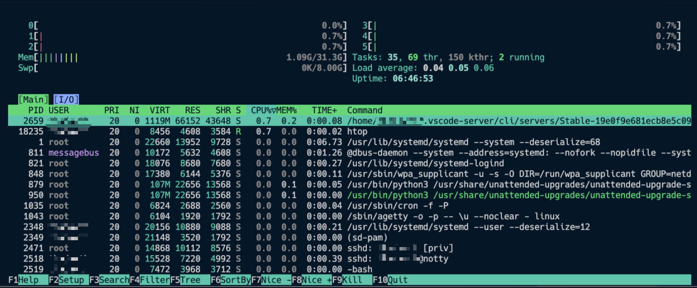
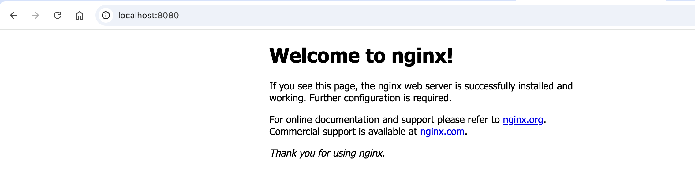

+++
title = "บันทึการติดตั้ง Kubernetes Cluster ด้วย RKE2 ฉบับ Homelab"
date = "2025-05-12"

[taxonomies]
categories = [ "Kubernetes" ]
tags = [ "Kubernetes", "ubuntu" ]

[extra]
id = "24gzuld"
+++

## แนะนำ Homelab และเป้าหมายของระบบ

เริ่มจาก…มีเครื่อง PC วางทิ้งไว้ 2 ปี
ตอนแรกตั้งใจจะเอามาเล่นเกม เพราะมีการ์ดจอ AMD RX6600, CPU AMD 6 Core, RAM 32GB แบบสเปกดีอยู่นะ
แต่สุดท้ายก็ไม่ได้เล่นสักที... กลายเป็นโต๊ะวางฝุ่นไปเฉย 😅

คิดไปคิดมา...ไหน ๆ ก็ไม่ได้เล่นเกมละ งั้นเอามาทำ Homelab ละกัน
เสียดายอย่างเดียวคือ License Windows 11 หายจ้อย เพราะจำ Key ไม่ได้แล้ว 5555


ผมไม่ค่อยได้ Setup Linux Server เท่าไหร่ ถ้าผมเขียนผมตรงไหน ฝากรบกวนแนะนำด้วยนะครับ


นี่ดูสิ Spec เหลือๆ 


### ทำไมเลือกใช้ RKE2?

จริง ๆ ตัวเลือกมันก็เยอะนะ ไม่ว่าจะเป็น:

* `kubeadm` แบบคลาสสิก
* `k3s` ที่เบาแต่บางอย่างก็ตัดทิ้งไปเยอะ
* หรือจะ `microk8s`, `kind`, `minikube` ก็มีนะ แต่ไม่ได้เลือกวันนี้

แต่สุดท้ายเลือก RKE2 เพราะ...

💡 มันคือ Kubernetes ที่:

* มี **ทุกอย่างแบบ production-grade**
* ใช้งานง่ายกว่า `kubeadm` เยอะ
* มี binary เดียวติดตั้งแล้วจบ
* ใช้ `containerd` ไม่ผูกกับ Docker
* มี bundled etcd, kubelet, scheduler มาให้ครบ
* และสำคัญสุดคือ... **ไม่ต้องผูกกับ Rancher UI ก็ใช้ได้**

แถม RKE2 ก็เป็นของ Rancher (SUSE) เหมือนกับ `k3s` นั่นแหละ

แต่ตัวนี้ **เน้น production + HA จริงจังมากกว่า**

แต่ก็นะ Spec เหลือๆ จะใช้ k3s ก็ดูถูก Spec ไปหน่อย 555 เลยลองอันที่น่าจะเอาไปใช้งานจริงได้ด้วยดีกว่า

### ทำไมต้องแยก Disk ด้วย LVM?

เวลาทำ Homelab หลายคนชอบลง ๆ ไว้ใน `/` หมดเลย
แต่พอทำจริง จะรู้เลยว่า:

* etcd กับ container runtime (containerd) มัน write เยอะมาก
* log ก็พุ่ง
* disk เต็ม → cluster พัง
* หรือจะ move/backup volume ทีนึงก็ลำบาก

เราเลยเลือกใช้ **LVM เพื่อจัดการ disk แบบยืดหยุ่น**

* แยก disk path `/var/lib`, `/opt/kube-data` ออกจากกัน
* เอา `/var/lib` ไปอยู่ SSD เพื่อให้ etcd/containerd เร็ว
* ทำ snapshot, resize, หรือย้าย path ได้ภายหลัง
* และแยก HDD อีกตัวไว้สำรอง/เก็บ log

### เป้าหมายของระบบนี้

เราอยากให้ Homelab ตัวนี้…

* ✅ ใช้ได้แบบ **production จริง** (run workload จริงได้)
* ✅ **Scale** ได้ในอนาคต (เพิ่ม Node ก็ได้)
* ✅ **ไม่ผูกกับ distro** ใด ๆ เช่น Rancher UI, k3s-only path
* ✅ เข้าใจว่าอะไรอยู่ตรงไหน ควบคุมได้เองหมด
* ✅ พร้อมใช้กับ Helm, Longhorn, GitOps, Monitoring ได้หมด

พูดง่าย ๆ คือมันจะเป็น “kube cluster ที่ไว้ใจได้”

เอาไว้ลองของจริงก่อนเอาไปใช้กับ production ข้างนอก

## วางแผนจัดการ Disk / Volume ให้พร้อมสำหรับ Kubernetes

ก่อนจะลง RKE2 ผมก็มานั่งคิดว่า...
ไหน ๆ ก็มี disk เยอะ ทำไมไม่จัดให้มันดีไปเลยตั้งแต่ต้น?

เครื่องที่ใช้มีทั้ง SSD และ HDD อยู่ในเครื่องเดียว:

* **SSD (NVMe 1TB)** → ใช้ทำงานเร็ว ๆ เช่น OS, Database, PVC ที่ต้องการ IOPS
* **HDD (2TB)** → ใช้เก็บ log, สำรองข้อมูล, ของที่ไม่ต้องอ่านเร็ว

พอรวมกับ LVM แล้ว เราก็จัดโครงสร้าง storage ได้แบบนี้เลย 👇

### SSD (NVMe): สำหรับ K8s Core และ Data ที่ต้องการความเร็ว

| Mountpoint       | ใช้ทำอะไร                                 | Volume      |
| ---------------- | --------------------------------------- | ----------- |
| `/`              | ตัว OS Ubuntu                            | `ubuntu-lv` |
| `/var/lib`       | เก็บ state ของ containerd, etcd, kubelet | `varlib`    |
| `/opt/kube-data` | สำหรับ PVC แบบเร็ว เช่น PostgreSQL, Redis   | `kubedata`  |

### HDD: สำหรับงานสำรอง / Log / Cold Storage

| Mountpoint                       | ใช้ทำอะไร                       | หมายเหตุ           |
| -------------------------------- | ----------------------------- | ----------------- |
| `/mnt/storage-hdd`               | สำรองข้อมูล, log, rsync snapshot | จาก `/dev/sda2`   |
| `/mnt/storage-hdd2` *(optional)* | สำรอง metadata หรือ media file  | `/dev/sda3` ถ้าว่าง |

### Logical Volume ที่สร้างด้วย LVM

| LV Name    | Mountpoint       | ใช้ทำอะไร                             |
| ---------- | ---------------- | ----------------------------------- |
| `root`     | `/`              | ระบบ OS                             |
| `varlib`   | `/var/lib`       | ส่วนที่ K8s ใช้หลัก ๆ (etcd, containerd) |
| `kubedata` | `/opt/kube-data` | PVC สำหรับ Database / Log เร็ว ๆ       |

### หลักการออกแบบ Volume ง่าย ๆ

ผมคิดไว้ว่า...

* ไม่อยากให้ K8s ใช้ path แบบ `rancher/`, `k3s/` หรืออะไรที่ "ผูกกับ distro"
* อยากตั้งชื่อ path แบบกลาง ๆ เช่น `/opt/kube-data` หรือ `/var/lib` ที่ควบคุมเองได้
* เวลาอยากย้าย cluster ก็แค่ย้าย folder หรือ LV ไปเท่านั้น

แถมด้วยข้อดีของ LVM:

* Resize ได้ง่าย
* Snap ได้
* แยก log / etcd ออกจากกันไม่ให้ disk เต็มรวมหัวกัน

### ตัวอย่าง Use Case จริง ๆ

| งาน                         | Path                       | ประเภท Storage |
| --------------------------- | -------------------------- | -------------- |
| etcd, containerd, kubelet   | `/var/lib`                 | SSD (เร็วมาก)   |
| PostgreSQL / Redis PVC      | `/opt/kube-data/postgres`  | SSD            |
| Media uploads / backup logs | `/mnt/storage-hdd/uploads` | HDD            |
| สำรอง snapshot               | `/mnt/storage-hdd/backup`  | HDD            |

ต่อจากนี้ก็จะเริ่มสร้าง LV, mount, format และเตรียมไว้ให้ RKE2 ใช้งานได้เลย


## ลงมือจัดการ LVM แยก Disk ให้ K8s ใช้งานได้ยาว ๆ 🚀

หลังจากลง Ubuntu 24.04 LTS เสร็จ ผมก็เช็คสเปกพื้นฐานก่อนด้วยคำสั่ง `lsb_release -a` กับ `uname -a`
เพื่อให้แน่ใจว่า kernel ใหม่ ๆ พร้อมใช้งาน และรองรับระบบ LVM กับ container runtime ได้ดี

```bash
$ lsb_release -a
Distributor ID: Ubuntu
Description:    Ubuntu 24.04.2 LTS
...
$ uname -a
Linux XXXX 6.8.0-59-generic ...
```

ที่ผมติดตั้งมาใช้ LVM แบบอัตโนมัติเรียบร้อย
เพราะอยากให้จัดการ Disk ได้ง่ายขึ้น โดยไม่ต้อง Format ใหม่ทุกครั้งที่อยากเพิ่ม volume

### เช็คโครงสร้าง disk ที่มีอยู่ก่อน

```bash
$ lsblk
NAME                      MAJ:MIN RM   SIZE RO TYPE MOUNTPOINTS
sda                         8:0    0   1.8T  0 disk 
├─sda1                      8:1    0    16M  0 part 
├─sda2                      8:2    0 886.4G  0 part 
└─sda3                      8:3    0 976.6G  0 part 
nvme0n1                   259:0    0 931.5G  0 disk 
├─nvme0n1p1               259:1    0     1G  0 part /boot/efi
├─nvme0n1p2               259:2    0     2G  0 part /boot
└─nvme0n1p3               259:3    0 928.5G  0 part 
  └─ubuntu--vg-ubuntu--lv 252:0    0   100G  0 lvm  /
```

จะเห็นว่า:

* มี SSD (nvme0n1) ขนาด \~1TB แบ่งเป็น 3 พาร์ติชัน ใช้ LVM อยู่แล้ว
* และมี HDD (sda) อีก 2 พาร์ติชันใหญ่ ๆ รวมประมาณ 1.8TB

ในตอนแรก root (`/`) ถูก mount ไว้ที่ LV ชื่อ `ubuntu-lv` ขนาด 100GB
และ volume group ชื่อ `ubuntu-vg` ยังเหลืออีกเพียบ! ประมาณ 828GB 😍

ก่อนจะเริ่มแบ่งพื้นที่จริง เรามาสำรวจ Volume Group ที่ Ubuntu ติดตั้งให้อัตโนมัติไว้ก่อน

```bash
$ sudo vgdisplay

  --- Volume group ---
  VG Name               ubuntu-vg
  Format                lvm2
  VG Access             read/write
  VG Status             resizable
  VG Size               928.46 GiB
  Alloc PE / Size       25600 / 100.00 GiB
  Free  PE / Size       212085 / 828.46 GiB
```

จากผลคำสั่ง vgdisplay จะเห็นว่า Ubuntu ติดตั้งมาแบบใช้ LVM ให้เรียบร้อยแล้ว
โดยมี Volume Group ชื่อ ubuntu-vg ขนาดรวมประมาณ 928GB

ตอนนี้ใช้ไปแค่ 100GB สำหรับ / เท่านั้นเอง
พื้นที่ที่เหลือยังมีอีกเกือบ 830GB แบบ resizable ด้วย
แปลว่าเราสามารถสร้าง Logical Volume เพิ่มได้อีกสบาย ๆ 🎉

### มาเริ่มสร้าง LVM เพิ่มกันเลย 🎉

เป้าหมายคือ...

| Mountpoint       | ขนาด  | ใช้ทำอะไร                           |
| ---------------- | ----- | --------------------------------- |
| `/var/lib`       | 100GB | เก็บ state ของ containerd ฯลฯ      |
| `/opt/kube-data` | 200GB | PVC / database / log ที่ต้องการ IOPS |

```bash
sudo lvcreate -n varlib -L 100G ubuntu-vg
sudo lvcreate -n kubedata -L 200G ubuntu-vg
```

### Format + Mount ทีละจุด

```bash
# Format
sudo mkfs.ext4 /dev/ubuntu-vg/varlib
sudo mkfs.ext4 /dev/ubuntu-vg/kubedata

# เตรียมโฟลเดอร์ mount
sudo mkdir -p /mnt/varlib /opt/kube-data

# mount ชั่วคราวเพื่อย้ายของใน /var/lib
sudo mount /dev/ubuntu-vg/varlib /mnt/varlib
sudo cp -a /var/lib/* /mnt/varlib/

# เปลี่ยนตัวจริง
sudo mv /var/lib /var/lib.bak
sudo mkdir /var/lib
sudo mount /dev/ubuntu-vg/varlib /var/lib
```

จากนั้นเพิ่มเข้า `/etc/fstab` เพื่อให้ system mount ให้อัตโนมัติหลัง reboot:

```bash
echo '/dev/ubuntu-vg/varlib /var/lib ext4 defaults 0 2' | sudo tee -a /etc/fstab
echo '/dev/ubuntu-vg/kubedata /opt/kube-data ext4 defaults 0 2' | sudo tee -a /etc/fstab
```

### จัดพื้นที่ backup บน HDD

ต่อไปเราจะเตรียม `/mnt/storage-hdd` สำหรับสำรอง log หรือ DB snapshot ต่าง ๆ

```bash
sudo mkfs.ext4 /dev/sda2
sudo mkdir -p /mnt/storage-hdd
sudo mount /dev/sda2 /mnt/storage-hdd
echo '/dev/sda2 /mnt/storage-hdd ext4 defaults 0 2' | sudo tee -a /etc/fstab
```

### เช็คสถานะหลัง mount

```bash
mount | grep -E '/var/lib|/opt/kube-data|/mnt/storage-hdd'
```

จะได้เห็นว่า:

* `/var/lib` ใช้ `varlib` จาก SSD แล้วจริง ๆ
* `/opt/kube-data` พร้อมใช้งาน
* `/mnt/storage-hdd` พร้อมสำรอง log แล้ว

### สรุป Logical Volume ที่มีตอนนี้

```bash
$ sudo lvs
LV        VG         LSize
ubuntu-lv ubuntu-vg  100.00g  (สำหรับ /)
varlib    ubuntu-vg  100.00g  (สำหรับ /var/lib)
kubedata  ubuntu-vg  200.00g  (สำหรับ /opt/kube-data)
```

และยังเหลือพื้นที่ใน VG (`ubuntu-vg`) อีกประมาณ **528GB**
เอาไว้ขยายในอนาคตได้อีก

ดู mountpoint ด้วย:

```bash
$ lsblk -o NAME,SIZE,FSTYPE,MOUNTPOINT,LABEL

NAME                        SIZE FSTYPE      MOUNTPOINT       LABEL
sda                         1.8T                              
├─sda1                       16M                              
├─sda2                    886.4G ext4        /mnt/storage-hdd 
└─sda3                    976.6G ntfs                         Entertain
nvme0n1                   931.5G                              
├─nvme0n1p1                   1G vfat        /boot/efi        
├─nvme0n1p2                   2G ext4        /boot            
└─nvme0n1p3               928.5G LVM2_member                  
  ├─ubuntu--vg-ubuntu--lv   100G ext4        /                
  ├─ubuntu--vg-varlib       100G ext4        /var/lib         
  └─ubuntu--vg-kubedata     200G ext4        /opt/kube-data   
```

จากนั้นก็ ทดสอบ reboot สักรอบ แล้วเช็คว่า mount ถูกต้อง

```bash
$ mount | grep -E '/var/lib|/opt/kube-data|/mnt/storage-hdd'
/dev/mapper/ubuntu--vg-kubedata on /opt/kube-data type ext4 (rw,relatime)
/dev/mapper/ubuntu--vg-varlib on /var/lib type ext4 (rw,relatime)
/dev/sda2 on /mnt/storage-hdd type ext4 (rw,relatime)
```
จะเห็นว่า mount ถูกต้องตามที่เราตั้งใจไว้

## ติดตั้ง RKE2 บน Ubuntu

ต่อไปเราจะติดตั้ง RKE2 บน Ubuntu 24.04 LTS

### 1. ติดตั้ง Binary ของ RKE2

RKE2 ใช้ installer ตัวเดียวจบเลย ไม่ต้องแยกลง kubelet, etcd อะไรให้วุ่นวาย
แค่รันคำสั่งนี้ก็พร้อมติดตั้งทุกอย่าง

```bash
curl -sfL https://get.rke2.io | sudo sh -
```

ระบบจะโหลด binary มาไว้ที่ `/usr/local` และติดตั้งแบบ systemd service ให้อัตโนมัติเลย

### 2. Enable และ Start Service

```bash
sudo systemctl enable rke2-server.service
sudo systemctl start rke2-server.service
```

> แนะนำให้รันแยกกัน เพื่อถ้ามี error ตอน `start` จะได้ดู log ทันที

### 3. ดู Log Realtime

ระหว่างรอ service ทำงาน ผมแนะนำให้เปิด log ดูไว้ก่อนเลย:

```bash
sudo journalctl -u rke2-server -f
```

ถ้า service ทำงานปกติ จะเจอบรรทัดประมาณนี้:

```text
Remotedialer connected to proxy
Adding node <ชื่อเครื่อง> etcd status condition
Tunnel authorizer set Kubelet Port 0.0.0.0:10250
```

🕐 ปกติใช้เวลาประมาณ 1–2 นาทีตอนรันครั้งแรก เพราะต้องโหลด container image ต่าง ๆ

### 4. ตรวจสอบ Node ด้วย kubectl

RKE2 จะมี `kubectl` ของมันเองอยู่ใน path:
`/var/lib/rancher/rke2/bin/kubectl`

ถ้าเรายังไม่มี `kubectl` ใน system path ก็สร้าง symlink ไปไว้ที่ `/usr/local/bin` เลย:

```bash
sudo ln -s /var/lib/rancher/rke2/bin/kubectl /usr/local/bin/kubectl
```

จากนั้นลองรัน:

```bash
kubectl get nodes
```

ถ้าขึ้นแบบนี้ แปลว่าใช้งานได้เรียบร้อย 🎉

```text
NAME       STATUS   ROLES                       AGE   VERSION
homelab    Ready    control-plane,etcd,master   3m    v1.31.x+rke2r1
```

**สรุปตอนนี้**

* RKE2 ติดตั้งและรันสำเร็จ
* kubectl พร้อมใช้งานจากเครื่อง server
* node status เป็น Ready แล้ว

 ## ตั้งค่า `kubectl` บนเครื่อง Mac ให้เชื่อมต่อ RKE2

หลังจาก RKE2 สร้าง cluster สำเร็จแล้ว
จะมีไฟล์ชื่อ `rke2.yaml` อยู่ที่:

```bash
/etc/rancher/rke2/rke2.yaml
```

ไฟล์นี้คือ **kubeconfig** ที่ใช้สั่ง `kubectl` เชื่อมเข้า cluster ได้เลย
แต่ต้องระวังนิดนึงเพราะมันเป็น cert-based admin user ที่มีสิทธิ์เต็ม ⚠️

 ### 1. คัดลอก `rke2.yaml` มาที่ home directory

```bash
sudo cp /etc/rancher/rke2/rke2.yaml /home/<your-user>/rke2.yaml
sudo chown <your-user>:<your-user> /home/<your-user>/rke2.yaml
```

> เปลี่ยน `<your-user>` เป็นชื่อจริงของ user บนเครื่อง

 ### 2. จาก Mac ใช้ `scp` ดึงไฟล์มา

```bash
scp -i ~/.ssh/my_home_lab/id_rsa <user>@<ip-server>:/home/<user>/rke2.yaml ~/.kube/rke2.yaml
```

เช่น:

```bash
scp -i ~/.ssh/my_home_lab/id_rsa thadawth@192.168.1.107:/home/thadawth/rke2.yaml ~/.kube/rke2.yaml
```

 ### 3. เปลี่ยนชื่อ context/cluster/user ด้วย `yq` ให้ดูดีขึ้น

ตอนนี้ทุกชื่อใน `rke2.yaml` จะชื่อว่า `default` หมดเลย
เราจะเปลี่ยนให้มันเท่ ๆ เช่น:

* context → `my_homelab`
* cluster → `my_homelab-cluster`
* user → `my_homelab-user`

ผมเตรียม script ให้ใช้เลย `rename-kubeconfig.sh`

```bash
#!/bin/bash

# 📌 รับ argument
CONTEXT_NAME="$1"
CLUSTER_NAME="$2"
USER_NAME="$3"
KUBECONFIG_PATH="$HOME/.kube/rke2.yaml"

# ✅ ตรวจสอบ input
if [[ -z "$CONTEXT_NAME" || -z "$CLUSTER_NAME" || -z "$USER_NAME" ]]; then
  echo "❌ Usage: $0 <context_name> <cluster_name> <user_name>"
  exit 1
fi

# ✅ เช็คว่า yq ติดตั้งแล้ว
if ! command -v yq &> /dev/null; then
  echo "❌ 'yq' not found. Install it with 'brew install yq'"
  exit 1
fi

echo "🔧 Updating kubeconfig: $KUBECONFIG_PATH"
echo "➡️  Context: $CONTEXT_NAME"
echo "➡️  Cluster: $CLUSTER_NAME"
echo "➡️  User: $USER_NAME"

# 🔁 แก้ชื่อทั้งหมด in-place
yq -i "(.clusters[] | select(.name == \"default\") | .name) = \"$CLUSTER_NAME\"" "$KUBECONFIG_PATH"
yq -i "(.clusters[] | select(.name == \"$CLUSTER_NAME\") | .cluster.server) = \"https://192.168.1.107:6443\"" "$KUBECONFIG_PATH"
yq -i "(.users[] | select(.name == \"default\") | .name) = \"$USER_NAME\"" "$KUBECONFIG_PATH"
yq -i "(.contexts[] | select(.name == \"default\") | .name) = \"$CONTEXT_NAME\"" "$KUBECONFIG_PATH"
yq -i "
  (.contexts[] | select(.name == \"$CONTEXT_NAME\") | .context.cluster) = \"$CLUSTER_NAME\" |
  (.contexts[] | select(.name == \"$CONTEXT_NAME\") | .context.user) = \"$USER_NAME\"
" "$KUBECONFIG_PATH"
yq -i ".current-context = \"$CONTEXT_NAME\"" "$KUBECONFIG_PATH"

echo "✅ Done! You can now merge it into ~/.kube/config with:"
echo "   KUBECONFIG=~/.kube/config:$KUBECONFIG_PATH kubectl config view --flatten > /tmp/config && mv /tmp/config ~/.kube/config"
```
จากนั้นก็ให้สิทธิ์ execute ให้กับ script

```bash
chmod +x rename-kubeconfig.sh
./rename-kubeconfig.sh my_homelab my_homelab-cluster my_homelab-defaultUser
```

 ### 4. รวม `rke2.yaml` เข้ากับ kubeconfig หลัก

```bash
export KUBECONFIG=~/.kube/config:~/.kube/rke2.yaml
kubectl config view --flatten > /tmp/kubeconfig-merged.yaml
cp ~/.kube/config ~/.kube/config.bak
mv /tmp/kubeconfig-merged.yaml ~/.kube/config
```

ลองดูว่า context ที่เราตั้งไว้มีอยู่มั้ย:

```bash
kubectl config get-contexts
CURRENT   NAME                     CLUSTER                  AUTHINFO                                               NAMESPACE
           my_homelab               my_homelab-cluster       my_homelab-defaultUser                                 
*          rancher-desktop          rancher-desktop          rancher-desktop       
```

ไม่ต้องไปสนใจว่า `rancher-desktop` มาจากไหนนะ พอผมใช้ `rancher-desktop` อยู่ด้วย

 ### 5. ตั้ง context ใหม่ให้เป็นค่า default

```bash
$ kubectl config use-context my_homelab
```

ลองดูว่าเชื่อมได้มั้ย:

```bash
$ kubectl get nodes
NAME       STATUS   ROLES                       AGE   VERSION
USER   Ready    control-plane,etcd,master   66m   v1.31.8+rke2r1
```

เย้ 🎉 ถ้าเห็น node ขึ้นจาก Mac ก็แปลว่าเชื่อมต่อสำเร็จ!

## Deploy แอปแรกบน RKE2: NGINX 🧑‍🍳

เราจะเริ่มจากการ deploy nginx แบบง่าย ๆ เพื่อ:

* ทดสอบว่า cluster ใช้งานได้จริง
* เข้าใจแนวทาง deploy แบบ basic
* พร้อมใช้ `kubectl`, `svc`, และ `port-forward`

### 1. สร้างไฟล์ `nginx-deploy.yaml`

```yaml
apiVersion: apps/v1
kind: Deployment
metadata:
  name: nginx-deployment
  labels:
    app: nginx
spec:
  replicas: 1
  selector:
    matchLabels:
      app: nginx
  template:
    metadata:
      labels:
        app: nginx
    spec:
      containers:
      - name: nginx
        image: nginx:stable
        ports:
        - containerPort: 80
---
apiVersion: v1
kind: Service
metadata:
  name: nginx-service
spec:
  selector:
    app: nginx
  ports:
  - port: 80
    targetPort: 80
  type: ClusterIP
```

> 📦 จะได้ทั้ง `Deployment` และ `Service` แบบ ClusterIP

### 2. Apply manifest

```bash
kubectl apply -f nginx-deploy.yaml
```

### 3. ตรวจสอบสถานะ

```bash
kubectl get deploy,pods,svc
```

ถ้าทุกอย่างปกติจะเห็นแบบนี้:

```text
NAME                                READY   UP-TO-DATE   AVAILABLE   AGE
deployment.apps/nginx-deployment   1/1     1            1           15s

NAME             TYPE        CLUSTER-IP      PORT(S)   AGE
nginx-service    ClusterIP   10.43.XXX.XXX   80/TCP    15s
```

### 4. เข้าผ่าน Mac ด้วย `port-forward` (วิธีเร็วที่สุด)

```bash
kubectl port-forward svc/nginx-service 8080:80
```

แล้วเปิด browser ไปที่:

```
http://localhost:8080
```

> เย้\~ จะเจอหน้า “Welcome to nginx!” แล้ว 🎉



## แนวทางเรื่อง Security: ระวัง rke2.yaml ให้ดี

หลังจากที่เรา copy `rke2.yaml` มาใช้บน Mac แล้ว เชื่อมต่อ cluster ได้ — เยี่ยมมาก!
แต่ต้องรู้ไว้ว่า...

> ⚠️ ไฟล์ `rke2.yaml` คือ **admin cert เต็มรูปแบบ**
> ใครได้ไฟล์นี้ = เหมือนได้ root access บน Kubernetes cluster ทันที

มันเป็น cert แบบ client certificate ที่ฝังไว้ใน `user.client-certificate-data`
ซึ่ง RKE2 auto-generate มาให้เราใช้งานได้สะดวกสุด ๆ
แต่ในแง่ความปลอดภัย ถ้าเราจะใช้งานหลายเครื่อง หรือแชร์ cluster ให้คนอื่นใช้ → ไม่ควรใช้ตัวนี้ต่อ

### วิธีแนะนำ: แยก ServiceAccount ตามผู้ใช้งาน

ใน Kubernetes เราสามารถสร้าง user แบบจำกัดสิทธิ์ได้ง่าย ๆ ผ่าน ServiceAccount
ซึ่งเป็นวิธีที่เบา ปลอดภัย และไม่ต้องยุ่งกับ cert เองเลย

### ตัวอย่าง: สร้าง `admin-user` แบบ read/write

```bash
kubectl create serviceaccount admin-user -n kube-system
kubectl create clusterrolebinding admin-user-binding \
  --clusterrole=cluster-admin \
  --serviceaccount=kube-system:admin-user
```

> สร้าง account ที่มีสิทธิ์เท่ากับ cluster-admin

### สร้าง token เพื่อเชื่อมต่อ

```bash
kubectl -n kube-system create token admin-user
```

จะได้ token string เอาไว้ใช้กับ `kubectl config` หรือใส่ใน CI/CD ก็ได้

### เหมาะกับใคร?

| สถานการณ์    | ใช้แบบไหนดี                |
| ----------- | ------------------------ |
| ใช้เครื่องเดียว | ใช้ `rke2.yaml` ได้เลย ✅   |
| แชร์ให้คนอื่นใช้ | สร้าง ServiceAccount แยก  |
| ทำระบบจริง    | ใช้ OIDC หรือ cert-manager |

## ส่งท้าย: จากเครื่องที่นอนเฉย ๆ → Cluster ที่ใช้ได้จริง

ทั้งหมดนี้คือเส้นทางของการเปลี่ยน “PC วางทิ้งไว้ 2 ปี” ให้กลายเป็น **Kubernetes Cluster พร้อมใช้งานจริงในบ้าน**
จากจุดที่ยังไม่มีอะไรเลย — เราเริ่มด้วยการ:

- ✅ ติดตั้ง Ubuntu และจัดการ disk ด้วย LVM
- ✅ วางแผนพื้นที่ใช้งานแยกชัดเจน (เร็ว / ใหญ่ / สำรอง)
- ✅ ติดตั้ง RKE2 และ config ให้ควบคุมผ่านเครื่อง Mac ได้
- ✅ deploy nginx สำเร็จเป็นแอปแรกบน cluster
- ✅ พร้อมวางรากฐานเรื่อง security, user และการขยายต่อในอนาคต

ทั้งหมดนี้ไม่ใช่แค่ setup แล้วจบ
แต่มันคือการวาง “โครงสร้าง” ที่เราจะต่อยอดไปได้อีกไกลมาก 🎯

## แล้วต่อไปจะทำอะไร?

ใน Part ต่อ ๆ ไป ผมจะพาไปลุยของจริงกันแบบจัดเต็ม เช่น...

> * 🌐 ติดตั้ง Ingress Controller เพื่อให้เข้าแอปจากข้างนอกได้แบบ domain name
> * 🔐 วางระบบ User / RBAC ให้แชร์ cluster แบบปลอดภัย
> * 📦 ติดตั้ง Helm, CSI Storage (Longhorn), และ GitOps
> * 📊 Monitoring / Logging แบบที่ production ต้องมี
>  * 🔄 รองรับ CI/CD จาก GitHub

ป.ล. อันนี้ก็ฝันไปก่อนนะ มีเวลาว่างเมื่อไหร่ค่อยว่ากันละกันนะ อิอิ

อย่าลืมติดตาม Part ถัดไปนะ 💬
ถ้าใครอยากลองทำตาม ผมรับรองว่าทำได้จริง (มั้งนะ) และสนุกมากแน่นอน 💙

แล้วเจอกันตอนหน้า! 😄✨
