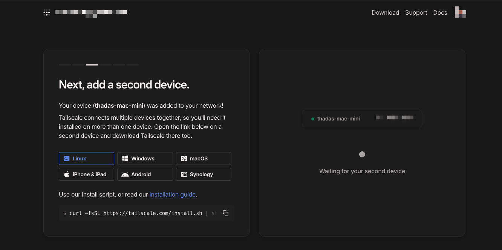
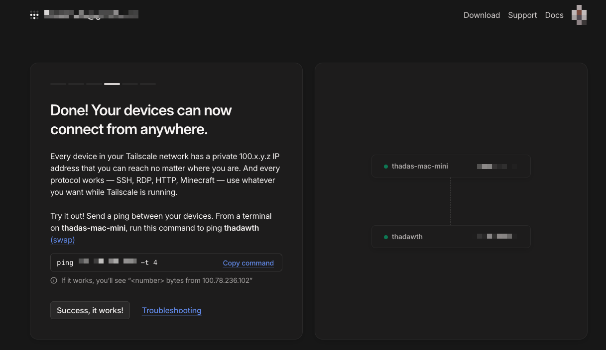
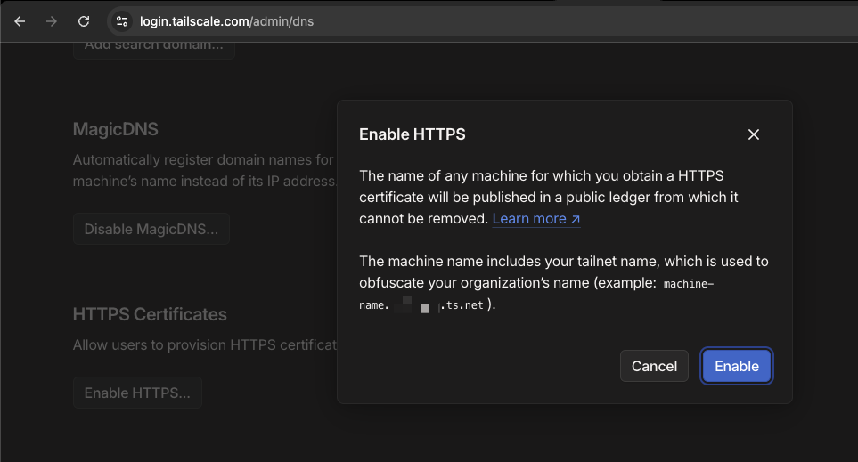

+++
title = "ตั้งค่าความปลอดภัยด้วย VPN with Tailscale และตั้งค่า Kubectl context ฉบับ Homelab EP. 2"
date = "2025-05-13"

[taxonomies]
categories = [ "Kubernetes" ]
tags = [ "Kubernetes", "ubuntu" ]
+++

ช่วงนี้ผมเริ่มกลับมาเล่น Homelab ใหม่อีกครั้งหลังจากที่ปล่อยให้เครื่อง Ubuntu Server วางฝุ่นมานานสองปี ตอนแรกว่าจะเอาไว้เล่นเกม แต่มันก็ไม่ได้ใช้สักที เลยตัดสินใจเปลี่ยนมาใช้ทำ Homelab แทน

ใน **EP.1** ผมลง RKE2 (Kubernetes) บนเครื่อง Ubuntu Server เรียบร้อยแล้ว และสามารถ `kubectl` ได้จากในเครื่องเดียวกัน

แต่… ปัญหาคือผมอยากเข้าถึง cluster ได้ **จากข้างนอกบ้าน** บ้าง เช่น ผ่านโน้ตบุ๊กหรือมือถือเวลาอยู่นอกบ้าน หรือใช้ hotspot 5G เชื่อมต่อ ทำให้ต้องมีระบบ network ที่ปลอดภัยและเชื่อมต่อกลับบ้านได้

**EP.2 นี้เลยจะพาไป:**

* ติดตั้ง [Tailscale](https://tailscale.com/) เพื่อเชื่อมต่อเครื่องทุกตัวให้อยู่ใน network เดียวกันแบบ private VPN
* ตั้งค่า `kubectl` ให้เชื่อมกับ K8s cluster ผ่านชื่อ domain ของ Tailscale (magicDNS)
* แก้ปัญหา TLS certificate ที่ไม่ตรงชื่อ domain
* และสรุปความเข้าใจเรื่อง token-based กับ cert-based auth ใน Kubernetes แบบง่าย ๆ

ทั้งหมดนี้จะเล่าตามสิ่งที่ผมเจอจริง และวิธีที่ผมใช้แก้แบบค่อย ๆ ทำ พร้อมจุดพลาดที่ควรระวังครับ

ไปลุยกันเลย 🔧

ได้เลยจ้ามาย!
ฟ้าจะเขียน **เกริ่นนำสั้น ๆ ว่าทำไมถึงเลือกใช้ Tailscale** ก่อนเข้าสู่ section ติดตั้งบน Ubuntu Server
เขียนให้อ่านสบาย ๆ ต่อจากเนื้อเรื่องในตอนแรกแบบไม่สะดุดนะ:

## ทำไมถึงเลือกใช้ Tailscale?

พอเริ่มทำ Homelab จริงจัง สิ่งที่อยากได้มากที่สุดคือ “ความสะดวกในการเข้าถึงเครื่องที่บ้านจากที่ไหนก็ได้”
ไม่ว่าจะนั่งอยู่คาเฟ่ ใช้ 5G hotspot หรือเปิดเครื่องจากต่างจังหวัด ก็อยากจะ `ssh` หรือ `kubectl` เข้าบ้านได้เหมือนนั่งอยู่ใน network เดียวกัน

แน่นอนว่าเราสามารถ forward port จาก router ก็ได้ หรือใช้ Dynamic DNS ก็ได้
แต่ทั้งสองวิธีนั้นมีความยุ่งยากหลายอย่าง เช่น ต้องตั้งค่า firewall เอง, เสี่ยงโดน scan จากภายนอก, และยังต้องจัดการกับ IP เปลี่ยนบ่อย ๆ ด้วย

ผมเลยมองหา solution ที่ทำให้:

* ทุกเครื่องเชื่อมต่อกันได้เหมือนอยู่ใน network เดียวกัน
* ไม่ต้องเปิดพอร์ตหรือยุ่งกับ router
* มีระบบ identity, auth และ DNS มาให้ครบ
* และที่สำคัญ... **ตั้งค่าง่าย ไม่ต้อง config เยอะ**

สุดท้ายก็มาเจอกับ **Tailscale** ที่ตอบโจทย์เกือบทุกข้อแบบไม่ต้องตั้งค่าอะไรเยอะเลย
แค่ login ก็ใช้งานได้ทันที

จากตรงนี้แหละครับ ที่ทำให้ผมตัดสินใจจะติดตั้ง Tailscale บน Ubuntu Server ที่เป็นเครื่องหลักใน Homelab

ไปดูกันว่าเราจะติดตั้งยังไง และเชื่อมเครื่องต่าง ๆ เข้า network เดียวกันได้ยังไงครับ 🛠️

## ติดตั้ง Tailscale บน Ubuntu Server

จะเห็นว่าผมลง App ของ Tailscale ไว้บน Mac Mini เรียบร้อยแล้ว มันขึ้นมาว่ามี device เชื่อมอยู่แค่เครื่องเดียว
ยังไม่ได้ลงฝั่ง Ubuntu Server เลย ซึ่งเป็นเครื่องหลักที่รัน RKE2 อยู่

วันนี้เราจะมาลง Tailscale บน Ubuntu Server กันครับ



เริ่มจากคำสั่งติดตั้งตามที่หน้าเว็บเค้าแนะนำ:

```bash
curl -fsSL https://tailscale.com/install.sh | sh
```

หลังจากนั้นมันจะขึ้นข้อความแนะนำว่าให้เรา `sudo tailscale up` เพื่อเริ่มใช้งาน

```bash
Installation complete! Log in to start using Tailscale by running:

sudo tailscale up
```

เมื่อรันคำสั่งนี้ มันจะให้ลิงก์มาให้เราไปเปิดใน Browser เพื่อ login ด้วยบัญชี Google หรือ Microsoft ที่เราใช้กับ Tailscale

```bash
$ sudo tailscale up

To authenticate, visit:

        https://login.tailscale.com/a/xxxxxxx
```

เปิดลิงก์นั้นใน browser แล้วกด login ให้เสร็จ จากนั้น… พร้อมแล้วครับ!



พอเสร็จแล้วเราจะเห็นว่าเครื่อง Mac กับ Ubuntu Server จะถูกเชื่อมอยู่ในเครือข่ายเดียวกันเรียบร้อย
ที่น่าทึ่งคือ เราสามารถ access กันผ่านชื่อ domain ได้เลยด้วย โดยไม่ต้องจำ IP อีกต่อไป

```bash
ssh thadawth.tail1234da.ts.net -i ~/.ssh/my_home_lab/id_rsa
```

ชื่อแบบนี้มาจาก magicDNS ของ Tailscale ซึ่งมันจะผูก domain ให้ device แต่ละตัวอัตโนมัติ โดย domain ทั้งหมดจะอยู่ภายใต้ tailnet name ของเรา

ชื่อ tailnet จะหน้าตาประมาณนี้:

```
xxxx.ts.net
```

ซึ่งตอนสมัครเค้าจะสุ่มมาให้เรา แต่เราสามารถเข้าไปเปลี่ยนชื่อได้ภายหลังที่หน้า admin console ของ Tailscale

และทุกเครื่องที่เชื่อมต่อจะได้ทั้ง IP address (ของ Tailscale) และ domain name ส่วนตัว
เช่น

```
mac-mini.tail1234da.ts.net
ubuntu-server.tail1234da.ts.net
```

ผมก็สามารถ ssh ข้ามไปยังเครื่อง ubuntu-server ได้จากที่ไหนก็ได้ผ่าน domain นี้เลย

หลังจากเชื่อมกันได้แล้ว อีกฟีเจอร์หนึ่งที่แนะนำให้เปิดคือ **HTTPS support** ของ Tailscale
จะช่วยให้ domain ที่เราจะเรียก (เช่น `https://my-node.tail1234da.ts.net`) ใช้ TLS ได้แบบ auto-verified จาก browser ทั่วไป

เปิดได้ง่าย ๆ ที่หน้า DNS ของ admin console:
[https://login.tailscale.com/admin/dns](https://login.tailscale.com/admin/dns)



ต่อไปเราจะเริ่มตั้งค่า `kubectl` เพื่อเชื่อมกับ RKE2 cluster ผ่าน DNS ตัวนี้กันครับ และดูว่าเราจะเจอ TLS error แบบไหนบ้าง แล้วแก้ยังไงให้เชื่อมต่อได้จากนอกบ้านแบบปลอดภัย


ได้เลยจ้ามาย! ✨
นี่คือ **ตอนที่ 3: ตั้งค่า kubectl context ให้ใช้ DNS จาก Tailscale และเจอ TLS Error ยังไง**
เล่าแบบลื่น ๆ ต่อจากตอนที่แล้วเลยนะ

## ตั้งค่า `kubectl` ให้ใช้ DNS ของ Tailscale เชื่อมไปที่ Cluster

หลังจากที่เราเชื่อมเครื่อง Mac กับ Ubuntu Server เข้าด้วยกันผ่าน Tailscale ได้แล้ว
ผมก็อยากจะ `kubectl` เข้าไปยัง RKE2 cluster จากเครื่อง Mac ผ่าน domain ของ Tailscale เลย

เครื่อง Ubuntu Server ของผมรัน RKE2 อยู่ที่:

```
https://192.168.1.107:6443
```

แต่พอเรามี Tailscale แล้ว เราสามารถเปลี่ยนไปใช้ชื่อ domain ได้เลย เช่น:

```
https://thadawth.tail1234da.ts.net:6443
```

ซึ่งเป็น magicDNS ของเครื่อง Ubuntu Server ที่ได้จาก Tailscale

### เพิ่ม context ใหม่เข้าไปใน kubeconfig

ผมลองสร้าง context ใหม่ใน `~/.kube/config` แบบนี้ครับ:

```yaml
apiVersion: v1
clusters:
- cluster:
    certificate-authority-data: xxx
    server: https://192.168.1.107:6443
  name: my_homelab-cluster
- cluster:
    certificate-authority-data: xxx
    server: https://thadawth.tail1234da.ts.net:6443
  name: my_homelab-cluster_tailscale
```

จากนั้นลองรันคำสั่ง:

```bash
kubectl config use-context my_homelab-cluster_tailscale
kubectl get pods
```

ผลลัพธ์คือ...

```
E0512 17:44:46.732328   34569 memcache.go:265] "Unhandled Error" err="couldn't get current server API group list: Get \"https://thadawth.tail1234da.ts.net:6443/api?timeout=32s\": tls: failed to verify certificate: x509: certificate is valid for ..., not thadawth.tail1234da.ts.net"
```

อ้าว... ทำไมเป็นแบบนี้?

### ปัญหาคือ TLS Certificate ไม่รองรับชื่อ Tailscale DNS

ผมเลยลอง inspect ตัว cert ที่ Kube API Server ใช้อยู่ ด้วย `openssl`:

```bash
openssl s_client -connect 127.0.0.1:6443 -showcerts </dev/null 2>/dev/null \
  | openssl x509 -noout -text | grep -A1 "Subject Alternative Name"
```

ผลที่ได้คือ:

```text
X509v3 Subject Alternative Name:
    DNS:kubernetes, DNS:kubernetes.default, DNS:kubernetes.default.svc,
    DNS:kubernetes.default.svc.cluster.local, DNS:localhost, DNS:thadawth,
    IP Address:127.0.0.1, IP Address:192.168.1.107, ...
```

จากตรงนี้เราจะเห็นว่า **ไม่มีชื่อ `thadawth.tail1234da.ts.net` อยู่ใน SAN** ของ cert เลย
ซึ่งหมายความว่า ถึงแม้จะชี้ DNS มาถูกต้องแล้ว `kubectl` ก็จะไม่ยอมเชื่อถือ server เพราะ TLS ไม่ match

ได้เลยจ้ามาย! 🔧
มาต่อกันที่ **ตอนที่ 4: แก้ปัญหา TLS – เพิ่มชื่อ DNS ของ Tailscale เข้าไปใน Cert ของ RKE2**

## ทำให้ Kube API Server รองรับชื่อ DNS ของ Tailscale

จากตอนที่แล้วเรารู้แล้วว่า `kubectl` เชื่อมผ่าน DNS ของ Tailscale ไม่ได้ เพราะ **cert ไม่ครอบคลุมชื่อที่ใช้**

ทางแก้คือ…
เราต้อง **เพิ่ม DNS ของ Tailscale (`thadawth.tail1234da.ts.net`) เข้าไปใน TLS certificate ของ RKE2**
ซึ่งเราทำได้โดยการตั้งค่าในไฟล์ config แล้วให้ RKE2 regenerate cert ใหม่ให้ครับ

### 1. แก้ไฟล์ config.yaml ของ RKE2

RKE2 จะอ่านค่าจากไฟล์นี้:

```
/etc/rancher/rke2/config.yaml
```

ถ้าไฟล์นี้ยังไม่มี ให้เราสร้างใหม่ได้เลย:

```bash
sudo mkdir -p /etc/rancher/rke2
sudo nano /etc/rancher/rke2/config.yaml
```

แล้วใส่ค่าแบบนี้ (เพิ่ม DNS ที่เราต้องการลงไป):

```yaml
tls-san:
  - "192.168.1.107"
  - "thadawth.tail1234da.ts.net"
```

บรรทัดแรกคือ IP เดิมที่มีอยู่แล้ว บรรทัดที่สองคือ DNS จาก Tailscale ที่เราต้องการให้ cert รองรับ

### 2. ลบ cert เก่า (เพื่อให้ RKE2 สร้างใหม่)

```bash
sudo systemctl stop rke2-server

sudo rm /var/lib/rancher/rke2/server/tls/serving-kube-apiserver.crt
sudo rm /var/lib/rancher/rke2/server/tls/serving-kube-apiserver.key
```

**⚠️ ระวัง:** อย่าลบไฟล์ `server-ca.key` เด็ดขาดนะครับ อันนั้นคือ root CA ของระบบ ถ้าหาย = cluster พัง

### 3. Start RKE2 ใหม่ เพื่อให้มันสร้าง cert ใหม่ที่รวม DNS ที่เราต้องการ

```bash
sudo systemctl start rke2-server
```

จากนั้นรอให้ cluster กลับมาพร้อม (`kubectl get nodes` ต้องใช้ได้จากเครื่อง server)

### 4. ตรวจสอบ cert ใหม่

ลองใช้ `openssl` ดูอีกทีว่า DNS ของเราถูกเพิ่มเข้าไปแล้วจริงไหม:

```bash
openssl s_client -connect 127.0.0.1:6443 -showcerts </dev/null 2>/dev/null \
  | openssl x509 -noout -text | grep -A1 "Subject Alternative Name"
```

ตอนนี้น่าจะเห็น:

```
DNS:thadawth.tail1234da.ts.net
```

โผล่มาแล้วเรียบร้อย 🎉

### เชื่อมต่อจากเครื่องอื่นผ่าน DNS... ยังไม่ได้

หลังจากที่เราเพิ่ม `thadawth.tail1234da.ts.net` เข้าไปใน SAN ของ cert แล้ว
ผมก็กลับมาที่เครื่อง Mac แล้วลองรัน `kubectl get nodes` ผ่าน context ที่ชี้ไปยัง DNS นี้

ผลคือ... ยังไม่ได้ครับ

```bash
Unable to connect to the server: x509: certificate signed by unknown authority
```

ถึงแม้ cert จะรองรับชื่อ DNS แล้ว แต่ฝั่ง client (เครื่อง Mac) ยังไม่สามารถ “เชื่อถือ” cert ได้อยู่ดี
เพราะใน `kubeconfig.yaml` ที่เราสร้างไว้ ยังใส่ `certificate-authority-data:` ไม่ถูกตัวนั่นเอง

## ใช้ `certificate-authority-data` ที่ถูกต้อง เพื่อให้เชื่อมต่อผ่าน DNS ได้จริง

ปัญหาจริง ๆ ไม่ได้อยู่ที่ cert ฝั่ง server แล้ว แต่เกิดจาก `certificate-authority-data:` ฝั่ง client
ใน `kubeconfig.yaml` เราต้องใส่ cert ที่ตรงกับ CA ที่ใช้ sign cert ฝั่ง server จริง ๆ

ซึ่งในกรณีของ RKE2 เราใช้ cert เดียวกับที่ Kube API Server ใช้รับการเชื่อมต่ออยู่แล้ว
คือไฟล์ `serving-kube-apiserver.crt` ที่เราพูดถึงในขั้นตอนก่อนหน้า

เราสามารถใช้คำสั่งนี้เพื่อ base64 cert ออกมาได้:

```bash
sudo cat /var/lib/rancher/rke2/server/tls/serving-kube-apiserver.crt | base64 | tr -d '\n'
```

จากนั้นเอาค่านี้ไปใส่ใน `kubeconfig.yaml` ตรง `certificate-authority-data:`
แล้วลอง `kubectl get nodes` จากเครื่องนอกบ้านอีกครั้ง

ครั้งนี้เชื่อมต่อได้เรียบร้อย
และระบบก็เชื่อถือ cert ได้อย่างถูกต้องปลอดภัย

## (Optional) สร้าง Account ใหม่สำหรับการเชื่อมต่อจากเครื่องนอกบ้าน แบบ Token

ถ้าเราไม่อยากใช้ cert เดิมที่ RKE2 สร้างให้ตั้งแต่ตอนติดตั้ง
(เพราะมัน embed cert+key แบบ root user ไว้ในไฟล์ `rke2.yaml`)
หรือเราอยากแยก context สำหรับใช้งานจากเครื่องอื่น โดยเฉพาะ...

เราสามารถสร้าง ServiceAccount ใหม่ แล้ว generate `kubeconfig.yaml` สำหรับ user นั้นได้เลยครับ

### 1. สร้าง ServiceAccount ใหม่

สมมติผมจะสร้างชื่อว่า `remote-admin`:

```bash
kubectl create serviceaccount remote-admin -n default
```

### 2. ให้สิทธิ์แบบ admin (หรือจะจำกัด namespace ก็ได้)

ถ้าอยากให้ใช้ได้เหมือน user หลัก:

```bash
kubectl create clusterrolebinding remote-admin-binding \
  --clusterrole=cluster-admin \
  --serviceaccount=default:remote-admin
```

### 3. สร้าง token แบบ short-lived (Kubernetes >= 1.24)

```bash
kubectl create token remote-admin -n default
```

มันจะ print token ออกมาทาง stdout → เก็บไว้ก่อน

### 4. ดึง `ca.crt` ที่ใช้สำหรับ certificate-authority-data

เราเคยได้ base64 cert ที่ถูกต้องไว้แล้วจากไฟล์นี้:

```bash
sudo cat /var/lib/rancher/rke2/server/tls/serving-kube-apiserver.crt | base64 | tr -d '\n'
```

### 5. สร้างไฟล์ `kubeconfig.yaml`

```yaml
apiVersion: v1
kind: Config
clusters:
- name: my-homelab_remote
  cluster:
    server: https://thadawth.tail1234da.ts.net:6443
    certificate-authority-data: <ใส่ base64 CA ที่ได้มาข้างบน>
users:
- name: remote-admin
  user:
    token: <ใส่ token ที่ create มาข้างบน>
contexts:
- name: my-homelab_remote-context
  context:
    cluster: my-homelab_remote
    user: remote-admin
current-context: my-homelab_remote-context
```


### 6. ใช้งานจากเครื่องอื่น: scp และ merge context

สมมติว่าเราอยู่ที่เครื่อง remote (เช่นเครื่อง Mac) แล้วต้องการเชื่อมต่อไปยัง Homelab ผ่าน Tailscale
เราจะทำตามขั้นตอนนี้:

#### 6.1 copy kubeconfig มาจากเครื่อง Homelab

```bash
scp -i ~/.ssh/my_home_lab/id_rsa \
    thadawth@thadawth.tail1234da.ts.net:/home/thadawth/scripts/remote-kubeconfig.yaml \
    ./remote-kubeconfig.yaml
```

#### 6.2 merge context เข้ากับ \~/.kube/config ที่ใช้งานอยู่

```bash
KUBECONFIG=~/.kube/config:./remote-kubeconfig.yaml kubectl config view --flatten > merged-config.yaml
mv ~/.kube/config ~/.kube/config.backup.$(date +%Y%m%d-%H%M%S)
mv merged-config.yaml ~/.kube/config
```

จากนั้นเช็กดูว่า context ใหม่เพิ่มเข้ามาหรือยัง:

```bash
kubectl config get-contexts
```

เราควรเห็นชื่อ context ที่ตั้งไว้ เช่น `my-homelab_remote-context`
จากนั้นก็สามารถสลับ context แล้วใช้งานได้ทันที:

```bash
kubectl config use-context my-homelab_remote-context
kubectl get nodes
```

แค่นี้เราก็สามารถ `kubectl` จากเครื่องข้างนอกเข้ามายัง cluster ที่บ้านได้แล้วครับ
ผ่าน domain ของ Tailscale แบบปลอดภัย และแยก context ได้ชัดเจน 🎯

ได้เลยครับมาย!
นี่คือ **ตอนที่ 6: Token กับ Cert-based auth แบบไหนปลอดภัยกว่า? และ RKE2 ใช้อะไรเป็นหลัก?**
เขียนแบบเล่าให้ฟังเรื่อย ๆ ไม่ต้องมีตาราง ไม่ต้องเน้นวิชาการ แต่เข้าใจภาพรวมแบบคนทำ Homelab จริงจัง

## Token vs Cert-based auth – อะไรปลอดภัยกว่ากัน?

ตอนที่ผมเริ่มตั้งค่าการเชื่อมต่อจากเครื่องนอกบ้าน สิ่งที่ต้องเจอแน่ ๆ คือคำถามนี้เลย
จะใช้ token ดีมั้ย หรือจะ generate cert-based user ดีกว่า?

ใน Kubernetes ทั้งสองวิธีนี้ถือว่าเป็น “ทางการ” ทั้งคู่
แต่พอใช้งานจริงจะมีลักษณะแตกต่างกันอยู่พอสมควร

**Token-based auth** อย่างที่เราใช้กับ `kubectl create token` จะออก token มาเป็น string ยาว ๆ เอาไปใส่ใน kubeconfig ได้เลย
ข้อดีคือใช้ง่ายมาก ไม่ต้องสร้าง key-pair หรือ cert ใด ๆ
เหมาะกับ automation, bot, หรือเวลาต้องใช้ชั่วคราวใน script

แต่ข้อเสียคือ... ถ้า token นี้รั่ว ก็สามารถถูกนำไปใช้ได้ทันทีเหมือนรหัสผ่าน
และในกรณีที่เป็น static token มันมักจะไม่มีวันหมดอายุด้วย

ถ้าจะปลอดภัยขึ้น ควรใช้ projected token หรือ short-lived token ที่ Kubernetes version ใหม่ ๆ รองรับ
(อันนี้แหละที่เราสร้างไว้ในตอนก่อนหน้า)

**Cert-based auth** จะใช้ public/private keypair
ต้องมีการออก cert โดย CA ของ cluster (หรือ external CA) แล้วฝังลงใน kubeconfig
เวลาจะ revoke ก็ทำได้จากฝั่ง server โดยไม่ต้องไปลบไฟล์ token ที่ฝั่ง user

ข้อดีคือปลอดภัยสูง ใช้ TLS ระดับ x509 มาตรฐาน
และสามารถระบุตัวตนได้แบบละเอียด เช่น อ้างอิง username, group, หรือ cert fingerprint ได้เลย

ข้อเสียคือมันตั้งค่ายุ่งกว่า ถ้าไม่มีระบบจัดการ cert อัตโนมัติ
และถ้า private key รั่ว ก็ไม่ต่างอะไรกับ token ที่รั่วเช่นกัน

### แล้ว RKE2 ใช้อะไรเป็น default?

คำตอบคือ **cert-based auth**

ตอนติดตั้ง RKE2 เสร็จ มันจะ generate cert ให้กับ user ชื่อ `kubernetes-admin` หรือบางกรณีก็เป็น `rke2-default`
พร้อมกับสร้าง kubeconfig ที่ฝัง `client-certificate-data` กับ `client-key-data` ไว้ในตัวเลย
เราสามารถเอาไฟล์นั้นไปใช้ได้ทันทีโดยไม่ต้องสร้างอะไรเพิ่ม

ผมคิดว่าเหตุผลที่ RKE2 เลือกใช้ cert เพราะมัน “ปลอดภัยโดยไม่ต้องพึ่ง external auth system”
และใช้งานง่ายใน context ของ Homelab หรือ air-gapped environment ที่ไม่ได้เชื่อมกับ Azure AD หรือ OIDC

สำหรับผมก็คือ

* ใช้ cert-based สำหรับผู้ใช้งานหลัก ที่ต้องเข้าควบคุม cluster
* ใช้ token-based สำหรับ automation หรือการเชื่อมต่อเฉพาะกิจ

## สรุป: เชื่อม RKE2 ผ่าน Tailscale แบบปลอดภัย ฉบับ Homelab

หลังจากลองปรับไปหลายรอบ ในที่สุดผมก็สามารถเชื่อม `kubectl` จากเครื่องอื่นเข้า RKE2 ที่บ้านผ่าน Tailscale ได้แบบปลอดภัยเต็มระบบ

สิ่งที่ดูเหมือนจะง่ายอย่างการ “แค่เปลี่ยนจาก local IP เป็น DNS” จริง ๆ แล้วต้องเข้าใจเรื่อง TLS, cert, SAN, และ auth อยู่พอสมควร
แต่พอเข้าใจแล้วก็ไม่ได้ยากอย่างที่คิดครับ

สิ่งที่ผมได้เรียนรู้จากรอบนี้คือ:

* **Tailscale ช่วยให้ทุกเครื่องเชื่อมอยู่ใน network เดียวกันได้ง่ายมาก** ไม่ต้องตั้งค่า router หรือ port forwarding อะไรเลย
* แค่เปลี่ยนจาก local IP เป็น DNS ยังไม่พอ **ต้อง regenerate cert ของ Kube API Server ให้รองรับชื่อ DNS ใหม่ด้วย**
* ถ้า `certificate-authority-data` ไม่ตรงกับ CA ที่เซ็น cert จริง ๆ ก็จะเชื่อมไม่ได้ ถึงแม้ชื่อจะ match แล้วก็ตาม
* การสร้าง `ServiceAccount` แยก user และออก token ใหม่ ก็ช่วยให้เชื่อมต่อได้อย่างปลอดภัย โดยไม่ต้องแชร์ cert หลักที่ฝังอยู่ในระบบ
* **cert-based auth กับ token-based auth มีจุดเด่นต่างกัน**
  ถ้าใช้งานในระยะยาวหรือกับ user ที่สำคัญ ควรใช้ cert
  แต่ถ้าใช้เฉพาะกิจหรือใน script ที่ rotate ได้ง่าย ก็ใช้ token ได้เลย

สุดท้าย ถ้ามีระบบที่ต้องให้คนอื่นเข้ามา access cluster หรืออยากเชื่อมต่อข้าม device อย่างปลอดภัย
Tailscale + RKE2 + การออก `kubeconfig` ที่ถูกต้อง ก็เป็นชุดที่ตอบโจทย์ได้แบบง่ายและมีประสิทธิภาพมาก ๆ โดยเฉพาะสำหรับ Homelab

ขอบคุณที่อ่านมาถึงตรงนี้ 🙌 ใครทำ Homelab เหมือนกัน ลองแชร์ประสบการณ์กันได้นะครับ 😎
