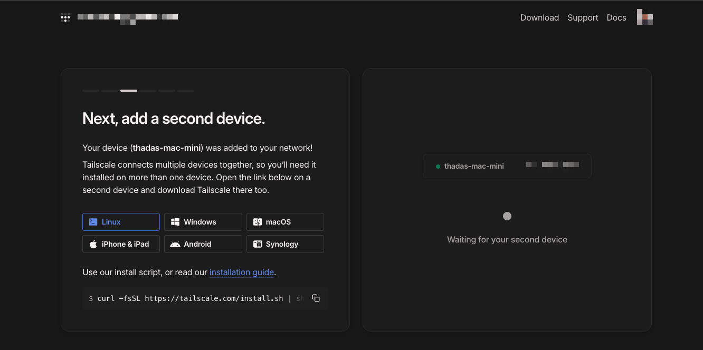
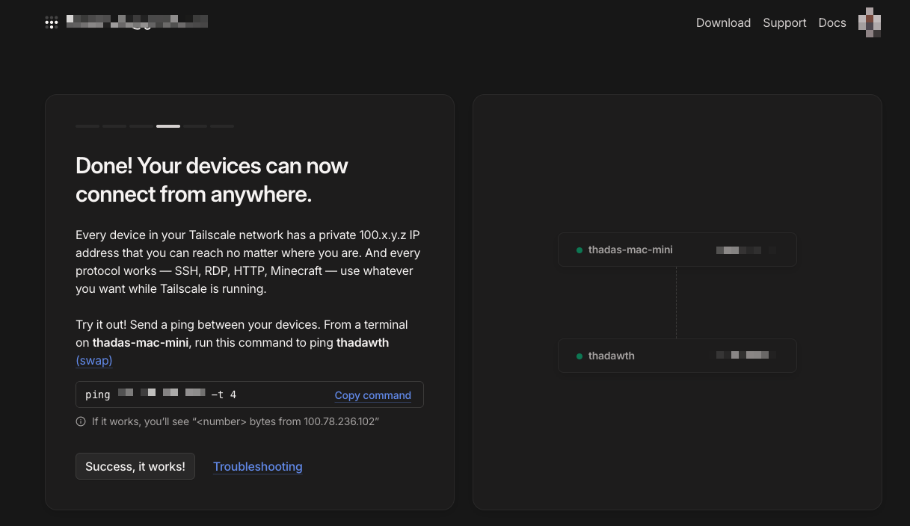

+++
title = "Setup VPN with Tailscale และ Setup Kubectl context ฉบับ Homelab EP. 2"
date = "2025-05-13"

[taxonomies]
categories = [ "Kubernetes" ]
tags = [ "Kubernetes", "ubuntu" ]


+++

จะเห็นว่าผมลง App บน Mac Mini แล้ว แต่ยังไม่ได้ลงบน Ubuntu Server เลย
วันนี้เราจะมาลง tailscale บน Ubuntu Server กันครับ



```
curl -fsSL https://tailscale.com/install.sh | sh
```
หลังจากนั้นเค้าจะบอกประมาณว่า เพื่อให้เรารันคำสั่งนี้เพื่อทำการติดตั้ง tailscale

```
Installation complete! Log in to start using Tailscale by running:

sudo tailscale up
```

ซึ่งเค้าก็จะให้ URL เรามา ให้เราไปเปิดใน Browser เพื่อทำการ Login ครับ

```bash
$ sudo tailscale up

To authenticate, visit:

        https://login.tailscale.com/a/xxxxxxx

```




อ๊า มันพา ทุก device ไปอยู่ใน network เดียวกัน และ access ผ่าน domain (ที่เป็น magicDNS ) ด้วย
```
ssh <internal-dns> -i ~/.ssh/my_home_lab/id_rsa
```

เช่น  machine-name.xxxx.ts.net

ซึ่งอันนี้ `xxxx.ts.net` เค้าเรียกว่า Tailnet name ครับ ซึ่งตอนแรกเค้าสุ่มมาให้ แต่เราสามารถเปลี่ยนได้ในหน้า admin console ของ tailscale ครับ และแต่ละ device ที่เราติดตั้ง tailscale จะมี IP address ของ tailscale ครับ และ Domain name ที่เป็น tailscale ครับ

เช่น 
device-a.xxxx.ts.net
device-b.xxxx.ts.net

ผมก็สามารถ ssh ไปที่ device-a.xxxx.ts.net ได้เลยครับ

ต่อไปก็ Enable HTTPS
https://login.tailscale.com/admin/dns

# Setup RKE2 Cluster ให้คุยผ่าน tailscale ได้

ผมพยายามสร้าง Context ใหม่จากเดิม ชื่อว่า my_homelab-cluster_tailscale

apiVersion: v1
clusters:
- cluster:
    certificate-authority-data: xxx
    server: https://192.168.1.107:6443
  name: my_homelab-cluster
- cluster:
    certificate-authority-data: xxx
    server: https://machine-name.tail1234da.ts.net:6443
  name: my_homelab-cluster_tailscale

แต่ได้ Error

get   
➜  .kube kubectl get pods
E0512 17:44:46.732328   34569 memcache.go:265] "Unhandled Error" err="couldn't get current server API group list: Get \"https://machine-name.tail1234da.ts.net:6443/api?timeout=32s\": tls: failed to verify certificate: x509: certificate is valid for kubernetes, kubernetes.default, kubernetes.default.svc, kubernetes.default.svc.cluster.local, localhost, machine-name, not machine-name.tail1234da.ts.net"

เพราะว่า Kube API server certificate มันไม่ match กับ domain ที่เราตั้งไว้คับ

```bash
$ openssl s_client -connect 127.0.0.1:6443 -showcerts </dev/null 2>/dev/null \
  | openssl x509 -noout -text | grep -A1 "Subject Alternative Name"

            X509v3 Subject Alternative Name:
                DNS:kubernetes, DNS:kubernetes.default, DNS:kubernetes.default.svc, DNS:kubernetes.default.svc.cluster.local, DNS:localhost, DNS:machine-name, IP Address:127.0.0.1, IP Address:0:0:0:0:0:0:0:1, IP Address:192.168.1.107, IP Address:2001:FB1:128:97CD:AAA1:59FF:FE4F:4A54, IP Address:10.43.0.1
```

