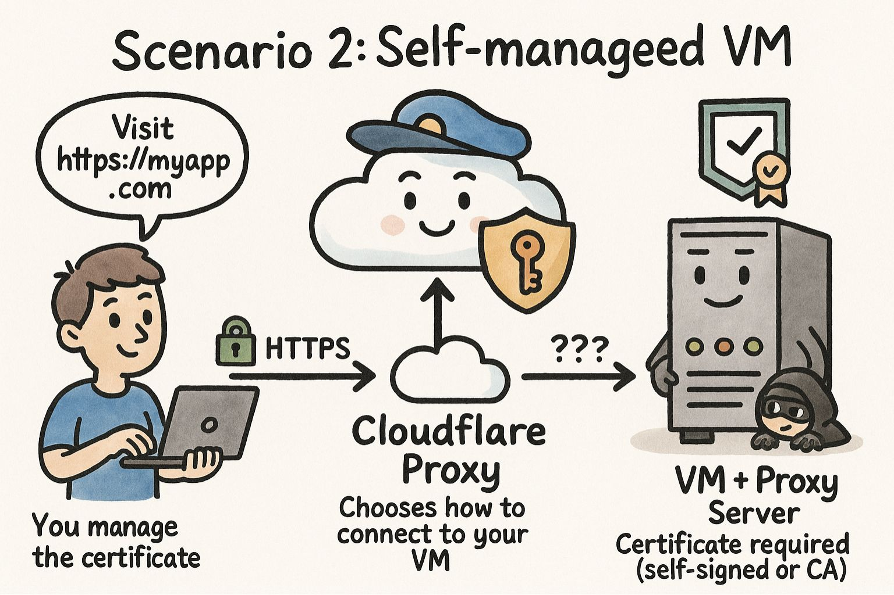

+++
title = "เข้าใจ SSL/TLS แบบง่าย ๆ ผ่าน Cloudflare และ Azure"
date = "2025-08-23"

[taxonomies]
categories = [ "DevOps" ]
tags = [ "SSL", "TLS", "HTTPS", "Certificate", "Cloudflare", "Azure" ]

[extra]
id = "93rv20c"
+++



- EP 1: เข้าใจ SSL/TLS แบบง่าย ๆ ผ่าน Cloudflare และ Azure (บทความนี้)
- EP 2: [ลงมือจริง: Setup Actual Budget บน VM ด้วย Docker, Nginx และ Cloudflare](/posts/ep2-setup-actual-budget-vm-docker-nginx-cloudflare/)


สวัสดีครับ วันนี้อยากมาเล่าเรื่อง **SSL/TLS หรือ HTTPS** กันสักหน่อย
คือหลาย ๆ คน (รวมถึงตัวผมเองเมื่อก่อน) มักจะรู้สึกว่า SSL นี่มันเหมือน **หลุมดำ** เลยครับ
ไม่รู้ว่ามันทำงานยังไง เห็นแค่พอเปิดเว็บแล้วมี “กุญแจสีเขียว” โผล่มาในเบราว์เซอร์ ก็น่าจะโอเคแล้ว

แต่พอถึงเวลาที่ต้อง **setup จริง หรือ maintain จริงๆ** … มันกลับไม่ง่ายเลย
โดยเฉพาะการทำงานกับ **certificate** ที่ต้องต่ออายุ ต้องจัดการ key ต้องเข้าใจการ trust chain
พอไม่เข้าใจก็กลายเป็นปัญหาที่มึนได้ง่าย ๆ

เลยอยากเขียนบทความนี้มาเป็น **สรุปแนวทางแบบเข้าใจง่าย ๆ**
ใช้ **ตัวอย่างจริง** ทั้ง Cloudflare และ Azure ที่หลายคนน่าจะคุ้นเคย
และที่สำคัญ… จะมี **diagram** ให้เห็นภาพการทำงานด้วยครับ


จริงๆ Azure ทั้ง 2 Service ที่ผมพูดถึงในบทความนี้ App Service และ Container App ค่อยข้างเข้าใจง่ายนะครับ โดยทั้งคู่เป็น PAAS (Platform as a Service) ที่เราไม่ต้องไปจัดการ VM เองเลย แค่ deploy code ขึ้นไป แล้ว Azure จะจัดการทุกอย่างให้เอง

ถ้าใครสนใจผมเคยพูดเกี่ยวกับ Azure App Service ไว้ใน [YouTube: Deploy Web App อย่างง่ายด้วย Azure App Service | Azure Note Series](https://www.youtube.com/watch?v=obtIYPkwm90) ครับ

และเคยพูดเรื่องของ Azure Container App ไว้ใน [YouTube: Serverless container on Microsoft Azure | Azure Developer Day 2023](https://youtu.be/RVb0gXZ6H2so) ครับ

ซึ่ง Azure App Service จะมี Free Tier ให้ลองเล่นฟรี ๆ ได้เลย ส่วน Azure Container App สามารถ Scale to zero ได้ ทำให้ถ้าเราใช้ในโปรเจกต์เล็ก ๆ ก็จะประหยัดค่าใช้จ่ายได้มากครับ หรือ ไม่ค่อยมีคนใช้งาน ก็แทบไม่เสียค่าใช้จ่ายอะไรเลย


## SSL/TLS คืออะไร

เวลาเราเข้าเว็บที่ขึ้นว่า `https://` หลายคนอาจจะรู้สึกว่า “อ๋อ ก็คือเว็บปลอดภัย” มีรูปกุญแจเล็ก ๆ โผล่มาตรง address bar แค่นั้น แต่จริง ๆ แล้วเบื้องหลังของเจ้าตัว HTTPS มันก็คือสิ่งที่เรียกว่า **SSL/TLS** นี่แหละครับ


ลองนึกภาพว่าเรากำลังส่งจดหมายหากัน ถ้าเป็น HTTP ปกติ มันก็เหมือนเราเขียนจดหมายใส่กระดาษแล้วส่งไปตรง ๆ ใครดักกลางทางก็เปิดอ่านได้หมด แต่ถ้าเป็น HTTPS มันเหมือนเรายัดจดหมายนั้นใส่กล่องเหล็กที่มีกุญแจล็อกไว้ แล้วมอบกุญแจให้เฉพาะผู้รับเท่านั้นที่จะเปิดออกมาอ่านได้

SSL (Secure Sockets Layer) และ TLS (Transport Layer Security) ก็คือ “กล่องเหล็กพร้อมกุญแจ” นี่เองครับ มันเป็นโปรโตคอลที่ทำหน้าที่เข้ารหัสข้อมูลระหว่าง **ผู้ใช้** กับ **เซิร์ฟเวอร์** ทำให้คนอื่น ๆ ที่พยายามดักดูระหว่างทาง ไม่สามารถอ่านหรือแก้ไขข้อมูลได้ง่าย ๆ

แต่ไม่ใช่แค่เรื่องการเข้ารหัสเท่านั้นนะครับ อีกหน้าที่หนึ่งที่สำคัญมากของ SSL/TLS ก็คือ **การยืนยันตัวตน (Authentication)** ว่าเซิร์ฟเวอร์ที่เรากำลังคุยด้วยนั้นเป็น “ของจริง” ไม่ใช่เว็บปลอมที่ใครบางคนตั้งขึ้นมาเพื่อหลอกเรา ซึ่งหน้าที่ตรงนี้แหละที่ certificate เข้ามามีบทบาท เปรียบเหมือน “บัตรประชาชน” ของเว็บไซต์ที่ออกโดยหน่วยงานที่เชื่อถือได้ (CA – Certificate Authority)

ดังนั้นเวลาที่เราบอกว่า “เปิดเว็บนี้แบบ HTTPS” จริง ๆ มันหมายความว่า เรากำลังเชื่อมต่อผ่าน TLS โดยมี certificate ที่คอยการันตีความน่าเชื่อถือ และ การเข้ารหัสข้อมูลครบถ้วน


## สถานการณ์ที่เจอบ่อยกับ SSL/TLS

วันนี้ผมมี 2 สถานการณ์มาเล่าให้ฟังครับ ว่าในแต่ละสถานการณ์ เราจะจัดการกับ SSL/TLS ยังไงให้เหมาะสม

โดยจริงๆ แล้วเราไม่จำเป็นต้องใช้ Cloudflare หรือ Azure ก็ได้นะครับ แต่ผมจะใช้ Cloudflare เป็นตัวอย่างของทั้ง DNS และ Proxy ที่หลายคนน่าจะคุ้นเคยกันดี ส่วน Azure ก็จะใช้เป็นตัวอย่างของ **Managed Service** และ **Virtual Mahcine** ที่หลายคนอาจจะเคยเจอ

ซึ่งถ้าเราจะใช้ DNS Provider เจ้าอื่นก็ได้ครับ แต่ถ้าเราใช้ Cloudflare เค้าจะมีฟีเจอร์ Proxy ที่ช่วยเสริมความปลอดภัยให้เว็บของเราได้อีกเยอะเลย


## สถานการณ์ที่ 1: ใช้ Managed Service อย่าง Azure App Service / Container App

เวลาที่เราพูดถึง **SSL/HTTPS** หลายคนอาจนึกถึงการต้องไปขอ certificate เอง ต้องต่ออายุทุกปี ต้องกลัวว่าเดี๋ยววันนึง cert หมดอายุแล้วเว็บจะเข้าไม่ได้… แต่พอเรามาใช้พวก **Managed Service** อย่าง Azure App Service หรือ Azure Container App เนี่ย มันต่างออกไปเลยนะครับ

ลองนึกภาพง่าย ๆ แบบนี้ครับ เรามี web app ตัวหนึ่ง เราเลือก deploy ไปไว้บน Azure App Service … พอเรากดปุ๊บ ตัว App Service นั้นมัน “แถม” HTTPS มาให้เราเลยโดยอัตโนมัติ เราไม่ต้องไปยุ่งกับการขอ cert ไม่ต้องมานั่งจัดการ renewal (ต่ออายุอัตโนมัติ) ไม่ต้องสนใจว่า CA ไหนจะหมดอายุเมื่อไร ทุกอย่าง Azure จัดการให้เสร็จสรรพ

เหมือนคุณซื้อคอนโดแล้วในคอนโดมีระบบรักษาความปลอดภัยครบวงจร มีทั้งยาม กล้องวงจรปิด และคีย์การ์ดพร้อมเสร็จ คุณไม่ต้องไปจ้างยามเอง ไม่ต้องไปเดินติดกล้องเอง ทุกอย่างรวมอยู่ในค่าบริการแล้ว

ทีนี้สมมติว่าเราจะเอา domain ของเราเองมาใช้ สมมติว่าเรามี `myapp.com` เราอาจจะเอาไปชี้ผ่าน **Cloudflare** สิ่งที่หลายคนจะเจอคือ Cloudflare เองมีโหมดให้เลือกว่าจะให้ทำงานเป็น **DNS only** หรือจะให้ทำงานในแบบ **Proxy Mode**

ถ้าดูตัวอย่างจาก Cloudflare Dashboard จะเป็นแบบนี้ครับ เราจะเห็นว่ามันมี **DNS only** กับ **Proxied** ให้เลือก ก็ขึ้นอยู่กับว่าเราต้องการให้ Cloudflare ทำหน้าที่แค่ไหน ซึ่งตรงนี้จะมีผลกับการจัดการ SSL/TLS ด้วย แต่ถ้าเป็น DNS Provider เจ้าอื่นๆ ส่วนใหญ่จะมีแค่แบบ DNS only อย่างเดียวครับ


ถ้าเราเลือก **DNS only** มันก็ตรงไปตรงมาเลยครับ การเชื่อมต่อของผู้ใช้กับ Azure App Service จะเป็น HTTPS ตามที่ Azure จัดการไว้ให้ทั้งหมด Cloudflare แทบไม่ได้ยุ่งอะไรเลย เป็นเหมือนสมุดโทรศัพท์ที่บอกว่า “อ๋อ myapp.com อยู่ตรงนี้นะ อยู่ IP นี้นะ” แล้วผู้ใช้ก็วิ่งไปหา Azure โดยตรง


แต่ถ้าเราเปิด **Proxy Mode** ขึ้นมา เรื่องมันจะสนุกขึ้นอีกหน่อยครับ Proxy Mode จะทำให้ Cloudflare กลายเป็น “ด่านหน้า” ของระบบทั้งหมด เวลามีคนเข้ามาที่ `https://myapp.com` การเชื่อมต่อ TLS จะถูก terminate ที่ Cloudflare ก่อน จากนั้น Cloudflare จะไปต่อ HTTPS อีกชั้นกับ Azure App Service อีกที

ลองนึกภาพแบบนี้ครับ


Cloudflare กลายเป็นเหมือน รปภ. ด่านหน้าของคอนโดที่เราพูดถึงเมื่อกี้ เวลาแขกเข้ามา เค้าจะต้องเจอ Cloudflare ก่อน Cloudflare จะเช็กบัตร ตรวจสอบว่า request นี้ปลอดภัยไหม มาจาก bot หรือเปล่า ถ้าเรียบร้อยค่อยส่ง request ไปที่ Azure ต่อ

ผลลัพธ์คืออะไร?

* เราได้ทั้ง HTTPS ที่ Azure จัดการให้อยู่แล้ว
* เราได้ฟีเจอร์เสริมจาก Cloudflare ไม่ว่าจะเป็น Caching, WAF, Bot protection
* และที่สำคัญคือ… เราไม่ต้องปวดหัวกับ certificate ฝั่ง Azure เลย เพราะมัน auto หมด

ในสถานการณ์นี้เราจะเห็นว่าจริง ๆ การใช้ Managed Service มันช่วยลดความซับซ้อนของ SSL ลงไปเยอะมาก ๆ เพราะ certificate ทั้งหมดถูก manage ให้อัตโนมัติอยู่แล้ว สิ่งเดียวที่เราต้องตัดสินใจคือ “อยากให้ Cloudflare เป็นแค่ DNS เฉย ๆ หรืออยากให้มันเป็น Proxy ที่ช่วยเสริมเกราะป้องกันให้เว็บของเรา” เท่านั้นเอง

ซึ่งถ้าเราใช้ Managed Service อย่าง Azure App Service หรือ Container App ผมแนะนำให้เปิด Proxy Mode ไว้เลยครับ เพราะมันได้ประโยชน์เยอะมาก ๆ และแนะนำให้ตั้งค่า SSL/TLS ใน Cloudflare เป็นแบบ **Full (Strict)** เพื่อความปลอดภัยสูงสุด สามารถอ่านเพิ่มเติมในในหัวข้อต่อๆ ไปครับ

### ตัวอย่างการตั้งค่า Custom Domain และ SSL บน Azure App Service


สามารถดูวิธีการตั้งค่า Custom Domain และ SSL บน Azure App Service ได้ที่ [Microsoft Docs: Add a custom domain to your app in Azure App Service](https://learn.microsoft.com/en-us/azure/app-service/app-service-web-tutorial-custom-domain) ครับ

### ตัวอย่างการตั้งค่า Custom Domain และ SSL บน Azure Container App


สามารถดูวิธีการตั้งค่า Custom Domain และ SSL บน Azure Container App ได้ที่ [Microsoft Docs: Custom domain names and free managed certificates in Azure Container Apps](https://learn.microsoft.com/en-us/azure/container-apps/custom-domains-managed-certificates?pivots=azure-portal) ครับ 

---

ซึ่งเวลาที่เราตั้งค่า Custom Domain เสร็จแล้ว Azure จะจัดการเรื่อง SSL ให้เราอัตโนมัติเลย เราไม่ต้องไปขอ cert เอง หรือมานั่งต่ออายุเอง

โดยที่ถ้าเราจะใช้ Cloudflare Proxy Mode เราจะต้องใช้ DNS only ก่อน เพื่อที่เวลาที่ทาง Azure จะ Validate domain ownership เค้าจะใช้วิธีการตรวจสอบผ่าน CNAME หรือ TXT record ที่เราตั้งใน Cloudflare 

เมื่อเราตั้งค่า Cloudflare DNS เป็น DNS only แล้ว เราก็ไปตั้งค่า Custom Domain ใน Azure App Service หรือ Container App ได้เลย พอ Azure ตรวจสอบความเป็นเจ้าของโดเมนเสร็จแล้ว เราก็กลับมาเปลี่ยน Cloudflare เป็น Proxy Mode ได้เลย


เพราะไม่อย่างนั้น เวลาที่เราเปิด Proxy Mode ทันทีตั้งแต่แรก Azure จะตรวจสอบความเป็นเจ้าของโดเมนไม่ผ่าน Cloudflare จะไม่มี DNS record ที่ Azure ต้องการให้ตรวจสอบ อย่างเช่น ถ้าผมเปิด Proxy Mode


จะเห็นได้ว่า DNS Record จะไม่สามารถตรวจสอบได้จากภายนอก

## สถานการณ์ที่ 2: มี VM + Proxy ของเราเอง

พอเราขยับจากการใช้ Managed Service ที่สบาย ๆ มาลองดูในโลกที่เราต้องจัดการเองทั้งหมด ภาพมันจะเปลี่ยนไปทันทีครับ สมมติว่าผมมี VM อยู่เครื่องหนึ่ง อาจจะรันอยู่บน Azure, AWS, หรือ DigitalOcean ก็แล้วแต่ เครื่องนี้เราได้มาเปล่า ๆ เลยครับ ไม่มีการจัดการ SSL ให้ ไม่มีระบบ auto renew ให้ ทุกอย่างต้องทำเองหมด

เราสามารถใช้ [https-portal](https://github.com/SteveLTN/https-portal) หรือ [Caddy](https://caddyserver.com/) เข้ามาช่วยจัดการ SSL แบบอัตโนมัติได้เหมือนกันนะครับ เช่นใช้ Let's Encrypt เป็น CA แต่เราก็ต้องมีขั้นตอนในการตั้งค่าเอง และดูแลรักษาเอง โดยถ้าเราจะจัดการ Certificate เองเราก็จะสามารถใช้ Cloudflare Proxy Mode ได้เหมือนกันครับ แต่เราก็เพิ่มความซับซ้อนขึ้นมาอีกหน่อย เพราะในเมื่อเราสามารถใช้ประโยชน์จาก Cloudflare Proxy Mode ได้ โดยที่ไม่ต้องมาจัดการ SSL เอง

แต่ในบทความนี้ผมอยากจะเล่าให้ฟังว่า ถ้าเราไม่อยากจัดการ SSL เอง เราจะทำยังไงให้มันง่ายขึ้น โดยใช้ Cloudflare เป็นตัวช่วย เป็น Proxy และไม่ต้องจัดการ Renewal เอง ในขณะที่เรายังสามารถใช้งานได้อย่างปลอดภัย ในโหมด **Full (Strict)**

ทีนี้ใน VM เครื่องนั้นเราก็อาจจะติดตั้ง proxy ขึ้นมาตัวหนึ่ง อาจจะเป็น Nginx, HAProxy หรืออะไรก็ได้ เพื่อทำหน้าที่เป็นด่านหน้าของแอปพลิเคชันทั้งหมด แล้วเราก็อยากเอา VM เครื่องนี้ไปผูกกับ **Cloudflare** ให้ผู้ใช้เข้าผ่าน domain `myapp.com` เหมือนเดิม

จุดที่เริ่มมีคำถามคือ… แล้วเราจะทำยังไงกับ SSL ที่ origin (ฝั่ง VM) ดี?

ลองนึกภาพเวลา user เข้ามาที่ `https://myapp.com` ครับ ถ้าเราเปิด Proxy Mode ที่ Cloudflare การเชื่อมต่อ TLS จะถูก terminate ที่ Cloudflare ก่อนหนึ่งรอบ จากนั้น Cloudflare จะไปสร้างการเชื่อมต่อใหม่ไปหา origin ของเรา ทีนี้เองที่ Cloudflare จะ “เลือก” ว่าจะเชื่อ origin หรือไม่

**ลองดูภาพนี้นะครับ**



ตรง “???“ นี่แหละครับที่เป็นเงื่อนไขสำคัญ ว่าจริง ๆ แล้ว Cloudflare จะไปคุยกับ VM ของเราแบบไหน ขึ้นกับโหมดที่เราเลือกใน Cloudflare


### Cloudflare Proxy Mode: Flexible
ถ้าเราเลือก **Flexible** มันจะเป็นแบบนี้


Cloudflare บังคับ terminate TLS ที่ตัวเอง แต่เวลาไปหา origin กลับวิ่ง HTTP ธรรมดา ไม่ต้องมี cert ใด ๆ ที่ VM เลย ถึงจะดูง่าย แต่จริง ๆ อันตรายมาก เพราะการเชื่อมต่อ Cloudflare → VM ไม่ได้เข้ารหัส

### Cloudflare Proxy Mode: Full

ถ้าเราเลือก **Full** ภาพจะเปลี่ยนเป็น


VM ของเราต้องมี cert อยู่ แต่จะเป็น self-signed ก็ได้ Cloudflare จะไม่เช็กว่า cert นั้นถูกต้องไหม แค่เจอ TLS ก็คุยต่อได้แล้ว อันนี้ก็พอช่วยให้การสื่อสารเข้ารหัสครบทุก hop แต่ถ้ามีใครปลอม cert ระหว่างทาง Cloudflare ก็ไม่รู้

### Cloudflare Proxy Mode: Full (Strict)

และสุดท้าย ถ้าเราเลือก **Full (Strict)**


รอบนี้ Cloudflare จะยอมคุยกับ VM ของเราก็ต่อเมื่อ VM มี cert ที่ถูกต้องเท่านั้น จะเป็น cert จาก CA ทั่วไป (เช่น Let’s Encrypt) หรือจะเป็น **Cloudflare Origin Certificate** ที่ออกมาใช้กับ Cloudflare โดยตรงก็ได้

โดยเราสามารถตั้งค่าโหมด SSL/TLS ได้ที่เมนู SSL/TLS ใน Cloudflare Dashboard ครับ ซึ่งอันนี้ตัวอย่างจะเป็นการตั้งค่าแบบ Full (Strict)


พอเล่ามาถึงตรงนี้ หลายคนน่าจะเห็นแล้วว่าความแตกต่างระหว่างโหมด Flexible, Full และ Full (Strict) มันอยู่ตรง **ความไว้ใจ (Trust)** ที่ Cloudflare มีต่อ cert ของเรา ถ้าเป็น Flexible ก็ไม่ต้องมีเลย ถ้าเป็น Full แค่พอมี TLS ก็พอใจ แต่ถ้า Strict ต้องมี cert จริงเท่านั้นถึงจะผ่าน

และในโลกจริง ๆ เวลาเรามี VM ของตัวเอง สิ่งที่แนะนำคือใช้ **Cloudflare Origin Certificate** ครับ เราสามารถ generate cert จาก Cloudflare แล้วเอาไปติดตั้งที่ VM ได้เลย แล้ว Cloudflare ก็จะเชื่อมต่อเข้ามาแบบ Strict ได้เต็มที่ ปลอดภัยทั้งสองฝั่ง

---

พอเปรียบเทียบกับสถานการณ์แรกจะเห็นชัดว่า การใช้ Managed Service เราแทบไม่ต้องคิดเรื่อง cert เลย Azure จัดการให้ แต่พอเป็น VM เอง เราต้องจัดการทุกอย่างเองตั้งแต่การ generate, ติดตั้ง ไปจนถึงการต่ออายุ cert ซึ่งตรงนี้แหละครับที่ทำให้หลายคนมองว่า SSL เป็นเรื่อง “ยุ่งยาก” …แต่จริง ๆ ถ้าเราเข้าใจ diagram การไหลของ TLS แค่ไม่กี่แบบนี้ ทุกอย่างจะเริ่มชัดขึ้นทันที

## ตัวอย่าง: การสร้าง CSR และติดตั้ง Cloudflare Origin Certificate บน Nginx

ทีนี้พอเราเล่ามาถึงตรงนี้ หลายคนอาจสงสัยว่า “แล้วในโลกจริง ๆ เวลาจะขอ certificate จาก Cloudflare ต้องทำยังไง?” เรื่องนี้ถ้าอธิบายแบบนามธรรมอาจจะยังไม่เห็นภาพ ผมเลยอยากยกตัวอย่างที่ง่ายที่สุด นั่นก็คือการใช้ **Nginx** เป็น proxy ของเราเอง แล้วติดตั้ง **Cloudflare Origin Certificate** ให้มันครับ

ลองนึกภาพตามกันครับ เรามี VM อยู่เครื่องหนึ่ง สมมติว่า IP เป็น `1.2.3.4` และเรามีโดเมน `myapp.com` ที่ชี้ไปหา IP เครื่องนี้แล้ว ทีนี้เราจะผูกมันเข้ากับ Cloudflare และเปิดโหมด **Full (Strict)** ให้ Cloudflare เชื่อมต่อกับ VM ได้อย่างปลอดภัย

ก่อนอื่น สิ่งที่เราต้องมีคือ **Private Key + CSR (Certificate Signing Request)**
การสร้าง CSR ก็เหมือนการไปทำ “ใบคำขอ” ที่เราจะยื่นต่อ CA ว่า เราคือเจ้าของโดเมนนี้นะ ออก cert ให้เราหน่อย

บน VM เราก็รันคำสั่งนี้:

```bash
openssl req -new -newkey rsa:2048 -nodes \
  -keyout myapp.com.key \
  -out myapp.com.csr \
  -subj "/CN=myapp.com"
```

พอรันเสร็จ เราจะได้สองไฟล์

* `myapp.com.key` → กุญแจส่วนตัว (ต้องเก็บไว้ที่ origin)
* `myapp.com.csr` → คำขอ cert ที่เอาไปยื่นกับ Cloudflare

ทีนี้เราก็เปิดหน้า Cloudflare Dashboard ไปที่เมนู SSL/TLS → Origin Certificates แล้วกด “Create Certificate”
Cloudflare จะให้เราเลือกว่าจะใช้แบบ **generate auto** หรือจะเอา CSR ของเราไปใส่ก็ได้
สมมติเราอัปโหลด `myapp.com.csr` เข้าไป Cloudflare ก็จะออกไฟล์ `myapp.com.crt` คืนมาให้

ตรงนี้แหละครับที่สำคัญ เพราะ `myapp.com.crt` ตัวนี้ Cloudflare ลงนามให้เรียบร้อยแล้ว Cloudflare เองก็เลย “ยอมเชื่อ” cert ตัวนี้เสมอ

---

พอเราได้ cert มาแล้ว เราก็เอาไฟล์ `myapp.com.crt` กับ `myapp.com.key` ไปวางใน VM จากนั้นก็ไปแก้ config ของ Nginx ให้มันฟังพอร์ต 443

สมมติว่าเรามีไฟล์ config แบบง่าย ๆ ชื่อ `/etc/nginx/sites-available/myapp.conf`

```nginx
server {
    listen 443 ssl;
    server_name myapp.com;

    ssl_certificate     /etc/nginx/ssl/myapp.com.crt;
    ssl_certificate_key /etc/nginx/ssl/myapp.com.key;

    location / {
        proxy_pass http://127.0.0.1:3000;
    }
}
```

แล้วก็เปิดพอร์ต 80 ไว้ redirect ไป 443 อีกทีเพื่อบังคับ HTTPS

```nginx
server {
    listen 80;
    server_name myapp.com;
    return 301 https://$host$request_uri;
}
```

จากนั้น reload nginx:

```bash
nginx -t
systemctl reload nginx
```


พอถึงตรงนี้ flow จะกลายเป็นแบบนี้ครับ


Cloudflare terminate TLS ที่ตัวเองก่อน แล้วก็เชื่อมต่อ HTTPS ต่อไปที่ Nginx อีกที
ทีนี้ Cloudflare จะเชื่อ cert ของเราแน่นอน เพราะ cert ตัวนี้มันเป็น **Origin CA ที่ Cloudflare ออกเอง**
ดังนั้นเราสามารถเปิดโหมด **Full (Strict)** ได้อย่างมั่นใจเลย

และนี่คือ **ภาพของการใช้ CSR + Origin CA จริง ๆ** ที่เราเจอกันในโลก production
บางทีเวลาอ่านทฤษฎี SSL มันอาจดูเป็นอะไรที่ไกลตัว แต่พอเราลองทำด้วยตัวเองสักครั้ง แล้วเห็นว่าจริง ๆ มันก็เป็นแค่ “ออกกุญแจ → ส่งคำขอ → ได้ใบ cert กลับมา → ใส่ไว้ใน proxy” … ความยุ่งยากที่เคยคิดว่ามันเป็นหลุมดำ ก็จะเริ่มคลี่คลายออกไปทีละนิดครับ

### Cloudflare origin CA

พอเราได้ลองทำงานกับ **Cloudflare Origin Certificate** จริง ๆ เราจะเห็นเลยว่ามันช่วยลดภาระชีวิตเราได้เยอะมาก ๆ เลยครับ เพราะถ้าเราไปใช้พวก Let’s Encrypt ปกติ เราอาจต้องคอยต่ออายุทุก 90 วัน หรือต้องคอยตั้ง automation ให้มัน renew เอง ไม่งั้นวันดีคืนดีเว็บเข้าไม่ได้เพราะ cert หมดอายุ

แต่ Origin CA ของ Cloudflare ไม่เหมือนกัน จุดเด่นเลยคือ **อายุยาวมาก** …ยาวเป็นสิบปีครับ เรียกได้ว่าพอออกมาแล้ว เราสามารถวางใจได้เลยว่า เราไม่ต้องมานั่งวิ่งวุ่นต่ออายุทุก ๆ ไตรมาส ชีวิตก็เบาขึ้นไปเยอะ

ดังนั้นเวลาที่เราเปิดโหมด **Full (Strict)** กับ Cloudflare แล้วใช้ Origin CA ที่ออกโดย Cloudflare เอง มันก็เลยเป็นเหมือนการจับคู่ที่ลงตัวสุด ๆ คือฝั่ง Cloudflare ก็ยอมเชื่อ cert นี้เสมอ เพราะมันเป็นของที่ตัวเองออก ส่วนฝั่งเราก็ไม่ต้องกังวลเรื่อง renewal บ่อย ๆ

อ่านเพิ่มเติมได้ที่ [Cloudflare: What is an Origin CA certificate?](https://developers.cloudflare.com/ssl/origin-configuration/origin-ca/)

หรือถ้าใครไม่อยากกดผ่านหน้า Cloudflare Dashboard ก็สามารถใช้ [Cloudflare API](https://developers.cloudflare.com/api/resources/origin_ca_certificates/methods/create/) สร้าง Origin CA ได้เหมือนกันครับ สะดวกมากๆ ครับ

## สรุป

เรื่อง SSL/TLS ถ้ามองผิวเผินมันอาจจะดูเหมือนเป็น “หลุมดำ” ที่เต็มไปด้วยศัพท์เทคนิคและขั้นตอนที่ซับซ้อน แต่จริง ๆ แล้วถ้าเราค่อย ๆ แยกแยะเป็นสถานการณ์ เราจะเห็นว่ามันไม่ได้ซับซ้อนอย่างที่คิด

* ถ้าเราใช้ **Managed Service** อย่าง Azure App Service หรือ Container App ทุกอย่างแทบจะถูกจัดการให้หมด เราแทบไม่ต้องแตะเรื่อง certificate เลย แค่เลือกว่าจะให้ Cloudflare ทำหน้าที่เป็น DNS เฉย ๆ หรือ Proxy เสริมก็พอ
* แต่ถ้าเราใช้ **VM + Proxy เอง** เรื่อง certificate จะกลายเป็นสิ่งที่เราต้องรับผิดชอบเองเต็ม ๆ ซึ่งถ้าเลือกใช้ **Cloudflare Origin CA** แล้วเปิดโหมด **Full (Strict)** เราก็จะได้ทั้งความปลอดภัยครบ และความสบายใจเพราะไม่ต้องคอยต่ออายุ cert บ่อย ๆ

สุดท้ายแล้ว การเข้าใจ flow ของ TLS termination ว่าเกิดขึ้นตรงไหนบ้าง ใครเชื่อใคร และ certificate ตัวไหนที่ Cloudflare ยอมรับ …สิ่งเหล่านี้จะช่วยให้เรามีความมั่นใจมากขึ้นในการ setup HTTPS ของตัวเอง

จากที่เคยรู้สึกว่า SSL เป็นเรื่องยุ่งยาก พอเราเห็นภาพและได้ลองลงมือจริง มันก็แค่การสร้างกุญแจ ขอใบรับรอง และเอาไปวางให้ proxy ใช้เท่านั้นเองครับ

