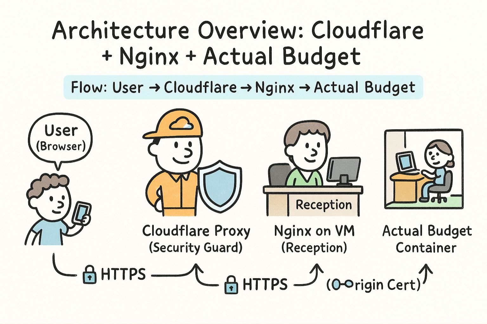

+++
title = "ลงมือจริง: Setup Actual Budget บน VM ด้วย Docker, Nginx และ Cloudflare - EP2"
date = "2025-08-31"

[taxonomies]
categories = [ "DevOps" ]
tags = [ "SSL", "Actual Budget", "HTTPS", "Certificate", "Cloudflare", "Azure", "Nginx"]
+++


- EP 1: [เข้าใจ SSL/TLS แบบง่าย ๆ ผ่าน Cloudflare และ Azure](/posts/2025-08-23-ssl-tls-made-easy-cloudflare-azure/)
- EP 2: ลงมือจริง: Setup Actual Budget บน VM ด้วย Docker, Nginx และ Cloudflare (บทความนี้)



สวัสดีครับ วันนี้ก็จะมาต่อกันใน **EP2** ของซีรีส์ SSL/TLS ที่เราเริ่มไว้กันนะครับ ถ้าใครได้อ่านตอนแรกไปแล้วก็น่าจะพอเห็นภาพกว้าง ๆ ว่า HTTPS มันทำงานยังไง ผ่านตัวอย่าง Cloudflare กับ Azure ว่าเวลาเราเลือกใช้ Managed Service หรือ VM เองเนี่ย เรื่องของ certificate จะต่างกันยังไง แต่พอเข้าใจแล้ว คราวนี้เราจะลอง “ลงมือจริง” กันดูบ้างครับ

ใน EP2 นี้ ผมจะเอาโปรเจกต์เล็ก ๆ ที่ชื่อว่า **Actual Budget** ซึ่งเป็น open-source budgeting app มาเป็นตัวอย่าง สมมติว่าเราอยากจะทำให้มันออนไลน์ใช้งานได้จริงบน VM ของเราเอง แล้วก็ครอบมันด้วย **Nginx + Cloudflare Origin Certificate** เพื่อให้ทุกอย่างปลอดภัยภายใต้โหมด Full (Strict) กันครับ เป้าหมายก็คือ… จาก VM ที่ว่างเปล่า เราจะค่อย ๆ ทำให้มันกลายเป็นเว็บที่มี HTTPS พร้อมใช้งานได้จริง ✨


สำหรับใครที่อยากลองทำตาม สามารถดูตัวอย่าง config ทั้งหมดได้ที่ GitHub repo นี้ครับ: [https://github.com/thaitype/actualbudget-vm-cloudflare](https://github.com/thaitype/actualbudget-vm-cloudflare)


ก่อนหน้านี้ผมเองก็เคยได้มีโอกาสลองใช้ **YNAB (You Need A Budget)** ในการจัดการเรื่องการเงินและงบประมาณส่วนตัว ต้องบอกเลยว่ามันเปลี่ยนวิธีคิดเรื่องการเงินของผมไปพอสมควร ปัญหาที่เคยเจอกันบ่อย ๆ อย่าง “เงินหายไปไหน”, “วางแผนงบยังไงดี”, หรือ “ค่าใช้จ่ายจริงกับที่ตั้งงบไม่ตรงกัน” — พอมาใช้ YNAB แล้วกลับกลายเป็นเรื่องที่ **ง่ายขึ้นเยอะมาก** เพราะตัวแอปมันออกแบบมาให้เราโฟกัสกับการบอก “ทุกบาททุกสตางค์มีที่ไป”

แต่ข้อเสียก็คือ ราคามันสูงไปหน่อยสำหรับการใช้งานระยะยาวสำหรับผม 😅 จนสุดท้ายผมมาเจอโปรเจกต์ที่ชื่อว่า **Actual Budget** ซึ่งเป็น open-source ที่หยิบเอาแนวคิดเดียวกันมาทำให้ฟรี และเราสามารถโฮสต์เองได้ ใครที่อยากเริ่มทำ “บัญชีส่วนตัว” แบบจริงจัง ผมแนะนำเลยครับว่าลอง Actual Budget ได้เลย จะเลือกใช้ VM บน Azure, DigitalOcean, fly.io หรือเจ้าไหนก็แล้วแต่ถนัดเลย แต่ในบทความนี้ผมจะขอใช้ **Azure VM** เป็นตัวอย่างหลักในการสาธิตครับ

## 1. เตรียม VM

สมมติว่าเรากำลังจะสร้างบ้านสักหลัง สิ่งแรกที่ต้องมีเลยก็คือ “ที่ดินเปล่า” ให้เราลงเสาเข็มได้ถูกไหมครับ? โลกของเซิร์ฟเวอร์ก็ไม่ต่างกันเลย สิ่งแรกที่เราต้องมีคือ **VM เปล่า ๆ** ซึ่งจะเป็นเหมือนที่ดินที่เราจะเอาบ้าน (หรือแอป Actual Budget ของเรา) ไปลงบนมัน

ในตัวอย่างนี้ผมจะใช้ **Azure VM** เป็นหลัก แต่จริง ๆ คุณจะเลือก DigitalOcean, AWS หรือเจ้าอื่นก็ได้เหมือนกัน ขึ้นอยู่กับความถนัดและความสะดวกของแต่ละคนเลยครับ จุดสำคัญคือ VM นี้จะต้องเป็น Linux (Ubuntu 20.04/22.04) ซึ่งเป็นเหมือน “ดินคุณภาพดี” ที่พร้อมให้เราลงโครงสร้างต่อไปได้ง่าย ๆ

พอได้ VM แล้ว เราก็เข้าไปผ่าน SSH เหมือนเดินเข้าสำรวจที่ดินของเรา จากนั้นกวาดลานนิดหน่อย (update system) เพื่อเคลียร์สภาพแวดล้อมให้พร้อมจะลงของใหม่ครับ

### ทำไมต้องใช้ VM ไม่ใช้ Managed Service?

หลายคนอาจสงสัยว่า… ทำไมเราต้องไปยุ่งยากเช่า VM เอง ทั้ง ๆ ที่ Azure หรือ Cloud Provider อื่น ๆ ก็มีพวก Managed Service ที่ทำให้ชีวิตง่ายขึ้น เช่น Azure App Service, Azure Container App อะไรพวกนี้ที่แถม HTTPS มาให้เลย แต่เหตุผลหลัก ๆ มันอยู่ตรงนี้ครับ

**Actual Budget ใช้ SQLite เป็นฐานข้อมูลหลัก** ซึ่ง SQLite จะเขียนไฟล์ลงดิสก์โดยตรง เวลาแอปทำงานจริง มันต้องการ **mount volume แบบ native** เพื่อให้สามารถอ่าน–เขียนไฟล์ได้ตามปกติ

ปัญหาคือ Managed Service ส่วนใหญ่ โดยเฉพาะพวก PaaS (Platform-as-a-Service) ของ Azure จะให้เราใช้ **Azure Files** หรือ storage อื่น ๆ ที่เป็น network file system แทน ซึ่งมันไม่ได้ support พฤติกรรมการเขียนไฟล์ทั้งหมดของ SQLite แบบ 100% ผลลัพธ์คือ… พอเราไป deploy จริง เราจะเจอ error ประมาณนี้เลย:

```
[Error: PRAGMA journal_mode = WAL - SQLITE_BUSY: database is locked]
```

ซึ่งก็คือ SQLite พยายามเข้าโหมด WAL (Write-Ahead Logging) แต่ดันล็อกไฟล์ไม่ได้ เพราะ storage ไม่รองรับการทำงานแบบนั้นเต็ม ๆ

ตรงนี้แหละครับที่ทำให้เราต้องเลือกใช้ **VM** หรือ service ที่ support **native filesystem mount** ได้จริง ๆ เช่น Azure VM, DigitalOcean Droplet, หรือ AWS EC2 เป็นต้น เพื่อให้ SQLite ทำงานได้ถูกต้องโดยไม่มีปัญหาเรื่อง database lock

พูดง่าย ๆ คือ… ถ้าเราอยากให้ Actual Budget รันได้ลื่น ๆ แบบไม่ต้องมานั่งปวดหัวกับ error แปลก ๆ เราก็ต้องยอมไปเช่า VM มา แล้วจัดการ environment เองทั้งหมดครับ

## 2. ติดตั้ง Docker & Docker Compose

พอเราได้ VM ที่เหมือนที่ดินเปล่า ๆ มาแล้ว ขั้นต่อไปก็คือการ “สร้างบ้าน” ให้แอปของเราอยู่ได้จริง แต่แทนที่จะไปลงเสา เทปูน ก่ออิฐทีละก้อน (ลง dependency เอง, ติดตั้ง runtime เอง) …เราจะเลือกวิธีที่ง่ายกว่า ก็คือการยก **บ้านสำเร็จรูป** มาลงไปเลยครับ

บ้านสำเร็จรูปในโลกของเซิร์ฟเวอร์ก็คือ **Docker** นั่นเอง — เราสามารถแพ็ก Actual Budget, Nginx, และ service อื่น ๆ ไว้ใน container ที่พร้อมใช้งาน แล้วเอามาวางลงบน VM ของเราได้ทันที โดยไม่ต้องห่วงว่า dependency จะชนกันหรือติดตั้งผิดเวอร์ชัน

นอกจากนี้ เรายังมี **Docker Compose** เป็นเหมือนแปลนบ้าน ที่เราบอกไว้เลยว่า “ห้องนี้คือ Nginx, ห้องนี้คือ Actual Budget, ห้องนี้ต่อไฟเข้ากับ database” — ทุกอย่างถูกนิยามไว้ในไฟล์ `docker-compose.yml` พอเราสั่ง `docker compose up -d` มันก็จะยกบ้านทั้งหลังขึ้นมาให้เราแบบอัตโนมัติเลย

ดังนั้นก่อนที่เราจะไปตั้งค่า config อื่น ๆ สิ่งแรกที่ต้องทำใน VM ของเราคือ:

1. ติดตั้ง Docker
2. ติดตั้ง Docker Compose
3. ตรวจสอบว่าใช้งานได้จริง (`docker --version`, `docker compose version`)

เมื่อเสร็จแล้ว เราก็พร้อมที่จะ “เอาของไปลงบ้าน” ได้ทันที

## 3. Config Environment สำหรับ Actual Budget

โอเคครับ ตอนนี้เรามี VM (ที่ดิน) + Docker/Compose (บ้านสำเร็จรูป) พร้อมแล้ว ทีนี้ก็ถึงเวลามา **จัดห้อง จัดเฟอร์นิเจอร์** ภายในบ้านกัน

สำหรับ Actual Budget สิ่งที่เราต้องทำก็คือการ **ตั้งค่า environment** เพื่อบอกบ้านเราว่า “ห้องไหนทำหน้าที่อะไร” เช่น URL ของเว็บ, ชื่อโดเมน, และ proxy ที่ไว้รับ request จากข้างนอก

วิธีการก็ง่าย ๆ ครับ:

1. เรา clone หรือโหลด template โปรเจกต์จาก GitHub มาก่อน [https://github.com/thaitype/actualbudget-vm-cloudflare](https://github.com/thaitype/actualbudget-vm-cloudflare)

2. จากนั้น copy ไฟล์ `.env.example` มาเป็น `.env` เหมือนเราได้คู่มือบ้านมาหนึ่งชุด

3. เปิด `.env` แล้วปรับค่าให้ตรงกับของเรา เช่น:

   * `ACTUAL_BASE_URL=https://actual-budget.mydomain.com`
   * `ACTUAL_SERVER_HOSTNAME=actual-budget.mydomain.com`
   * `TRUSTED_PROXIES` (ใครที่เรายอมให้ผ่าน proxy ได้)

4. นอกจากนี้ยังต้องไปแก้ใน config ของ Nginx (`default.conf`) ให้ใช้โดเมนของเราจริง ๆ ด้วย เพื่อให้เวลามีคนพิมพ์ `https://actual-budget.mydomain.com` ระบบจะรู้จักและส่งไปหา container ที่ถูกต้อง

พูดง่าย ๆ ก็คือ ขั้นตอนนี้คือการ **จัดห้อง + ตั้งป้ายชื่อห้อง** ว่า “อันนี้ห้องครัวนะ, อันนี้ห้องนั่งเล่นนะ” เพื่อให้ระบบทั้งหมดมันสื่อสารกันถูกต้อง

พอเราทำ config เสร็จเรียบร้อยแล้ว ก็เหมือนกับบ้านที่พร้อมจะขนเฟอร์นิเจอร์ (service จริง) เข้ามาวางแล้วครับ

## 3.1 Architecture Overview: Cloudflare + Nginx + Actual Budget

ก่อนที่เราจะไปขอ Certificate จาก Cloudflare ผมอยากชวนมาดู **ภาพรวมการทำงาน** ของระบบนี้กันก่อนครับ จะได้เข้าใจว่า Nginx มีหน้าที่อะไร ทำไมต้องอยู่ตรงกลางระหว่าง Cloudflare กับ Actual Budget

ลองนึกภาพเป็นอาคารสำนักงานหนึ่งหลังที่มี **รปภ.** (Cloudflare) ยืนอยู่หน้าประตูใหญ่ ใครจะเข้ามาในตึกก็ต้องผ่านรปภ.ก่อน ตรวจบัตร ตรวจความปลอดภัย แล้วถ้าไม่มีปัญหา ถึงจะปล่อยให้เข้าไปในตัวตึก

ในโลกของเราก็คล้าย ๆ กันครับ

* **User** → คือคนที่เดินเข้ามาในตึก ก็คือผู้ใช้ที่เปิดเว็บ `https://actual-budget.mydomain.com`
* **Cloudflare Proxy** → คือรปภ. ด่านแรก คอยตรวจสอบ request ว่ามาจาก bot หรือเปล่า, มี DDoS หรือเปล่า, และช่วย terminate TLS แรกให้
* **Nginx (บน VM)** → คือพนักงานต้อนรับในอาคาร ที่คอยรับ request ต่อจาก Cloudflare แล้วกระจายงานไปยังห้องต่าง ๆ ในตึก (service ภายใน VM)
* **Actual Budget Container** → ก็คือห้องทำงานจริง ๆ ข้างในตึก ที่คอยประมวลผลและตอบกลับ

ดังนั้น flow ของการสื่อสารจะเป็นแบบนี้ครับ:



* ผู้ใช้เชื่อมต่อแบบ HTTPS ปลอดภัยมาถึง Cloudflare
* Cloudflare เปิด connection ใหม่ไปหา VM ผ่าน HTTPS อีกรอบ โดยเช็ก certificate ของ Nginx (ซึ่งเราจะใช้ Origin CA ที่ Cloudflare ออกให้)
* Nginx ทำหน้าที่เป็น reverse proxy → รับ request แล้วส่งต่อไปยัง container ของ Actual Budget ที่รันอยู่ใน Docker

**Key Point:**
Nginx ไม่ได้ทำงานแทน Cloudflare แต่ทำหน้าที่เป็น **“ฝั่งรับ”** ของ certificate ที่ Cloudflare ไว้ใจ และช่วย forward traffic ไปยังแอปของเราอย่างถูกต้อง


แบบนี้เวลาเราไปขอ Cloudflare Origin Certificate ผู้อ่านจะเข้าใจทันทีว่ามันไม่ใช่การขอ cert มาแปะมั่ว ๆ แต่คือการ “ทำกุญแจบ้าน” ที่ Cloudflare และ Nginx จะใช้ในการเชื่อมต่อกันครับ


## 4. ขอ Cloudflare Origin Certificate

โอเคครับ พอเราเข้าใจ Architecture แล้วว่า Cloudflare → Nginx → Actual Budget มันเชื่อมกันยังไง สิ่งสำคัญถัดมาก็คือ **“ทำให้ Cloudflare เชื่อมั่นใน Nginx ของเรา”**

โดยปกติแล้ว ถ้าเราอยากให้เซิร์ฟเวอร์มี HTTPS เรามีสองทางเลือก:

1. **ใช้ Certificate ทั่วไปจาก CA**

   * อาจจะเป็นฟรีอย่าง **Let’s Encrypt** หรือแบบเสียตังค์จากผู้ให้บริการอย่าง DigiCert, Sectigo ฯลฯ
   * จุดเด่นคือ cert แบบนี้ **browser ทั่วไปก็เชื่อถือได้** เวลาผู้ใช้เข้าเว็บตรงมาที่ origin (ไม่ผ่าน Cloudflare) ก็จะไม่เจอ warning ใด ๆ
   * ข้อเสียคือ Let’s Encrypt อายุสั้น (90 วัน) ต้องต่ออายุเรื่อย ๆ ส่วน cert ที่เสียเงินก็แพงกว่า

2. **ใช้ Cloudflare Origin Certificate**

   * Cloudflare ออกให้โดยตรงเพื่อใช้ระหว่าง **Cloudflare ↔ Origin Server (Nginx/VM)** เท่านั้น
   * อายุยาวมาก (default 15 ปี) หมายความว่าเราไม่ต้องปวดหัวคอย renew บ่อย ๆ
   * แต่ cert แบบนี้ **browser ปกติจะไม่เชื่อ** ถ้าเข้าเว็บตรงไปที่ origin IP (จะขึ้น warning) → เพราะมันออกมาเพื่อให้ Cloudflare ใช้ validate กับ origin โดยเฉพาะ
   * ซึ่งก็โอเคอยู่แล้ว เพราะผู้ใช้จริงจะต้องเข้าผ่าน Cloudflare Proxy เสมอ

พูดง่าย ๆ เลยก็คือ:

* ถ้าอยากให้ **คนกับ browser เชื่อ** → ใช้ Let’s Encrypt / CA ปกติ
* ถ้าอยากให้ **Cloudflare เชื่อ** (สำหรับ Full Strict) → ใช้ **Origin CA**

และในโปรเจกต์ Actual Budget ของเรา เนื่องจากผู้ใช้ทุกคนจะวิ่งผ่าน Cloudflare อยู่แล้ว เราก็เลือกใช้ **Origin Cert** เพื่อความสบายใจและลดภาระการต่ออายุครับ

### ขั้นตอนการขอ Origin Cert

1. เข้าไปที่ **Cloudflare Dashboard → SSL/TLS → Origin Server → Create Certificate**
2. เลือก hostname ของเรา เช่น `actual-budget.mydomain.com`
3. เลือก key type: RSA
4. เลือก validity: default (15 ปี)
5. Cloudflare จะสร้างไฟล์มาให้สองอัน:

   * **Origin Certificate** → เก็บเป็น `origin.crt`
   * **Private Key** → เก็บเป็น `origin.key`

จากนั้นเราก็จะเอาไฟล์สองตัวนี้ไปใส่ใน Nginx เพื่อให้ Cloudflare เชื่อมต่อเข้ามาแบบ Full Strict ได้อย่างปลอดภัยครับ

## 5. ตั้งค่า Nginx (Reverse Proxy)

ตอนนี้เรามี VM (ที่ดิน), Docker (บ้านสำเร็จรูป), และ Origin Certificate (กุญแจที่ Cloudflare ออกให้) เรียบร้อยแล้ว สิ่งที่ขาดไม่ได้เลยก็คือ **“พนักงานต้อนรับ”** ที่คอยรับแขกทุกคนที่เดินเข้ามาในตึก → นั่นก็คือ **Nginx** ครับ

Nginx ทำหน้าที่เป็น **Reverse Proxy** ก็คือเวลามี request มาจาก Cloudflare → Nginx จะเป็นคนแรกที่รับ จากนั้นมันจะตรวจว่า request ไปไหน แล้วส่งต่อให้ service ข้างใน (Actual Budget container) อีกที

ลองนึกภาพง่าย ๆ:

* Cloudflare = รปภ. หน้าตึก
* Nginx = เคาน์เตอร์พนักงานต้อนรับ
* Actual Budget = ห้องทำงานจริง ๆ ที่อยู่ด้านใน

เวลาคน (User) เดินเข้ามา → Cloudflare ตรวจบัตรแล้วปล่อยผ่าน → พนักงานต้อนรับ (Nginx) จะเป็นคนบอกว่า “อ๋อ คุณจะไปห้อง Actual Budget ใช่ไหม? เชิญทางนี้เลย” แล้วส่ง request เข้าห้องถูกต้อง

---

### Config Nginx

เราจะให้ Nginx ฟังทั้งพอร์ต 80 (HTTP) และ 443 (HTTPS)

* พอร์ต 80: แค่ redirect ทุก request ไปที่ HTTPS (เพื่อบังคับเข้ารหัสเสมอ)
* พอร์ต 443: ฟังด้วย SSL (ใช้ Origin Cert ที่ Cloudflare ออกให้) แล้วทำ proxy pass ไปยัง Actual Budget container

ตัวอย่าง config (แบบย่อ):

```nginx
server {
  listen 80;
  server_name actual-budget.mydomain.com;
  return 301 https://$host$request_uri;
}

server {
  listen 443 ssl http2;
  server_name actual-budget.mydomain.com;

  ssl_certificate     /etc/nginx/certs/actual-budget.mydomain.com/origin.crt;
  ssl_certificate_key /etc/nginx/certs/actual-budget.mydomain.com/origin.key;

  ssl_protocols TLSv1.2 TLSv1.3;
  ssl_ciphers HIGH:!aNULL:!MD5;

  location / {
    proxy_pass http://actual:5006;
    proxy_set_header Host $host;
    proxy_set_header X-Real-IP $remote_addr;
    proxy_set_header X-Forwarded-For $proxy_add_x_forwarded_for;
    proxy_set_header X-Forwarded-Proto https;
  }
}
```

ในที่นี้ `proxy_pass http://actual:5006;` หมายถึง Nginx จะส่งต่อ traffic ไปยัง container ของ Actual Budget ที่รันบนพอร์ต 5006

### Key Point ที่ต้องเข้าใจ

* **Cloudflare → Nginx** เชื่อมกันด้วย HTTPS (Origin Cert)
* **Nginx → Actual Budget Container** ใช้ HTTP ธรรมดาภายใน VM ก็พอ เพราะมันวิ่งในเครือข่าย local อยู่แล้ว
* User ไม่มีทางเข้ามาถึง Nginx โดยตรง ต้องวิ่งผ่าน Cloudflare เสมอ → ทำให้ปลอดภัย

พอ config Nginx เสร็จแล้วก็เหมือนเราได้ “พนักงานต้อนรับที่พร้อมเปิดตึก” ไว้เรียบร้อย รอเพียงแค่ยกของ (config และ cert) ขึ้นไปไว้บน VM แล้ว start ระบบจริง

## 5.1 Authenticated Origin Pulls (เพิ่มรปภ. สองชั้น)

ถึงตรงนี้เราจะเห็นว่า Nginx ของเรามี **Origin Certificate** แล้ว Cloudflare ก็เชื่อมต่อมาด้วย HTTPS แบบ Full Strict ได้ แต่ในบางกรณี เรายังอาจกังวลอยู่ว่า… “แล้วถ้ามีใครสักคนพยายามข้าม Cloudflare แล้วยิง HTTPS ตรงเข้ามาที่ Nginx โดยตรงล่ะ?”

ปกติแล้วมันอาจจะยังต่อได้ (ถ้ารู้ IP VM ตรง ๆ) เพราะ Origin Cert ถูกออกมาให้ Cloudflare ใช้ แต่ browser ปกติไม่รู้จักก็จะขึ้น warning → อย่างไรก็ตาม ถ้าเป็น attacker ที่บังคับข้าม Cloudflare เข้ามา Nginx ก็อาจจะยังเปิดรับอยู่

ตรงนี้แหละครับที่ **Authenticated Origin Pulls** เข้ามาแก้ปัญหา

### มันคืออะไร?

* Cloudflare จะส่ง **client certificate** ของตัวเองมาพร้อมกับการเชื่อมต่อ HTTPS ทุกครั้ง
* Nginx (ฝั่ง origin) จะตรวจสอบ cert นั้นว่าเป็นของ Cloudflare จริงหรือเปล่า
* ถ้าไม่ใช่ → ปฏิเสธ connection ทันที

พูดง่าย ๆ ก็คือ เพิ่มการตรวจว่า **“คนที่เข้ามาเป็น Cloudflare จริง ๆ นะ ไม่ใช่ใครก็ได้ที่ต่อ HTTPS มาหาเรา”**

### Nginx Config (เสริม)

นอกจาก ssl\_certificate / ssl\_certificate\_key ของ Origin Cert แล้ว เราเพิ่ม config นี้เข้าไป:

```nginx
ssl_client_certificate /etc/nginx/certs/cloudflare/origin-pull-ca.pem;
ssl_verify_client on;
```

* `origin-pull-ca.pem` คือ certificate ของ Cloudflare ที่เราโหลดมาจากหน้า Origin Pulls ของ Cloudflare
* `ssl_verify_client on;` บังคับให้ Nginx ยอมคุยเฉพาะกับ client (Cloudflare) ที่ถือ cert ตัวนี้เท่านั้น

### เปรียบเทียบให้เห็นภาพ

* เดิมทีมีแค่ **กุญแจล็อกประตู (Origin Cert)** → Cloudflare มีกุญแจไขเข้ามาได้
* แต่ตอนนี้เพิ่ม **ตรวจบัตรพนักงาน (Authenticated Pull Cert)** → ต่อให้ใครลอกกุญแจเลียนแบบมา แต่ถ้าไม่มีบัตรที่ Cloudflare ออกจริง ก็เข้าไม่ได้

สรุปคือ ถ้าเราเปิด **Authenticated Origin Pulls** เราจะมั่นใจได้เลยว่า **ทุก request ที่ถึง Nginx ต้องมาจาก Cloudflare เท่านั้น** ไม่ใช่ attacker ที่พยายามเข้าตรง ๆ

## 6. Deploy Configuration ไปที่ VM

โอเคครับ ตอนนี้เรามีทุกอย่างครบแล้ว ทั้ง **Docker/Compose** (บ้านสำเร็จรูป), **Nginx config** (พนักงานต้อนรับ), และ **Origin Certificate** (กุญแจบ้าน) รวมถึงถ้าอยากปลอดภัยสุด ๆ ก็มี **Authenticated Origin Pulls** (ตรวจบัตรพนักงาน) …ทีนี้ก็ถึงเวลาขนของจริงไปลงบน VM ของเราแล้ว

การ deploy ตรงนี้ก็เปรียบเหมือนกับการ **ย้ายเฟอร์นิเจอร์และของใช้ทั้งหมดเข้าบ้านใหม่** นั่นแหละครับ เราจะเอาไฟล์สำคัญ ๆ เช่น:

* `.env` (ค่าตั้งต่าง ๆ ของ Actual Budget)
* `docker-compose.yml` (แปลนบ้าน)
* `nginx/conf.d/` (พนักงานต้อนรับ)
* `origin.crt` + `origin.key` (กุญแจบ้าน)

แพ็กทั้งหมดขึ้นรถบรรทุก (deployment script) แล้วส่งไปยัง VM ผ่าน SSH

---

### Flow ของการ Deploy

1. **ตรวจสอบไฟล์ config ฝั่งเราให้เรียบร้อยก่อน** → เหมือนตรวจเช็กว่าของครบมั้ยก่อนย้ายบ้าน
2. **ใช้ script ส่งไฟล์ขึ้น VM ผ่าน SCP/rsync** → เหมือนขนเฟอร์นิเจอร์ขึ้นรถแล้วไปส่ง
3. **เซ็ต permission บน cert** → เพื่อให้กุญแจบ้าน (origin.key) ถูกเก็บอย่างปลอดภัย มีแค่ Nginx อ่านได้
4. **วางไฟล์ทั้งหมดลงที่ directory ของ VM** เช่น `/home/ubuntu/actual`
5. **SSH เข้า VM เพื่อตรวจสอบอีกที** ว่าของมาถึงครบ พร้อมใช้งาน

---

### ตัวอย่างคำสั่ง Deploy

```bash
REMOTE_HOST=203.0.113.10 \
REMOTE_USER=ubuntu \
REMOTE_DIR=/home/ubuntu/actual \
SSH_KEY=~/.ssh/id_ed25519 \
./deploy-config.sh
```

script นี้จะช่วยเรา validate ไฟล์, copy ขึ้น VM, เซ็ตสิทธิ์ไฟล์ cert ให้เรียบร้อย แล้วสรุปขั้นตอนต่อไปให้

พอเสร็จขั้นตอนนี้ เราจะได้ “บ้านพร้อมอยู่” แล้วครับ เหลือแค่สั่งเปิดไฟ (start service) ทุกอย่างก็พร้อมทำงานจริง 🎉

## 7. ตั้งค่า DNS บน Cloudflare

โอเคครับ ถึงตอนนี้บ้านของเราก็พร้อมแล้ว ทั้งโครงสร้างภายใน (Docker + Actual Budget), พนักงานต้อนรับ (Nginx), และกุญแจบ้าน (Origin Cert) …แต่ปัญหาคือคนทั่วไป **ยังไม่รู้ว่าบ้านเราอยู่ที่ไหน**

ตรงนี้เองที่ **DNS** เข้ามามีบทบาทครับ มันก็เหมือน **สมุดหน้าเหลือง / Google Maps** ที่บอกว่า “ถ้าอยากไปบ้านนี้ ให้ตามพิกัดนี้ไปนะ”

ใน Cloudflare เราจะต้องเข้าไปเพิ่ม DNS record ให้ domain/subdomain ของเรา เช่น:

* `actual-budget.mydomain.com` → ชี้ไปที่ **IP ของ VM** ของเรา

### ขั้นตอนใน Cloudflare

1. เข้า **Cloudflare Dashboard → DNS**
2. เพิ่ม A record:

   * Name: `actual-budget`
   * Value: `<VM_PUBLIC_IP>`
   * Proxy: เปิดเป็น **Proxied (เมฆสีส้ม)** ☁️
3. ไปที่ **SSL/TLS → Overview** แล้วเลือก **Full (Strict)** เพื่อให้ Cloudflare บังคับเชื่อมกับ Origin เฉพาะที่มี cert ถูกต้องเท่านั้น
4. (Optional) เปิด **Authenticated Origin Pulls** ถ้าเรา config ไว้ที่ Nginx แล้ว

### ภาพรวม Flow หลังตั้งค่า DNS

```
[ User ] → actual-budget.mydomain.com
   ↓ (DNS lookup by Cloudflare)
[ Cloudflare Proxy ] --HTTPS (Origin Cert)--> [ Nginx @ VM ] → [ Actual Budget ]
```

พอถึงตรงนี้ ทุกอย่างเริ่มเข้าที่เข้าทางแล้วครับ ผู้ใช้ก็สามารถพิมพ์ `https://actual-budget.mydomain.com` แล้วระบบจะวิ่งผ่าน Cloudflare → Nginx → Container ได้อย่างปลอดภัย 🔒


## 8. Start Service + Test

โอเคครับ ตอนนี้ทุกอย่างเราขนเข้าบ้านเรียบร้อยแล้ว ไม่ว่าจะเป็นโครงสร้าง (Docker), พนักงานต้อนรับ (Nginx), กุญแจบ้าน (Origin Cert), และบอกพิกัดบ้านบนแผนที่ (DNS) …ทีนี้ก็ถึงเวลาสำคัญที่สุด คือ **เปิดไฟบ้านให้ใช้งานจริง** ครับ 💡

บน VM ของเรา เราเพียงเข้าไปที่ directory ที่เก็บไฟล์ทั้งหมด (เช่น `/home/ubuntu/actual`) แล้วสั่ง:

```bash
docker compose up -d
```

จากนั้น Docker ก็จะยกทุก container ขึ้นมาพร้อมกัน ทั้ง Actual Budget, Nginx, และ service ที่เกี่ยวข้อง

### ตรวจสอบว่าระบบทำงานจริง

1. ใช้ `docker ps` → เหมือนเดินดูว่าทุกห้องในบ้านมีไฟติดครบ
2. ใช้ `docker logs -f nginx` → ดูว่าพนักงานต้อนรับ (Nginx) ตอบสนองปกติไหม
3. ใช้ `curl -I https://actual-budget.mydomain.com` → ทดลอง “กดกริ่งบ้าน” จากข้างนอก

ถ้าได้ status `200 OK` ก็แปลว่าบ้านเราเปิดรับแขกแล้วครับ 🎉


### เปิดเบราว์เซอร์

พิมพ์ใน browser:

👉 `https://actual-budget.mydomain.com`

ถ้าทุกอย่างเรียบร้อย คุณจะเจอหน้าเว็บ Actual Budget พร้อมกุญแจเขียว 🔒 โผล่ขึ้นมา → แปลว่า TLS ทำงานครบทั้งเส้นทาง (User → Cloudflare → Nginx → Container) แล้ว

พูดง่าย ๆ เลยก็คือ จาก **VM เปล่า ๆ** เราก็เปลี่ยนมันเป็น **เว็บแอปที่พร้อมใช้งานจริง** ได้สำเร็จแล้วครับ 🚀

## 9. Backup Strategy

พอเรามีบ้านใหม่เสร็จสรรพ เปิดไฟใช้งานจริงได้แล้ว สิ่งหนึ่งที่มักจะถูกลืม แต่สำคัญไม่แพ้กันก็คือ… **การทำกุญแจสำรองและประกันบ้าน**
ในโลกของระบบ นั่นก็คือ **การทำ Backup** ครับ

ลองนึกภาพดูว่า วันหนึ่งถ้าไฟดับ ฮาร์ดดิสก์พัง หรือเราเผลอลบไฟล์ผิดไป …เราจะอยากมีวิธี “ย้อนเวลา” กลับไปยังสภาพที่ระบบเคยใช้งานได้ปกติใช่ไหมครับ การทำ backup จึงเป็นเหมือนการเตรียม **ประตูหนีไฟ** เอาไว้ให้เราอุ่นใจ

### สิ่งที่ควร Backup

1. **ข้อมูลผู้ใช้ + งบการเงิน**

   * เก็บอยู่ใน directory `./actual-data`
   * ตรงนี้คือหัวใจของ Actual Budget เลย เพราะมันบันทึกข้อมูลทั้งหมดที่ผู้ใช้กรอก

2. **SSL Certificates (origin.crt + origin.key)**

   * แม้ว่าจะขอใหม่จาก Cloudflare ได้ แต่การเก็บสำรองไว้จะช่วยให้เรา restore ได้เร็วขึ้น

3. **ไฟล์ Config สำคัญ**

   * `.env`, `docker-compose.yml`, `nginx/conf.d/*`
   * เป็นเหมือนคู่มือบ้าน ถ้าไฟล์พวกนี้หาย ระบบอาจจะยังสร้างบ้านใหม่ได้ แต่จะต้องใช้เวลา setup นานขึ้น

### แนวทางการ Backup

* ตั้ง cron job บน VM → copy `./actual-data` ออกไปยัง storage ภายนอก
* หรือใช้ tool พวก rsync / restic เพื่อ sync ข้อมูลเป็นระยะ ๆ
* เก็บไฟล์สำรองไว้ใน cloud storage อื่น เช่น Azure Blob, S3, หรือแม้แต่ Google Drive ก็ได้

พูดง่าย ๆ ก็คือ Backup = **กุญแจสำรอง** + **ประกันบ้าน**
ทำให้มั่นใจว่า ต่อให้เกิดอะไรขึ้นกับ VM หรือ container …ข้อมูลการเงินของเราก็ยังไม่หายไปไหน


## 10. Conclusion

จากตอนแรกที่เราเริ่มต้นด้วย **VM เปล่า ๆ** เหมือนซื้อที่ดินโล่ง ๆ มาหนึ่งแปลง จนถึงตอนนี้เราสามารถสร้างบ้านที่พร้อมอยู่จริงได้สำเร็จแล้ว 🎉

* เราเลือกใช้ **VM** เพราะ Actual Budget ใช้ SQLite เป็นฐานข้อมูลที่ต้องการ native filesystem → Managed Service อย่าง Azure App Service ไม่ตอบโจทย์
* เราติดตั้ง **Docker & Docker Compose** เหมือนยกบ้านสำเร็จรูปมาลง → ทำให้จัดการ service ได้ง่ายและยืดหยุ่น
* เรา config **Environment และ Nginx** → ทำหน้าที่เป็นพนักงานต้อนรับ คอยจัดการ traffic ที่วิ่งเข้ามา
* เราขอ **Cloudflare Origin Certificate** → เป็นกุญแจสำคัญที่ทำให้ Cloudflare ยอมเชื่อมต่อกับ origin ได้แบบ Full (Strict)
* เราเปิด **Authenticated Origin Pulls** → เป็นเหมือนการตรวจบัตรพนักงานที่มั่นใจได้ว่า request ที่เข้ามาต้องผ่าน Cloudflare จริง ๆ
* เราตั้งค่า **DNS บน Cloudflare** → เพื่อบอกโลกว่าเว็บเราอยู่ตรงไหน
* สุดท้าย เรา start service ขึ้นมา และปิดท้ายด้วยการทำ **Backup Strategy** ให้ชีวิตปลอดภัยขึ้นอีกขั้น

ทั้งหมดนี้ก็คือการเอาทฤษฎีจาก **EP1** ที่เราคุยกันเรื่อง TLS Flow และ Certificate มา **ลงมือจริงใน EP2** จนกลายเป็นเว็บแอปที่เปิดใช้งานได้จริงพร้อม HTTPS

สำหรับผมแล้ว มันทำให้รู้สึกว่าเรื่อง SSL/TLS ที่แต่ก่อนเคยดูเป็น “หลุมดำ” เต็มไปด้วยศัพท์เทคนิคยาก ๆ …พอเราแยกเป็นสถานการณ์, วาด flow ให้ง่าย, แล้วลองลงมือทำจริง มันก็ไม่ได้ยากเกินไปเลยครับ ✨

และนี่ก็คือ **Actual Budget + Nginx + Cloudflare Origin Cert** ที่ผมอยากเล่าให้ฟังในตอนนี้ 
