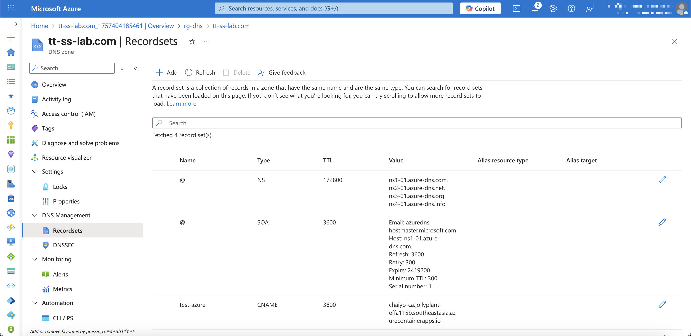
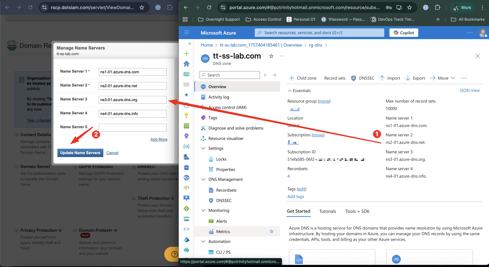

+++
title = "พื้นฐานของ DNS และการย้าย DNS ไปยัง Azure DNS Zone"
date = "2025-09-09"

[taxonomies]
categories = [ "DevOps" ]
tags = [
  "Azure",
  "Azure DNS Zone"
]

[extra]
mermaid = true
+++

สวัสดีครับ วันนี้อยากมาเล่าเรื่อง **DNS Zone และการย้ายโดเมนมาที่ Azure DNS Zone** กันแบบง่าย ๆ หลายคนอาจเคยได้ยินคำว่า DNS แล้วรู้สึกว่าเป็นศัพท์เทคนิคที่ซับซ้อน แต่จริง ๆ แล้ว DNS ก็คือ **สมุดโทรศัพท์ของอินเทอร์เน็ต** นี่เองครับ ถ้าเปรียบเทียบให้เห็นภาพ: โดเมนเนม (`example.com`) ก็เหมือน “ชื่อคน” ในสมุดโทรศัพท์, IP Address (`1.2.3.4`) ก็เหมือน “เบอร์โทรศัพท์จริง” ส่วน DNS Record คือบันทึกที่บอกว่า *ชื่อนี้ต้องโทรไปที่เบอร์ไหน* เวลาที่เบราว์เซอร์อยากเข้าเว็บ มันก็แค่เปิดสมุดโทรศัพท์เล่มนี้ดู แล้วรู้ทันทีว่าจะต้องวิ่งไปที่ IP ไหนถึงจะเจอเว็บไซต์ของเรา

<!-- gen image -->

## พื้นฐานของ DNS

แล้วในสมุดโทรศัพท์ของอินเทอร์เน็ตเอง ก็ไม่ได้มีแค่ **“ชื่อ → เบอร์”** แบบเดียว แต่ยังมีหลายประเภทของการเชื่อมต่อ ที่บอกว่าโดเมนควรวิ่งไปหาปลายทางแบบไหนบ้าง ตัวอย่างที่เจอบ่อย ๆ ได้แก่

* **A Record** → ระบุว่า *ชื่อนี้* ต้องชี้ไปยัง *หมายเลขบ้านจริง* (IP Address แบบตัวเลข)
* **CNAME Record** → เป็นเหมือน *ชื่อเล่น* ของชื่อหลัก เช่น `www.example.com` ชี้ไปที่ `example.com`
* **MX Record** → ใช้สำหรับ *อีเมล* บอกว่าถ้ามีใครจะส่งจดหมาย (อีเมล) มาที่ `@example.com` ต้องไปที่ “ไปรษณีย์เซิร์ฟเวอร์” ไหน
* **TXT Record** → เป็นเหมือน *โน้ตสั้น ๆ* ที่แนบไว้กับชื่อ เช่น การยืนยันความเป็นเจ้าของโดเมน หรือการตั้งค่าความปลอดภัยของอีเมล

แต่ถ้าวันหนึ่งเราไม่ได้อยากใช้แค่เว็บสำเร็จรูปของผู้ให้บริการแล้ว เช่น อยากเอาโดเมนนี้ไปชี้เข้ากับแอปที่รันอยู่บน Azure, ใช้กับอีเมลของ Microsoft 365 หรือ Google Workspace, หรืออยากควบคุม DNS ด้วยโค้ด (Infrastructure as Code) ปัญหาจะเริ่มตามมาทันทีครับ เพราะ DNS Record ที่ผู้ให้บริการตั้งมาให้อาจไม่ตรงกับสิ่งที่เราต้องการ หรือบางครั้ง panel ของผู้ให้บริการก็ไม่ยืดหยุ่นพอที่จะรองรับการตั้งค่าซับซ้อน เมื่อถึงจุดนี้เองที่เราจะเริ่มเห็นประโยชน์ของการ “ย้าย DNS Zone” มาจัดการเองบน Azure DNS ครับ

## ทำไมถึงต้องใช้ Azure DNS

สาเหตุที่หลายคนเลือกจะย้าย DNS มาจัดการเองบน Azure DNS ก็เพราะว่ามันช่วยให้เราควบคุมได้มากกว่าการปล่อยให้ผู้ให้บริการโดเมนเป็นคนจัดการครับ อย่างแรกเลยคือเรื่อง **ความยืดหยุ่น** เวลาเราอยากเพิ่ม record แปลก ๆ หรือแก้ไขค่าให้ตรงกับระบบที่เราสร้างเอง บางที panel ของผู้ให้บริการเดิมไม่รองรับ แต่บน Azure DNS เราตั้งค่าได้เต็มที่ อีกอย่างคือมันรองรับการทำงานแบบ **Automation** ผ่าน API, Azure CLI หรือ Terraform ซึ่งสำคัญมากเวลาที่เรามีหลาย environment เช่น Dev, UAT, Prod แล้วอยากให้ DNS ถูกสร้างและอัปเดตแบบอัตโนมัติพร้อมกับระบบอื่น ๆ สุดท้ายคือ **การเชื่อมต่อกับบริการ Azure อื่น ๆ** ที่ทำได้เนียนกว่า เช่น App Service, Container App หรือ VM พอใช้ DNS ของ Azure อยู่แล้ว การผูก custom domain เข้ากับ service เหล่านี้ก็สะดวกขึ้นมากครับ

## DNS ทำงานยังไง

หลายคนอาจจะสงสัยว่า เวลาที่เราซื้อโดเมนมาแล้ว เราจะเอาโดเมนนี้ไปใช้กับบริการ DNS ของเจ้าอื่นได้ยังไง เพราะอาจเข้าใจว่าการซื้อโดเมนมันเหมือนกับการสมัครใช้ซอฟต์แวร์แบบ Subscription (SaaS) ที่ล็อกเราไว้กับระบบของเขา ย้ายออกไปที่อื่นแทบจะเป็นไปไม่ได้ แต่ความจริงแล้วการ “ซื้อโดเมน” คือการจดทะเบียนชื่อบนอินเทอร์เน็ตครับ ส่วนบริการ DNS ที่แถมมาด้วยเป็นแค่ ตัวช่วย ที่ registrar เตรียมไว้ให้เราเท่านั้น เราสามารถเลือกได้เลยว่าจะใช้ DNS ของเขา หรือย้ายไปใช้ DNS Provider รายอื่น เช่น Azure DNS หรือ Cloudflare โดยทำได้แค่การเปลี่ยน Nameserver ของโดเมนให้ชี้ไปยังระบบใหม่เท่านั้นเอง

เพื่อให้เห็นภาพชัดขึ้น ลองมาดูกันครับว่าเวลาเรามี **Domain, DNS และ Nameserver** ทั้งสามอย่างนี้ทำงานร่วมกันยังไง

* **Domain** → คือ “ชื่อ” ที่เราจดทะเบียนไว้ เช่น `example.com` คล้าย ๆ กับการที่เราไปจองชื่อร้านในห้าง ว่าชื่อนี้เป็นของเราแล้ว คนอื่นจะมาใช้ชื่อเดียวกันไม่ได้
* **DNS Record** → คือ “กฎการแปลงชื่อ” ว่าเวลามีคนเรียก `example.com` ต้องไปที่ไหนต่อ เช่น A record ชี้ไป IP ของเซิร์ฟเวอร์, MX record ชี้ไปเซิร์ฟเวอร์อีเมล
* **Nameserver (NS)** → คือ “คนเฝ้าสมุดโทรศัพท์” คอยตอบคำถามเวลามีคนมาถามว่าชื่อนี้ต้องไปที่ไหน สมมติเราเปลี่ยน nameserver ของโดเมนไปเป็นของ Azure DNS ก็หมายความว่า ต่อจากนี้ใครก็ตามที่ถามข้อมูลเกี่ยวกับ `example.com` จะต้องไปถาม Azure DNS เพื่อให้มันตอบกลับมา

ดังนั้นภาพรวมการทำงานคือ **Domain** เป็นชื่อ, **DNS Record** คือกฎการชี้ทาง, และ **Nameserver** คือผู้ให้บริการที่ถือสมุดบันทึกนี้ไว้ พอเราย้าย nameserver ไปเจ้าไหน ก็เท่ากับว่ามอบสิทธิ์การจัดการ DNS Record ทั้งหมดให้เจ้านั้นไปดูแลครับ

## เวลาที่เราเข้า example.com มันทำงานยังไง?

ลองมาดูขั้นตอนการทำงานของ DNS กันแบบละเอียด ๆ ครับ สมมติว่าเรามีโดเมน `example.com` ที่จดทะเบียนกับ Google Domain แล้วตั้ง nameserver ไปที่ Azure DNS Zone ที่เราสร้างไว้ (เช่น `ns1-01.azure-dns.com`, `ns2-01.azure-dns.net`, etc.) และใน Azure DNS Zone เราตั้ง A record ให้ `example.com` ชี้ไปที่ IP ของเว็บเซิร์ฟเวอร์ที่รันอยู่บน Azure (เช่น `20.50.100.25`) เวลาที่ผู้ใช้พิมพ์ `example.com` ในเบราว์เซอร์ ขั้นตอนการทำงานจะเป็นดังนี้ครับ:

1. **ผู้ใช้พิมพ์ `example.com` ใน browser**

   * Browser จะถามระบบปฏิบัติการก่อนว่าเคยเก็บ IP ของ `example.com` ไว้ใน cache ไหม (เหมือนเราเคยจดเบอร์โทรเพื่อนลงมือถือไว้แล้ว)
   * ถ้าไม่มี → ต้องไปถามคนอื่น (DNS Resolver)

2. **DNS Resolver รับหน้าที่ตามหาคำตอบ**

   * Resolver เปรียบเหมือน “คนกลาง” ที่เราส่งคำถามไปให้ เช่น DNS ของ ISP, Google (8.8.8.8), หรือ Cloudflare (1.1.1.1)
   * ถ้า resolver ไม่เคยเจอ `example.com` มาก่อน → มันต้องเริ่มออกเดินทางตามหา

3. **ถาม Root Server ก่อน**

   * Root Server คือ “สารบัญใหญ่สุด” ของโลกอินเทอร์เน็ต
   * มันจะไม่รู้ว่า `example.com` อยู่ที่ไหน แต่จะตอบว่า
     👉 *“อ๋อ ชื่อที่ลงท้ายด้วย .com ต้องไปถามที่ **.com TLD Server** นะ”*

4. **ไปถาม TLD Server (.com)**

   * TLD Server ของ `.com` ก็ยังไม่รู้ IP ของ `example.com` โดยตรง
   * แต่มันรู้ว่าโดเมนนี้ใช้ **Nameserver ของเจ้าไหน** เช่น

     ```
     example.com → ใช้ Nameserver ns1-01.azure-dns.com
     ```
   * ตรงนี้แหละครับคือ **จุดที่ domain ของเราผูกกับ nameserver**

     * Domain = `example.com` (ที่เราจดทะเบียน)
     * Nameserver = `ns1-01.azure-dns.com` (ที่เราตั้งให้ชี้ไปยัง Azure DNS)

5. **ถาม Nameserver ของโดเมนเรา (Azure DNS)**

   * คราวนี้ Resolver ก็เลยไปถาม Nameserver ของเราโดยตรง
   * Azure DNS จะเปิด “สมุดของเรา” (DNS Zone) มาดูว่าเราตั้ง record อะไรไว้

     * เช่น A Record: `example.com → 20.50.100.25`
   * แล้ว Azure DNS จะตอบกลับมาทันที

6. **Resolver ส่งคำตอบกลับไปที่ Browser**

   * Resolver จะเก็บคำตอบนี้ไว้ใน cache (เพื่อให้ครั้งหน้าเร็วขึ้น)
   * แล้วส่ง IP กลับไปให้ Browser

7. **Browser รู้ IP แล้ว → ไปเจอเซิร์ฟเวอร์จริง**

   * ได้เลข IP แล้ว Browser ก็ตรงไปหา Web Server ของเราที่ `20.50.100.25`
   * สุดท้ายก็โหลดหน้าเว็บมาแสดง

### สรุปด้วย Diagram

เราลองมาดูภาพรวมการทำงานของ DNS ผ่าน sequence diagram กันครับ


sequenceDiagram
    participant U as User's Browser
    participant R as DNS Resolver (ISP / 8.8.8.8 / 1.1.1.1)
    participant Root as Root Server
    participant TLD as TLD Server (.com)
    participant NS as Authoritative Nameserver (Azure DNS)
    participant WS as Web Server (20.50.100.25)

    U->>U: 1. Check local cache
    U->>R: 2. Query example.com
    R->>Root: 3. Ask Root for .com
    Root-->>R: Referral → TLD Server (.com)
    R->>TLD: 4. Ask TLD for example.com
    TLD-->>R: Referral → NS (ns1-01.azure-dns.com)
    R->>NS: 5. Ask Azure DNS for example.com
    NS-->>R: A Record → 20.50.100.25
    R-->>U: 6. Return IP 20.50.100.25
    U->>WS: 7. Connect to Web Server
    WS-->>U: 8. Return Web Page


### สรุปว่า Domain กับ Nameserver อยู่ตรงไหน

* **Registrar** → คือ “ร้านรับจดโดเมน” ที่เราไปซื้อชื่อเว็บ เช่น `example.com` ให้กลายเป็นของเรา (ตัวอย่างเช่น Metaregistrar, Namecheap, หรือ Google Domain/Squarespace) Registrar มีหน้าที่หลัก ๆ แค่ *เก็บทะเบียนชื่อ* ว่าใครเป็นเจ้าของ ไม่ได้เก็บรายละเอียดว่าชื่อนี้จะต้องชี้ไปที่ไหน

* **Domain** → คือ “ชื่อ” ที่เราจดไว้ เช่น `example.com` เหมือนเราจองป้ายชื่อร้านค้าในห้าง ใครอยากเรียกร้านเราก็ต้องใช้ชื่อนี้เท่านั้น

* **Nameserver (NS)** → คือ “สมุดโทรศัพท์ของโดเมน” ที่บันทึกกฎการชี้ทาง (DNS Record) เอาไว้ ว่าเวลามีใครเรียก `example.com` ต้องไปเจอ IP ไหน ใช้เมลเซิร์ฟเวอร์อะไร ฯลฯ เราเลือกเองได้ว่าจะใช้ Nameserver ของใคร เช่น Azure DNS, Cloudflare หรือ Nameserver ของ Registrar เดิม

ดังนั้น เวลาใครถามว่า “`example.com` คืออะไร” → เขาจะวิ่งไปถาม **Nameserver ที่เราตั้งไว้** แล้ว Nameserver ก็จะเปิด **DNS Zone ของเรา** ขึ้นมาตอบว่า ชื่อนี้ต้องไปที่ไหนจริง ๆ ครับ

## ขั้นตอนการย้าย DNS มาที่ Azure DNS

พอเราเข้าใจแล้วว่า Domain, Nameserver และ DNS Zone ทำงานยังไง ทีนี้มาดูภาพรวมของการย้าย DNS จากผู้ให้บริการเดิมมาที่ Azure DNS กันครับ จริง ๆ แล้วขั้นตอนไม่ซับซ้อนเลย แค่ต้องทำตามลำดับให้ถูกต้อง

1. **สร้าง DNS Zone บน Azure**

   * เข้า Azure Portal แล้วสร้าง Resource ประเภท *DNS Zone*
   * ตั้งชื่อ Zone ให้ตรงกับโดเมนที่เรามี เช่น `tt-ss-lab.com`
   * 

2. **เพิ่ม DNS Record ลงไปใน Zone**

   * ก๊อปปี้ Record เดิมที่มีอยู่บน DNS ของผู้ให้บริการเก่า (เช่น A, MX, CNAME, TXT) มาใส่ใน Azure DNS
   * ตรวจสอบให้ครบ โดยเฉพาะ record สำคัญอย่าง MX (อีเมล) และ TXT (ที่ใช้ยืนยันกับบริการต่าง ๆ)
   * 

3. **อัปเดต Nameserver ที่ Registrar**

   * พอเราสร้าง Zone เสร็จ Azure จะให้ Nameserver ชุดใหม่ (เช่น `ns1-01.azure-dns.com`, `ns2-01.azure-dns.net`)
   * เข้าไปที่ Registrar ที่เราซื้อโดเมน (เช่น Google Domain/Squarespace, Namecheap) แล้วเปลี่ยน Nameserver ของโดเมนให้ชี้ไปยัง Azure DNS
   * อย่างตัวอย่างนี้ผมใช้ Registrar (ผู้ให้บริการจด Domain) ในไทย และสามารถอัพเดทค่าของ nameserver จาก Azure ได้
   * 

4. **รอ Propagation**

   * หลังจากเปลี่ยน Nameserver อาจต้องรอ 24–48 ชั่วโมง กว่าข้อมูลจะอัปเดตไปทั่วโลก
   * ระหว่างนี้บาง resolver อาจยังตอบข้อมูลเก่าอยู่ ถือว่าเป็นเรื่องปกติ

แค่ 4 ขั้นตอนนี้ เราก็ย้าย DNS มาจัดการเองบน Azure DNS ได้แล้วครับ ทีนี้เราจะควบคุม DNS ผ่าน Azure Portal, Azure CLI หรือ Terraform ก็ได้ สะดวกและยืดหยุ่นกว่าการผูกติดอยู่กับ DNS ของ registrar เดิมเยอะเลย

