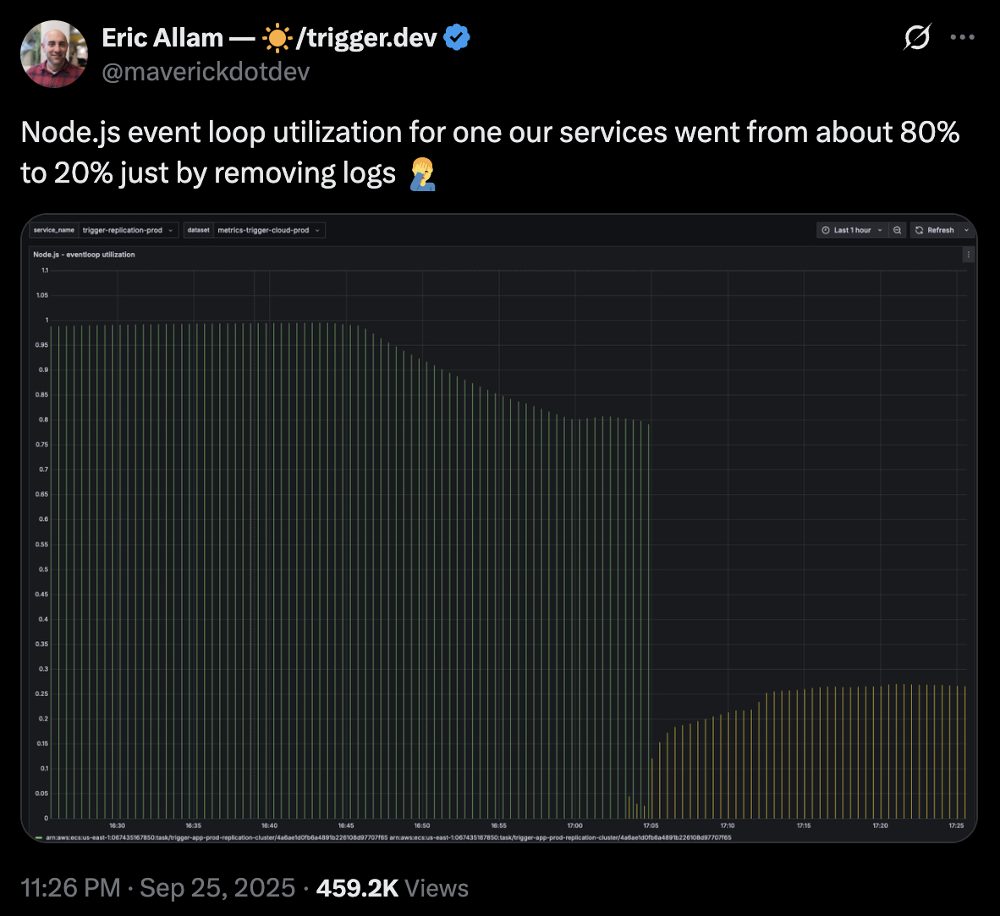
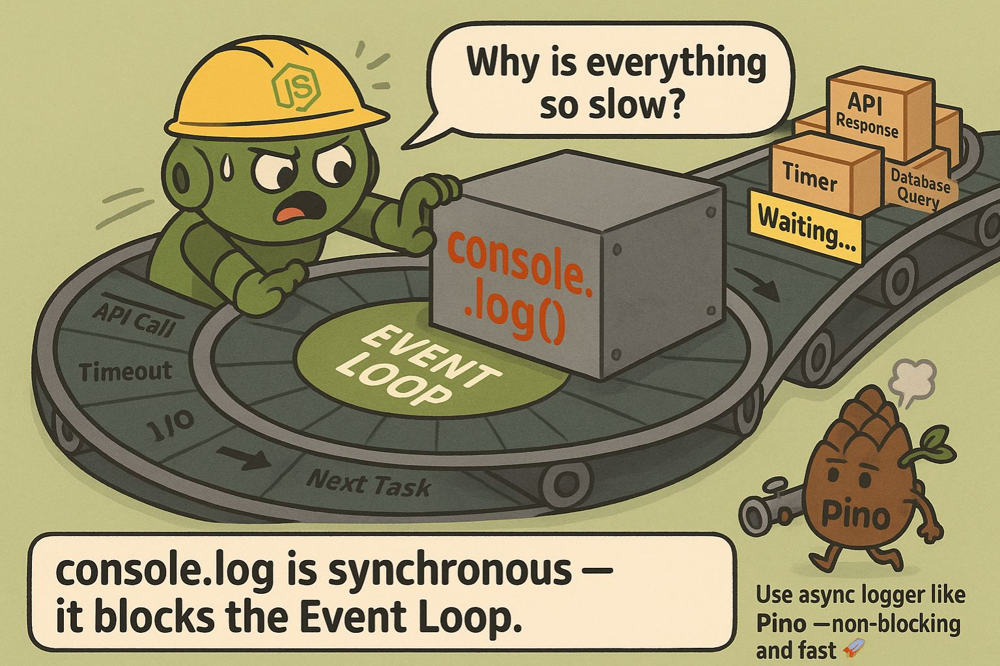

+++
title = "ทำไมแค่ console.log ก็ทำให้ Node.js ช้าลงได้?"
date = "2025-10-05"

[taxonomies]
tags = [ "Console.log", "Event Loop", "Node.js", "JavaScript" ]
categories = [ "Node.js" ]

[extra]
id = "38afpyx"
+++

สวัสดีเช้าวันอาทิตย์ พอดีวันก่อนได้มีโอกาสไปเห็นโพสต์ Twitter นึง โพสต์ถึงเรื่องของการที่ลบคอนโซลล็อก (`console.log`) ออกไปจาก Node.js แล้วก็ทำให้ **Performance ของ Server ดีขึ้น เยอะเลย**

> Ref: Node.js event loop utilization for one our services went from about 80% to 20% just by removing logs by @maverickdotdev 🤦<https://x.com/maverickdotdev/status/1971249969463165313>

ทีนี้พอเราเห็นเรื่องนี้ ผมคิดว่าหลาย ๆ คนน่าจะต้องสงสัยแน่เลย ไม่ว่าจะเป็นมือใหม่ในการเขียน Node.js เอง หรือคนที่เขียนมาสักระยะนึงแล้ว จริง ๆ แล้วเราอาจจะต้องเข้าใจก่อนว่า **ตัว `console.log` ซึ่งเป็นคำสั่งในกลุ่ม `console` ของ Node.js เอง** เราต้องทำความเข้าใจก่อนว่า **Node.js เนี่ย มันทำงานเป็น Event Loop** ใช่ไหมครับ เดี๋ยวผมจะมีบล็อกอธิบายเรื่อง Event Loop อีกทีนึง แต่โดยสรุปคือ Event Loop ของ Node.js เนี่ย มันจะพูดถึงการทำงานแบบ **Single Thread**

คำว่า Single Thread ก็คือว่า อะไรก็ตามที่มันทำงาน มันจัดการงานหลายอย่างแบบ concurrent ผ่าน Event Loop แม้จะมีเพียง main thread เดียว ประโยชน์แน่นอนครับว่า Single Thread เนี่ย มันช่วยทำให้เราสามารถที่จะใช้ทรัพยากร CPU ได้อย่างมีประสิทธิภาพ

## console.log

ทีนี้มากลับมาที่เรื่องของ `console.log` กันบ้าง **ตัวคำสั่งที่เป็น `console.log` หรือประเภท `console` อื่น ๆ พวกนี้มันเป็นคำสั่งประเภท synchronous** หลาย ๆ คนก็อาจจะสงสัยว่า จริง ๆ แล้ว Node.js ทำงานแบบ asynchronous เป็นหลักอยู่แล้ว (สำหรับ I/O, network, timers) แต่ทำไมการทำงานแบบ synchronous ถึงมีปัญหา


อ่านต่อที่ Official Documentation ของ Node.js เรื่อง Console: <https://nodejs.org/api/process.html#a-note-on-process-io>


งั้นเดี๋ยวมาอธิบายกัน คือการทำงานแบบ synchronous เนี่ย มันไปบล็อก Main Thread ซึ่ง Node.js เนี่ย มันมี Main Thread อยู่อันเดียว หมายความว่ามันจะไปบล็อกการทำงานของ Event Loop (โค้ด JavaScript ภายใน callback/function ยังคงรันแบบ synchronous ได้ และคำสั่ง `console.log` อาจบล็อก Event Loop ขึ้นอยู่กับว่า `stdout` เชื่อมต่อไปที่ terminal, file หรือ pipe) **ถ้าเราเอา `console.log` ใส่เยอะ ๆ มันก็จะส่งผล Performance ตามมา เพราะว่า Event Loop ก็จะถูกบล็อกไปด้วย**

## ทางออก

หลาย ๆ คนก็อาจจะมีคำถามตามมาว่า ถ้าเราไม่ได้ใช้ `console.log` แล้วเราจะสามารถพ่น Log ออกมาทาง Terminal หรือทาง STDOUT ได้ยังไง การที่เราพ่น Log มาเนี่ย มันทำได้หลายวิธี วิธีการที่ไม่ไปบล็อก Thread เนี่ย มันก็จะมี Library ที่เข้ามาแก้ปัญหา ยกตัวอย่างเช่น เหมือนที่ผมใช้อยู่ก็จะเป็น [**Pino**](https://github.com/pinojs/pino) ผมใช้บ่อยกว่า Pino ตัวที่เค้าเอามาแก้ปัญหาเรื่อง Log

จริง ๆ หลายคนอาจจะบอกว่า ฉันก็เขียน Log เองก็ได้นี่ ฉันเขียน Interface มาก็ได้นี่ ทำไมฉันจะต้องใช้ Pino เพราะว่าฉันก็สามารถที่จะเขียนตัวกลไกของ Log เองได้ ใช้ Level ได้ Log ที่ถูกออกแบบมาเพื่อแก้ปัญหาหนึ่งคือ

เรื่องของการบล็อก Thread ของ `console.log` นี่แหละ แทนที่เราจะพ่น Log ออกไปทางใดก็ตามแล้วมันจะไปบล็อก Thread ใช่ไหม **การที่เราใช้ Pino เนี่ย เค้าจะใช้วิธีการ คือเขามีการ "แตก Worker Thread" ออกมา** คือมีการใช้ **อีกเทรดนึงเพื่อที่จะมาจัดการเรื่องของการทำ Logging โดยเฉพาะเลย** ทำให้เวลาที่เราสั่งคำสั่ง Log ผ่าน Pino มันก็จะทำได้อย่างรวดเร็วมาก **เพราะว่ามันไม่ไปบล็อก Main Thread นั่นเอง**

พอมันออกไปทาง Pino แล้ว เราจะไปตั้งค่า transport ได้ ซึ่งเจ้า transport ก็คือ การตั้งค่าขาออกของ Log ว่าจะให้ไปออกที่ไหนก็แล้วแต่ อย่างเช่น อาจจะเป็น console อาจจะเป็นไฟล์ อาจจะเป็นที่ไหนก็ได้ ที่เราจะตั้งค่าให้มันออกไป ถึงแม้ว่าเราจะใช้ `console.log` บน Pino แล้วก็ตาม มันก็ยังไม่ช้า เพราะว่า Pino จัดการเรื่องของการจัดการเทรดที่เป็น Worker Thread แล้ว

## ทำไมการ Bundle กับ Pino ถึงยากขึ้น?

> ใครที่ไม่ได้สนใจเรื่องของการ Bundle Node.js สามารถข้ามส่วนนี้ไปได้เลยครับ

แต่เดี๋ยวก่อน ใครที่ใช้ Pino จะมีการเจอ Challenge ของการทำ bundling ที่จะทำให้ Node Application เวลาที่เรามีการ bundle มัน หรือเวลาที่เราต้องการจะลดขนาด หรือทำ Docker Image ขนาดเล็ก มันก็จะทำได้ยุ่งยากขึ้น ผมเคยเขียนบทความเกี่ยวข้องกับโจทย์ เวลาที่เราต้อง bundle Node.js ที่มีการใช้งานท่าประหลาด ๆ ใน Node.js ซึ่งหนึ่งในท่าประหลาด ๆ คือเรื่องของ Pino **เพราะว่า Pino เวลาที่มันจัดการ Worker Thread มันจะมีการสร้างไฟล์ขึ้นมาใหม่**


บทความที่เกี่ยวข้อง: [ทำไมการ Bundle Node.js ที่ใช้ Worker Threads ถึงยาก?](/posts/why-nodejs-bundle-hard)


ถ้าเราไม่ได้มีการจัดการอย่างดี ไฟล์พวกนี้ที่มันถูกสร้างมาใหม่ เวลาที่มัน bundle เวลาที่โปรแกรมที่เป็นอย่างเช่น ES Build bundle มันจะไม่เห็นไฟล์พวกนี้ **มันก็เลยทำให้เกิด Runtime Error ได้** ก็เป็นสิ่งที่เราควรระมัดระวัง

หวังว่าบทความนี้จะเป็นประโยชน์กับทุก ๆ คน 

สำหรับวันนี้ไปก่อนครับ สวัสดีครับ

