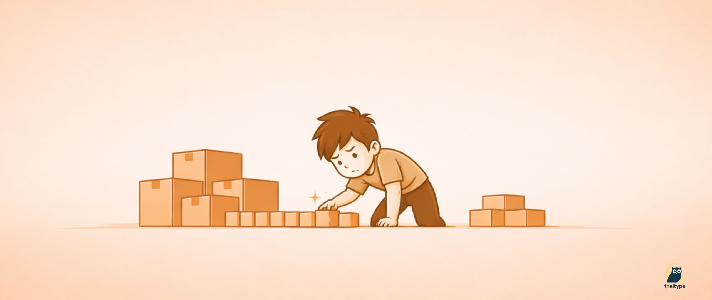
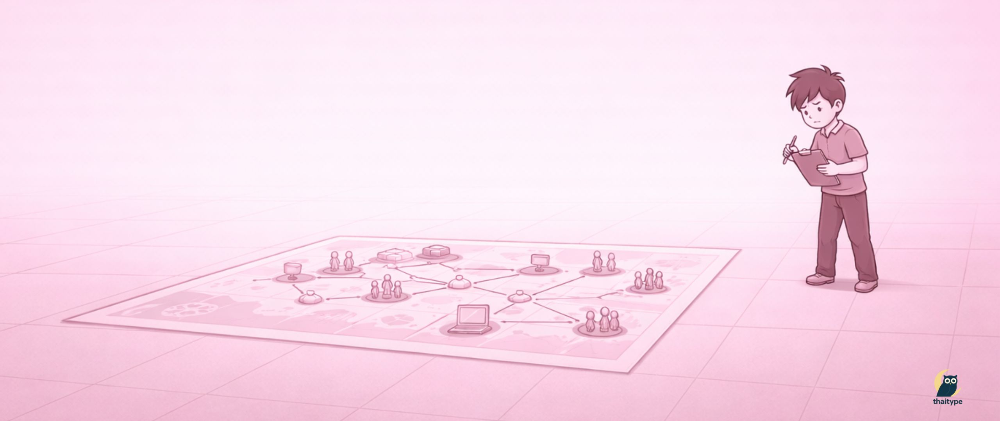
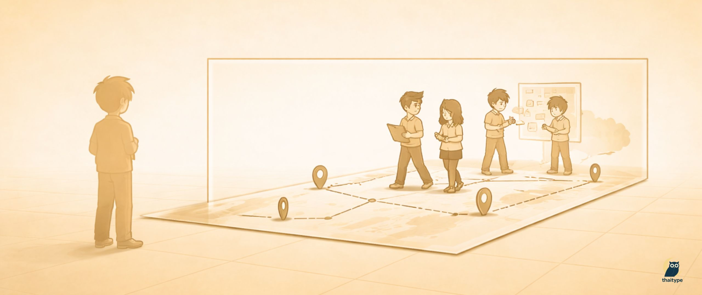

+++
title = "รีวิวปี 2025 กับการปล่อยให้ทีม DevOps ตัดสินใจได้เอง และเป็นทีมที่ flat มากขึ้น"
date = "2025-12-21"

[taxonomies]
tags = [
  "DevOps Engineer",
  "Platform Engineer",
  "Team Lead",
  "Team Management"
]
categories = [ "Management" ]

[extra]
id = "rhwcwir"
+++

ตอนนี้ก็ใกล้จะจบปีแล้ว พอมองย้อนกลับไป ผมรู้สึกว่าปีนี้เป็นปีแห่งการเปลี่ยนแปลงจริงๆ ไม่ใช่แค่ในแง่ของเทคโนโลยีหรือระบบที่เราใช้อยู่ แต่เป็นการเปลี่ยนวิธีคิดและวิธีทำงานของทั้งทีม การเขียน reflection ครั้งนี้ ผมหวังว่าจะเป็นประโยชน์กับใครหลายคน โดยเฉพาะคนที่กำลังดูแลทีมอยู่ เพราะมันเป็นเรื่องของการค่อยๆ ปรับทีมให้ flat ขึ้น และผลลัพธ์ที่ได้ กลับดีกว่าที่ผมคาดไว้มาก

## เมื่อความละเอียดของผม กลายเป็น bottleneck ของทีม

ตั้งแต่ไหนแต่ไรมา ผมเป็นคนที่มั่นใจในตัวเองมาก เพราะอาจจะทำอะไรหลายๆ อย่างด้วยตัวเองมาตลอด ก่อนมาเป็น DevOps Engineer ผมก็เขียนโปรแกรมมาเยอะ ซนมาเยอะ มันก็เลยทำให้ผมเป็นคน perfectionist โดยไม่รู้ตัว

ตอนที่ยังเป็น DevOps Engineer ช่วงนั้นผมไว้ใจตัวเองมาก โดยเฉพาะในเรื่องรายละเอียดของงาน ไม่ว่าจะเป็นการออกแบบระบบ โครงสร้างของ infrastructure หรือผลกระทบระยะยาว ทุกอย่างต้อง “ดีพอ” ก่อนถึงจะปล่อยไปได้ ความรู้สึกตอนนั้นคือ ถ้าผมเป็นคนทำเอง ผมจะคุมคุณภาพได้ และนั่นคือสิ่งที่ทำให้ผมมั่นใจว่างานจะไม่พัง

อย่างไรก็ตาม คำว่า **perfectionist** ในแบบของผม ไม่ได้หมายความว่าผมอยากทำทุกอย่างให้ใหญ่หรือเกินความจำเป็น เวลาทำงาน ผมเริ่มจากคำถามว่า <u>ทำไมเราต้องทำสิ่งนี้ และปัญหาที่แท้จริงคืออะไร</u> ก่อนจะคิดถึงวิธีแก้หรือเครื่องมือที่ใช้ ผมให้ความสำคัญกับบริบทและข้อจำกัดรอบตัวเสมอ ไม่ว่าจะเป็นเวลา ทีม หรือผลกระทบต่อระบบอื่นๆ

ความเป็น perfectionist ของผมจึงไม่ได้อยู่ที่การขยาย scope งาน แต่เป็นเรื่องของคุณภาพและการออกแบบ งานอาจเริ่มจากจุดเล็กๆ ได้ แต่โครงสร้างต้องไม่ปิดทางการเติบโตในอนาคต ผมมักคิดเสมอว่า *ถ้าวันหนึ่งระบบนี้ต้อง scale ขึ้น จะยังไปต่อได้หรือไม่ และการตัดสินใจวันนี้ จะกลายเป็นภาระของทีมในวันข้างหน้าหรือเปล่า* ความละเอียดในจุดนี้เองที่ทำให้ผมรู้สึกสบายใจเมื่อปล่อยงานออกไป

ในช่วงที่ผมยังทำงานคนเดียว หรือทีมยังเล็ก วิธีคิดแบบนี้ช่วยให้งานออกมามั่นคงและรับมือกับการเปลี่ยนแปลงได้ดี แต่ผมก็เริ่มตระหนักทีหลังว่า สิ่งที่เคยเป็นจุดแข็งของผม อาจกลายเป็นข้อจำกัดของทีม เมื่อคนที่ต้องตัดสินใจทุกอย่างยังเป็นคนเดิม

สิ่งที่เป็นผลลัพธ์ก็คือ ระบบ Platform หลังบ้านที่ดูแลเป็น Automation ทั้งส่วนของ infra และ Pipeline ต่างๆ ถูกสร้างขึ้นมา และสามารถต่อยอดมาได้เรื่อยๆ และแทบไม่มีส่วนไหนที่ต้องมานั่งรื้อทิ้งใหม่ เผื่อใครนึกภาพไม่ออก พอดีผมเพิ่งได้รับเชิญจากพี่รูฟไปพูดในงาน Platform Engineering Meetup ที่ ODDS ผมเลยวิดิโอมาให้ดูเผื่อจะช่วยให้เห็นภาพมากขึ้นครับ

{{ youtube(id="Rb7HkHZa4MU" , alt="ผมไปแบ่งปันประสบการณ์การสร้าง Platform จากศูนย์ ที่ ODDS ในงาน Platform Engineering Meetup เมื่อวันที่ 2 ส.ค. 2568 ที่ผ่านมา") }}

## อิสระของ DevOps และต้นทุนที่มองไม่เห็น

ต้องบอกก่อนว่า การที่ทีม DevOps ของผมทำทุกอย่างเอง ไม่ใช่สิ่งที่เกิดขึ้นโดยบังเอิญ แต่เป็นการตัดสินใจของผมเองตั้งแต่ต้น งานหลายอย่างในโลกของ DevOps เข้าถึงยาก อธิบายยาก และมองจากภายนอกแทบไม่เห็นคุณค่า สิ่งที่คนส่วนใหญ่มองเห็นมักเป็นแค่ผลลัพธ์ปลายทาง เช่น deploy เร็วขึ้น ระบบเสถียรขึ้น หรือ workflow สะดวกขึ้น แต่เบื้องหลังของสิ่งเหล่านี้เต็มไปด้วยรายละเอียด การออกแบบ และการตัดสินใจที่ซับซ้อน

*ในช่วงแรก ผมเลือกที่จะรับมันไว้เอง*

ตอนที่ผมยังทำงานคนเดียว หรือทีมยังเล็ก วิธีนี้ทำให้ทุกอย่างเดินได้เร็ว และคุณภาพของงานออกมาค่อนข้างนิ่ง แต่เมื่อทีมเริ่มมีคนเพิ่มขึ้น สิ่งที่เคยเป็นจุดแข็ง ก็เริ่มแสดงผลข้างเคียงออกมาชัดขึ้นเรื่อยๆ แม้จะมีทีมแล้ว แต่การตัดสินใจสำคัญหลายอย่างยังคงวนกลับมาที่ผม ไม่ว่าจะเป็นเรื่องการออกแบบ การเลือกแนวทาง หรือการปล่อยงาน ทุกอย่างต้องผ่านสายตาผมก่อนเสมอ โดยไม่รู้ตัว ผมกลายเป็นทั้งคนออกแบบ คนตรวจคุณภาพ และคนให้คำตอบสุดท้ายในเวลาเดียวกัน

ในขณะที่ทีม developer โดยทั่วไปจะมี BA, SA และ PM คอยช่วยจัดการ requirement วางแผนงาน และช่วยคิดเรื่อง design ที่ซับซ้อน **DevOps team ของผมกลับต้องทำทุกอย่างเอง ตั้งแต่รับโจทย์ที่ยังไม่ชัด แกะ requirement ออกมา วิเคราะห์ผลกระทบ ออกแบบระบบ วางแผน sprint ไปจนถึงลงมือทำจริง** โมเดลการทำงานแบบนี้ให้อิสระกับทีมสูงมาก และเปิดโอกาสให้ DevOps Engineer ได้เห็นภาพระบบแบบ end-to-end แต่ในขณะเดียวกัน ความรับผิดชอบก็สูงขึ้นอย่างหลีกเลี่ยงไม่ได้

ช่วงนั้นผมยังรู้สึกว่านี่คือสิ่งที่ควรทำ และเป็นหน้าที่ของผมในฐานะ DevOps Team Lead ที่ต้องช่วยดูแลคุณภาพของงานให้ดีที่สุด แต่สิ่งที่เริ่มชัดขึ้นเรื่อยๆ คือ งานจำนวนมากไม่ได้ช้าเพราะทีมทำไม่ได้ หากแต่ช้าเพราะต้องรอการตัดสินใจจากผม และในหลายครั้ง ผมเองก็เริ่มใช้เวลาส่วนใหญ่ไปกับการ review และ approve มากกว่าการคิดภาพรวมในระดับที่ควรจะเป็น

ผมไม่ได้รู้สึกว่างานกำลังพัง หรือทีมกำลังไปต่อไม่ได้ ความจริงคือทุกอย่างยังเดินได้ดี เพียงแต่ผมเริ่มรู้สึกว่าพลังที่ใช้ไปในแต่ละวัน เริ่มไม่สมดุลกับสิ่งที่ผมควรโฟกัสในบทบาทนี้มากขึ้นเรื่อยๆ และที่สำคัญคือ ผมเริ่มเห็นว่าหลายอย่างยังคงขึ้นอยู่กับผมมากเกินไป โดยไม่รู้ตัว ผมกลายเป็น single point of failure ทั้งในเชิงการตัดสินใจและการขับเคลื่อนงาน กล่าวคือ ถ้าผมช้า งานจำนวนหนึ่งก็จะช้าตามไปด้วย

ในฐานะคนที่ออกแบบระบบ ผมคุ้นเคยกับแนวคิดนี้ดี ระบบที่ดีไม่ควรผูกความสำคัญไว้กับองค์ประกอบเดียว และเมื่อหันกลับมามองการทำงานภายในทีม ผมก็เริ่มรู้สึกไม่ต่างกัน โครงสร้างการทำงานที่ยังต้องรอผมอยู่ตลอด อาจจะยังใช้งานได้ในวันนี้ แต่ไม่ใช่สิ่งที่ผมอยากออกแบบให้ทีมต้องพึ่งพาในระยะยาว

ตอนนั้นผมยังไม่รู้คำตอบที่ชัดเจนว่าควรแก้ปัญหานี้อย่างไร รู้แค่ว่าถ้ายังทำงานในรูปแบบเดิมต่อไป ไม่ใช่แค่ทีมที่จะเหนื่อย แต่ตัวผมเองก็คงไปต่อได้ไม่ไกลเช่นกัน

## จุดที่ต้องยอมรับว่า ถ้าไม่ปล่อย ทีมจะไปต่อไม่ได้

ต่อมาผมเริ่มยอมรับอย่างจริงจังว่า ปัญหาไม่ได้อยู่ที่ความสามารถของทีม หรือคุณภาพของระบบ แต่เป็นโครงสร้างการทำงานที่ผูกทุกการตัดสินใจไว้กับคนคนเดียว ความเหนื่อยสะสมที่เพิ่มขึ้นเรื่อยๆ เป็นสัญญาณชัดว่าผมกำลังแบกมากเกินไป และวิธีทำงานแบบเดิมไม่ยั่งยืนอีกต่อไป

คำแนะนำที่ผมได้รับจากหัวหน้าในตอนนั้นไม่ได้ซับซ้อนอะไร **เขาเพียงบอกให้ผมลองปล่อย ลองทำทีมให้แบนลง และเลิกเป็นจุด approve ของทุก decision** ฟังดูง่าย แต่สำหรับคนที่เคยควบคุมคุณภาพทุกอย่างด้วยตัวเอง มันไม่ใช่เรื่องเล็กเลย การปล่อยในที่นี้ไม่ได้หมายความว่าปล่อยปละละเลย แต่คือการยอมรับว่าคุณภาพอาจไม่สมบูรณ์แบบเท่าที่ผมคุ้นเคย และเปิดโอกาสให้ทีมได้เรียนรู้จากการตัดสินใจของตัวเอง

ในตอนนั้นผมยังไม่แน่ใจว่าวิธีนี้จะเวิร์กจริงหรือไม่ รู้แค่ว่าถ้ายังทำงานในรูปแบบเดิมต่อไป ต่อให้ระบบยังรันอยู่ดี ทีมอาจจะไปต่อไม่ได้ และที่สำคัญ ตัวผมเองก็คงไม่สามารถแบกทุกอย่างไว้ได้นานกว่านี้แล้ว

## ช่วงที่ยากที่สุด คือการวางใจคนอื่น

หลังจากตัดสินใจว่าจะลองปล่อย และทำทีมให้แบนลงจริงๆ สิ่งที่ยากที่สุดสำหรับผม ไม่ใช่การปรับ process หรือเปลี่ยนวิธีทำงาน แต่คือการจัดการกับตัวเอง ความรู้สึกที่เคยมั่นใจว่า *“ถ้าผมทำเอง ทุกอย่างจะปลอดภัยกว่า”* ยังอยู่ครบ และมันไม่ได้หายไปเพียงเพราะผมตัดสินใจเปลี่ยนบทบาท

ในช่วงแรก ผมต้องฝืนตัวเองอย่างมากที่จะไม่เข้าไปแก้ ไม่เข้าไปชี้นำทุกจุด และไม่เข้าไปตัดสินใจแทนทีม หลายครั้งผมเห็นสิ่งที่ถ้าเป็นผม ผมอาจจะทำต่างออกไป และต้องยอมรับความไม่สบายใจนั้นไว้ให้ได้ การวางใจคนอื่นในที่นี้ ไม่ใช่การเชื่อว่าทุกการตัดสินใจจะถูกต้อง แต่คือการยอมรับว่าความผิดพลาดเป็นส่วนหนึ่งของการเรียนรู้

สิ่งที่ผมค่อยๆ เรียนรู้คือ **หน้าที่ของผมไม่ใช่การทำให้ทุก decision ออกมาสมบูรณ์แบบ แต่คือการสร้างพื้นที่ที่ทีมกล้าตัดสินใจ และกล้ารับผลของการตัดสินใจนั้น** ผมเริ่มเปลี่ยนจากการให้คำตอบ เป็นการตั้งคำถาม จากการบอกว่าควรทำอย่างไร เป็นการชวนคิดว่ามีทางเลือกอะไรบ้าง และแต่ละทางเลือกมีผลกระทบอย่างไร

ช่วงเวลานี้ทำให้ผมเห็นชัดว่า ความไว้วางใจไม่ใช่สิ่งที่เกิดขึ้นจากคำพูดหรือโครงสร้างทีม แต่เกิดจากการกระทำซ้ำๆ การไม่เข้าไปแทรกแซงโดยไม่จำเป็น การยอมรับว่าคุณภาพอาจยังไม่เท่าที่ผมเคยทำเอง และการยืนอยู่ข้างทีม แม้ในวันที่การตัดสินใจนั้นไม่ออกมาสมบูรณ์แบบนัก

ผมไม่กล้าบอกว่าช่วงนี้เป็นช่วงที่สบาย เพราะมันไม่ใช่ แต่เป็นช่วงที่ทำให้ผมเข้าใจความหมายของคำว่า leadership ชัดขึ้นกว่าที่เคย การวางใจคนอื่นไม่ใช่การปล่อยมือทั้งหมด แต่คือการเลือกที่จะไม่จับทุกอย่างไว้แน่นเหมือนเดิม และนั่นอาจเป็นทักษะที่ยากที่สุดที่ผมต้องเรียนรู้ในปีนี้

## วิธีทำงานแบบ flat ที่ค่อยๆ เป็นรูปเป็นร่าง

หลังจากผ่านช่วงที่ต้องปรับใจและเรียนรู้ที่จะวางใจคนอื่น วิธีทำงานแบบ flat ไม่ได้เกิดขึ้นจากการเปลี่ยนโครงสร้างทีมในทันที แต่มันค่อยๆ เป็นรูปเป็นร่างจากการปรับพฤติกรรมเล็กๆ ในแต่ละวัน มากกว่าการออกกฎหรือประกาศวิธีทำงานใหม่อย่างเป็นทางการ

สิ่งแรกที่ผมเริ่มทำคือการถอยตัวเองออกจาก flow งานประจำวัน ผมเลิกเป็นคน approve ทุกอย่าง และพยายามไม่เป็นจุดศูนย์กลางของการตัดสินใจ DevOps Engineer แต่ละคนเริ่มรับโจทย์เอง ตั้งแต่การไปคุยหา requirement วิเคราะห์ปัญหา ออกแบบแนวทาง ลงมือทำ ทดสอบ และ deploy ให้จบในตัวเอง โดยใช้ peer-review ภายในทีมเป็นกลไกหลักในการรักษาคุณภาพ

การตัดสินใจหลายอย่างจึงเริ่มเกิดใกล้กับปัญหามากขึ้น คนที่ลงมือทำเป็นคนตัดสินใจ และรับผิดชอบผลลัพธ์ของงานนั้นโดยตรง **บทบาทของผมเปลี่ยนไปเป็นการเข้ามาช่วยในจุดที่ซับซ้อน หรือมีผลกระทบในระดับที่ต้องการมุมมองเพิ่ม** ไม่ใช่เพื่อให้คำตอบสุดท้าย แต่เพื่อช่วยตั้งคำถามและทำให้บริบทของการตัดสินใจชัดขึ้น

ในส่วนของการวางแผนงาน ผมยังคงเป็นคนออกแบบ sprint อยู่ เพราะต้องคอย balance ระหว่างงานจาก product, developer และ roadmap ภายในของทีม DevOps เอง แต่ภายใน sprint นั้น ทีมเป็นคนจัดการรายละเอียดทั้งหมด ตั้งแต่วิธีทำ การแบ่งงาน ไปจนถึงการผลักงานให้เสร็จ โดยไม่ต้องรอการควบคุมจากผมเหมือนเดิม

วิธีทำงานแบบ flat ในแบบของผมจึงไม่ได้หมายถึงการปล่อยทุกอย่างออกจากมือ แต่คือการเลือกถือเฉพาะสิ่งที่จำเป็นจริงๆ และปล่อยให้ทีมถือ ownership ของงานในส่วนที่พวกเขาพร้อมจะรับผิดชอบ วิธีนี้ค่อยๆ ลดการพึ่งพาคนคนเดียว และทำให้ระบบการทำงานเดินต่อไปได้ แม้บทบาทของผมจะไม่ได้อยู่ในทุกขั้นตอนเหมือนที่ผ่านมา

## บทบาทใหม่ของผมในฐานะ DevOps Team Lead

เมื่อวิธีทำงานแบบ flat เริ่มนิ่งขึ้น บทบาทของผมในฐานะ DevOps Team Lead ก็เปลี่ยนไปอย่างชัดเจน จากคนที่เคยอยู่ในแทบทุกขั้นตอนของงาน กลายเป็นคนที่เลือกเข้าไปอยู่เฉพาะในจุดที่ทีมต้องการจริงๆ ไม่ใช่เพราะผมอยากถอยออกมา แต่เพราะบทบาทที่ทีมต้องการจากผม เปลี่ยนไปตามบริบทขององค์กร

ก่อนหน้านี้ ตอนที่บริษัทยังเล็ก ทีม Dev, DevOps, Product, Customer-facing รวมถึงทีม IT Admin ทำงานใกล้ชิดกันมาก หลายปัญหาแก้ได้ด้วยการคุยกันตรงๆ หรือส่งข้อความใน Slack ไม่กี่บรรทัด ผมสามารถเห็นภาพรวมของระบบได้แทบทั้งหมด และการทำงานแบบ proactive ก็เป็นเรื่องที่ค่อนข้างเป็นธรรมชาติ

แต่เมื่อองค์กรถูกซื้อโดยบริษัทที่ใหญ่ขึ้น โครงสร้างทุกอย่างเริ่มซับซ้อนขึ้น ทีมกระจายตัว การสื่อสารกลายเป็นอีเมล การประชุมข้าม timezone และการทำงานที่กลางวันกลางคืนไม่ตรงกัน บริบทที่เคยเห็นชัด กลับต้องใช้ความพยายามมากขึ้นกว่าจะปะติดปะต่อได้ และการทำงานเชิงรุกที่ผมถนัด ก็ยิ่งทำได้ยากขึ้นเรื่อยๆ หากผมยังต้องอยู่ใน flow งานประจำวันเหมือนเดิม

งานหลักของผมในช่วงนี้จึงไม่ใช่การ approve หรือสั่งการ แต่เป็นการ consult ในปัญหาที่ซับซ้อนหรือมีผลกระทบสูง โดยเฉพาะเรื่องที่ต้องอาศัยประสบการณ์เชิงระบบ หรือการตัดสินใจที่มีผลระยะยาว *โดยพยายามไม่เข้าไปให้คำตอบสำเร็จรูป แต่ช่วยตั้งคำถาม ช่วยชี้ให้เห็น trade-off และช่วยเติม context ที่ทีมอาจยังมองไม่ครบ* เพื่อให้การตัดสินใจนั้นเกิดใกล้กับจุดที่ลงมือทำมากที่สุด

อีกส่วนหนึ่งของบทบาทที่สำคัญมาก คือการทำงานกับทีม USA และทีม product ในระดับที่สูงขึ้น เรื่องเหล่านี้มักไม่ใช่ task รายวัน แต่เป็นการสื่อสารทิศทาง ความคาดหวัง และข้อจำกัดของระบบ **ผมทำหน้าที่เป็นตัวกลางในการแปลความต้องการเชิงธุรกิจ ให้กลายเป็นกรอบที่ทีม DevOps สามารถนำไปตัดสินใจต่อได้เอง โดยไม่ต้องรอคำสั่งจากผมทุกครั้ง**

ในขณะเดียวกัน ผมมองว่าหน้าที่ของ DevOps Team Lead คือ<u>การปกป้องทีมจาก noise ที่ไม่จำเป็น ไม่ใช่ทุก requirement ที่เข้ามาจะพร้อม หรือควรถูกทำทันที</u> การช่วยกรอง ชะลอ และจัดลำดับความสำคัญ คือส่วนหนึ่งของการทำให้ทีมมีสมาธิกับสิ่งที่สำคัญจริงๆ และไม่ต้องรับแรงกดดันทั้งหมดโดยตรง

บทบาทใหม่นี้อาจดูเหมือนผมถอยออกมาจากงาน แต่ในความเป็นจริง ผมกลับต้องใช้พลังมากขึ้นในอีกแบบหนึ่ง แทนที่จะใช้พลังไปกับการแก้ปัญหาเฉพาะหน้า ผมต้องใช้พลังไปกับการคิดเชิงระบบ การสื่อสารข้ามทีม และการมองความเสี่ยงล่วงหน้าในบริบทขององค์กรที่ใหญ่ขึ้น

สิ่งที่ผมเริ่มเห็นชัดคือ เมื่อผมเลิกเป็นศูนย์กลางของทุกอย่าง ทีมกลับทำงานได้คล่องขึ้น และ paradox ที่เกิดขึ้นคือ ผมกลับมีพื้นที่และสมาธิมากพอที่จะทำงานแบบ proactive ได้ดีกว่าเดิม ทั้งกับทีม DevOps เอง และกับทีม Product, Customer-facing รวมถึง IT Admin ที่อยู่ไกลตัวมากขึ้น ผมเองก็ยังไม่แน่ใจว่าวิธีนี้คือคำตอบที่ดีที่สุดหรือไม่ แต่สิ่งที่เห็นชัดคือ ทีมเริ่มเดินงานได้ด้วยตัวเองมากขึ้นกว่าที่เคย

## Sprint และ Roadmap ที่ทีมต้องออกแบบเอง

เมื่อผมถอยออกมาจากการตัดสินใจในรายละเอียด งานหนึ่งที่ผมยังคงต้องดูแลอยู่คือการออกแบบ sprint ของทีม ไม่ใช่เพื่อแจก task หรือควบคุมการทำงานรายวัน แต่เพื่อจัดกรอบและจังหวะของงานให้สอดคล้องกับบริบททั้งหมดที่ทีมต้องรับมืออยู่ในช่วงนั้น

ทีม DevOps ของเราไม่ได้ทำงานจาก requirement ที่ถูกส่งมาอย่างเดียว **ยังมีงานอีกจำนวนมากที่ไม่มีใครส่งมาเป็น ticket ชัดเจน ไม่ว่าจะเป็นเรื่อง security, operation, cost optimization, platform foundation หรือการทดลองทำ R&D เพื่อเตรียมระบบสำหรับอนาคต** งานเหล่านี้อาจยังไม่เร่งด่วนในวันนี้ แต่ถ้าไม่ถูกจัดการไว้ก่อน มันจะกลายเป็นภาระของทีมในวันข้างหน้าอย่างหลีกเลี่ยงไม่ได้

บทบาทของผมในส่วนนี้คือการช่วยมองภาพรวมและจัดลำดับความสำคัญ ให้ sprint มีพื้นที่สำหรับงานประเภทนี้อยู่เสมอ แต่เมื่อกรอบของ sprint ชัดแล้ว ทีมจะเป็นคนจัดการรายละเอียดทั้งหมดเอง ตั้งแต่วิธีทำ การตัดสินใจ ไปจนถึงการผลักงานให้เสร็จ โดยไม่ต้องรอการ approve จากผมเหมือนที่ผ่านมา

สิ่งที่เริ่มเห็นชัดคือ DevOps ไม่ได้ทำงานแบบรอโจทย์ หากช่วงไหนไม่มี requirement จาก product งานก็ยังเดินต่อได้ เพราะ roadmap ภายในของทีมยังคงถูกดูแลอยู่ตลอด Roadmap นี้ไม่ใช่เอกสารเพื่อรายงานใคร แต่เป็นเครื่องมือที่ช่วยให้ทีมรู้ว่า เรากำลังเลือกแบกอะไรไว้ และกำลังลดความเสี่ยงตรงไหนของระบบ

การที่ทีมต้องออกแบบและดูแล roadmap ของตัวเอง ทำให้ ownership ของงานชัดขึ้นมาก แต่ก็มาพร้อมกับความรับผิดชอบที่สูงขึ้นเช่นกัน งานของ DevOps มักไม่จบลงพร้อมกับระบบที่ยังทำงานได้ เพราะยังมีอีกหลายเรื่องที่ต้องจัดการ เพื่อไม่ให้มันกลายเป็นปัญหาในอนาคต

## สิ่งที่ได้มา และสิ่งที่ต้องแลก

สิ่งที่เห็นได้ชัดจากการปรับวิธีทำงานแบบ flat คือ ทีมเริ่มตัดสินใจได้เองมากขึ้น งานหลายอย่างไม่ต้องรอคำตอบจากผมเหมือนเดิม การตัดสินใจจำนวนมากเกิดขึ้นใกล้กับจุดที่ลงมือทำจริง และนั่นทำให้งานสามารถเดินต่อได้ แม้ผมจะไม่ได้อยู่ใน flow งานตลอดเวลา

ผลที่ตามมาคือ งานเริ่มไม่ผูกอยู่กับคนคนเดียว ระบบและกระบวนการต่างๆ ไม่ได้ขึ้นกับการตัดสินใจของผมเพียงอย่างเดียว ทีมรับผิดชอบงานของตัวเองตั้งแต่ต้นจนจบ และต้องรับผลของการตัดสินใจนั้นมากขึ้น ไม่ว่าจะออกมาดีหรือพลาดบ้างก็ตาม

แต่การเปลี่ยนผ่านแบบนี้ไม่ได้ราบรื่นทั้งหมด ช่วงแรกมี mistake เกิดขึ้นจริง มีบางการตัดสินใจที่ถ้าผมเป็นคนทำเอง อาจเลือกต่างออกไป คุณภาพของงานบางส่วนมีช่วงที่แกว่ง และทีมเองก็ต้องใช้เวลาในการปรับตัวกับความรับผิดชอบที่เพิ่มขึ้น

ในช่วงนั้น **สิ่งที่ผมพยายามทำคือไม่รีบเข้าไปแก้ทุกอย่างทันที แต่เปิดพื้นที่ให้ทีมได้เรียนรู้จากความผิดพลาด ทีมสามารถล้ม หรือตกน้ำได้ แต่ไม่จมน้ำเพราะผมจะเป็นคนคอยดึงขึ้นมาเมื่อจำเป็น** คอยปกป้องทีมจากแรงกดดันภายนอก และช่วยประสานงานกับฝ่ายอื่น เพื่อให้ทีมมีพื้นที่เรียนรู้และเดินต่อได้ โดยไม่ต้องรับแรงกระแทกทั้งหมดเพียงลำพัง

สิ่งที่ผมได้เรียนรู้จากประสบการณ์นี้คือ ความยั่งยืนของทีม DevOps ไม่ได้มาจากการตัดสินใจที่ถูกต้องทุกครั้ง แต่เกิดจากระบบการทำงานที่รองรับความผิดพลาดได้ และทีมที่สามารถเรียนรู้และปรับตัวจากมันได้เร็วพอ การยอมแลกความสบายใจในระยะสั้น จึงเป็นราคาที่หลีกเลี่ยงไม่ได้ หากต้องการให้ทีมและระบบเดินต่อได้ในระยะยาว

## บทเรียนเรื่อง leadership ในชีวิตจริง

ผมไม่คิดว่าบทเรียนเรื่อง leadership ที่ได้จากปีนี้ เป็นสิ่งใหม่ หรือเป็นความคิดที่ผมเพิ่งสร้างขึ้นมาเอง มันอาจจะถูกเขียนอยู่ใน tech blog หรือหนังสือเล่มไหนสักเล่มมานานแล้ว หรือผมอาจจะเคยเปิดอ่านผ่านๆ เมื่อนานมาแล้ว เพียงแต่ก่อนหน้านี้ ผมอาจจะยังไม่เคยเปิดไปเจอ หรือยังไม่อยู่ในจุดที่เข้าใจมันได้จริง

ตลอดเวลาที่ทำงาน ผมอ่านบทความกับหนังสือมามากพอสมควร หลายแนวคิดอ่านแล้วก็รู้สึกว่าเข้าใจ แต่ไม่ได้รู้สึกว่ามันเกี่ยวข้องกับตัวเองโดยตรง จนกระทั่งวันที่บทบาทของผมเปลี่ยน และปัญหาที่ต้องเจอไม่ใช่แค่เรื่องระบบ แต่เป็นเรื่องคนและความรับผิดชอบ แนวคิดเหล่านั้นถึงเริ่มมีความหมายขึ้นมา

สิ่งที่ผมเพิ่งได้เรียนรู้ คือ **leadership ไม่ได้อยู่ที่การตัดสินใจให้ถูกที่สุดเสมอไป แต่อยู่ที่การยอมรับว่าการตัดสินใจบางอย่างจะไม่สมบูรณ์แบบ และหน้าที่ของผู้นำคือการอยู่กับผลลัพธ์นั้นไปพร้อมกับทีม การปล่อยให้ทีมตัดสินใจเอง** ไม่ได้ทำให้บทบาทของผมลดลง แต่เปลี่ยนจากคนที่คุมทุกอย่าง มาเป็นคนที่ช่วยพยุงทีมในวันที่ผลลัพธ์ไม่เป็นอย่างที่หวัง

อีกอย่างหนึ่งที่ผมเพิ่งเข้าใจ คือการสร้างพื้นที่ที่ทีมสามารถผิดพลาดได้อย่างปลอดภัย ไม่ต่างจากการออกแบบระบบที่ต้องรองรับ failure การ defend ทีมเมื่อเกิดปัญหา ไม่ได้หมายความว่าทีมไม่มีความรับผิดชอบ แต่เป็นการให้เวลาทีมได้เรียนรู้ แก้ไข และเติบโต โดยไม่ถูกตัดสินเร็วเกินไป

ผมยังได้เรียนรู้ว่าการเป็นผู้นำที่ยั่งยืน เริ่มจากการรู้ขีดจำกัดของตัวเอง การยอมรับว่าเราไม่สามารถแบกทุกอย่างไว้ได้ และไม่ควรเป็นศูนย์กลางของทุกการตัดสินใจ สิ่งเหล่านี้อาจจะเคยถูกเขียนไว้ที่ไหนสักแห่งมาก่อนแล้ว เพียงแต่ปีนี้เป็นปีที่ผมได้มาเจอมันในชีวิตจริง

ถ้าบทเรียนเหล่านี้จะมีคุณค่าอยู่บ้าง ผมหวังว่ามันอาจเป็นเหมือนหนังสืออีกเล่มหนึ่ง ที่คุณบังเอิญเปิดเจอในวันที่กำลังต้องการมันพอดี ไม่ใช่เพราะมันใหม่ แต่เพราะมันมาในเวลาที่เหมาะสม

## บทพิสูจน์ที่ผมไม่ได้วางแผนไว้

บทพิสูจน์ของการเปลี่ยนวิธีทำงานครั้งนี้ ไม่ได้มาจากการวัดผลหรือ retrospective ใดๆ แต่เกิดขึ้นจากสถานการณ์ที่ผมไม่ได้เตรียมตัวไว้เลย

ช่วงปลายเดือนพฤศจิกายนของปี เกิดน้ำท่วมครั้งใหญ่ที่สุดในรอบหลายสิบปีที่หาดใหญ่ ผมติดน้ำท่วมเกือบเป็นอาทิตย์ ไม่มีไฟฟ้า ไม่มีอินเทอร์เน็ต และไม่สามารถติดต่อทีมได้เลย ในสภาพแบบนั้น ผมไม่ได้ช่วยตัดสินใจ ไม่ได้ consult และไม่ได้ตามงานใดๆ ทั้งสิ้น ผมหายออกจากระบบไปอย่างสมบูรณ์

**สิ่งที่เกิดขึ้นคือ ทีมยังทำงานต่อได้ตามปกติ งานไม่ได้หยุด ระบบยังเดิน และไม่มีเรื่องเร่งด่วนที่ต้องรอผมกลับมาแก้ไข** สิ่งที่เคยกังวลว่า ถ้าผมไม่อยู่แล้วทุกอย่างจะชะงัก กลับไม่เกิดขึ้นจริง

ตอนที่ผมกลับมาออนไลน์อีกครั้ง ผมไม่ได้เห็นงานที่พัง หรือ backlog ที่ค้าง แต่เห็นทีมที่ยังเดินต่อได้ด้วยตัวเอง และรู้ว่าควรตัดสินใจอะไรโดยไม่ต้องรอคำตอบจากผม

ผมไม่ได้มองว่าสิ่งนี้เป็นความสำเร็จส่วนตัว แต่มันเป็นสัญญาณที่ชัดเจนที่สุดว่า การปล่อยบางอย่างออกจากมือก่อนหน้านี้ ทำให้ทีมแข็งแรงพอที่จะรับมือกับสถานการณ์ที่ไม่มีใครวางแผนไว้ได้จริงๆ

## ถ้าย้อนกลับไปบอกตัวเองตอนยังเป็น perfectionist ได้

ถ้าผมย้อนกลับไปคุยกับตัวเองในวันที่ยังเป็น DevOps Engineer ที่คุมทุกอย่างไว้คนเดียวได้ ผมคงไม่ได้บอกให้หยุดทำแบบนั้นทันที เพราะในตอนนั้น มันอาจเป็นวิธีที่ดีที่สุดเท่าที่ผมรู้จัก แต่ผมอยากบอกให้ระวังบางอย่างให้มากขึ้น

อย่างแรกคือ การคุมทุกอย่างไว้กับตัวเอง ไม่ได้แปลว่ารับผิดชอบมากกว่าเสมอไป ในหลายกรณี มันคือการสร้างความเสี่ยงโดยไม่รู้ตัว เพราะเมื่อทุกการตัดสินใจต้องผ่านคนคนเดียว ระบบอาจดูนิ่งในวันที่ทุกอย่างปกติ แต่จะเปราะบางทันทีเมื่อคนนั้นไม่พร้อม

อย่างที่สองคือ ทีมที่ดี ไม่ควรขึ้นกับคนคนเดียว ต่อให้คนนั้นจะตั้งใจดี แบกงานเก่ง หรือรู้ระบบมากแค่ไหนก็ตาม ทีมที่เดินต่อได้จริง คือทีมที่สามารถตัดสินใจและรับผิดชอบงานของตัวเองได้ แม้ไม่มีใครคอยยืนอยู่ตรงกลางตลอดเวลา

และสุดท้าย สิ่งที่ผมภูมิใจที่สุดของปีนี้ ไม่ใช่ระบบที่ยังรันอยู่ ไม่ใช่ pipeline ที่เร็วขึ้น หรือ automation ที่ซับซ้อนขึ้น แต่คือการได้เห็นทีมทำงานต่อได้อย่างราบรื่น แม้ในวันที่ผมไม่อยู่ และไม่สามารถช่วยอะไรได้เลย

ถ้ามีอะไรที่อยากบอกตัวเองในวันนั้นจริงๆ ก็คงเป็นว่า การปล่อยบางอย่างออกจากมือ ไม่ได้ทำให้งานแย่ลงเสมอไป บางครั้ง มันคือสิ่งที่จำเป็น เพื่อให้ทั้งทีมและตัวเราเองไปต่อได้ในระยะยาว

## บันทึกสั้นๆ ถึงตัวเอง (และเผื่อใครที่กำลังอยู่ในจุดคล้ายกัน)

ถ้าจะทิ้งอะไรบางอย่างจากปีนี้ไว้ให้ตัวเอง ผมคิดว่ามันไม่ใช่สูตร ไม่ใช่ framework และไม่ใช่ checklist สำหรับการบริหารทีม แต่มันเป็นความเข้าใจบางอย่างที่ผมไม่เคยคิดว่าต้องเรียนรู้จากประสบการณ์ตรงขนาดนี้

ผมเพิ่งเข้าใจว่า ความละเอียดและความตั้งใจดีของเรา อาจกลายเป็น bottleneck ได้โดยไม่รู้ตัว สิ่งที่เคยช่วยให้งานนิ่งในวันที่ทีมยังเล็ก อาจกลายเป็นข้อจำกัดของทีมในวันที่ทุกอย่างเริ่มโตขึ้น

ผมก็เพิ่งเห็นชัดว่า DevOps ที่ทำทุกอย่างเองให้ความเร็วจริง แต่มีต้นทุนที่มองไม่เห็น ทั้งต้นทุนด้านพลังงานของคน และความเสี่ยงจากการผูกการตัดสินใจไว้กับคนเดียว ซึ่งในวันที่ทุกอย่างปกติ มันอาจดูไม่อันตราย แต่จะชัดมากทันทีเมื่อมีอะไรผิดแผน

อีกอย่างหนึ่งที่ผมต้องเตือนตัวเองเสมอคือ การทำทีมให้ flat ไม่ได้แปลว่าปล่อยทุกอย่างออกจากมือ แต่มันคือการเลือกถือเฉพาะสิ่งที่จำเป็น และยอมปล่อย ownership ให้เกิดใกล้กับจุดที่ลงมือทำจริง แม้บางครั้งผลลัพธ์จะไม่ออกมาสมบูรณ์แบบอย่างที่คุ้นเคย

ผมยังได้เรียนรู้ว่า ทีมที่ยั่งยืนไม่ได้เกิดจากการตัดสินใจที่ถูกต้องทุกครั้ง แต่เกิดจากระบบการทำงานที่รองรับความผิดพลาดได้ และทีมที่มีพื้นที่พอจะเรียนรู้จากมันโดยไม่ถูกตัดสินเร็วเกินไป

สุดท้ายแล้ว บทบาทของผมในฐานะผู้นำ อาจไม่ได้อยู่ที่การตัดสินใจให้ถูกที่สุดเสมอไป แต่อยู่ที่การทำให้ทีมกล้าตัดสินใจ และยังไปต่อได้ แม้ผลลัพธ์จะไม่สมบูรณ์แบบในบางครั้ง

## Closing: บันทึกส่งท้ายปีหนึ่งของ DevOps Team Lead

บทความนี้ไม่ได้ถูกเขียนขึ้นเพื่อบอกว่าวิธีทำงานแบบไหนดีที่สุด หรือทีมทุกทีมควรทำงานแบบ flat เหมือนกันทั้งหมด เพราะบริบทของแต่ละทีมไม่เหมือนกัน และจังหวะของการเปลี่ยนแปลงก็ไม่เท่ากัน

มันเป็นเพียงบันทึกหนึ่งของปีที่ผมได้เรียนรู้ว่า การปล่อยบางอย่างออกจากมือ ไม่ได้แปลว่าเราละเลยความรับผิดชอบ แต่บางครั้ง มันคือความรับผิดชอบในรูปแบบที่ต่างออกไป เป็นความรับผิดชอบต่อทีม ต่อความยั่งยืน และต่อขีดจำกัดของตัวเราเอง

ผมยังไม่แน่ใจว่าสิ่งที่ทำอยู่ตอนนี้คือคำตอบที่ดีที่สุดหรือไม่ แต่สิ่งที่เห็นชัดคือ ทีมสามารถเดินต่อได้ด้วยตัวเองมากขึ้น และตัวผมเองก็มีพื้นที่มากพอที่จะทำหน้าที่ในบทบาทที่ควรจะเป็นจริงๆ

ถ้าบทความนี้จะมีคุณค่าอยู่บ้าง ผมหวังว่ามันอาจช่วยให้ใครบางคนที่กำลังเหนื่อยอยู่กับการแบกทุกอย่างไว้คนเดียว ได้หยุดคิด และถามตัวเองว่า
มีอะไรบ้าง ที่เราไม่จำเป็นต้องถือไว้แน่นเหมือนเดิมแล้วหรือเปล่า

แล้วบางที คำตอบนั้นอาจไม่ต้องรีบหาในวันนี้
เหมือนกับที่ผมเองก็เพิ่งมาเข้าใจมันในปีนี้เช่นกัน

---

แล้วพบกันใหม่ในปีหน้า สวัสดีปีใหม่ครับทุกคน 🎉