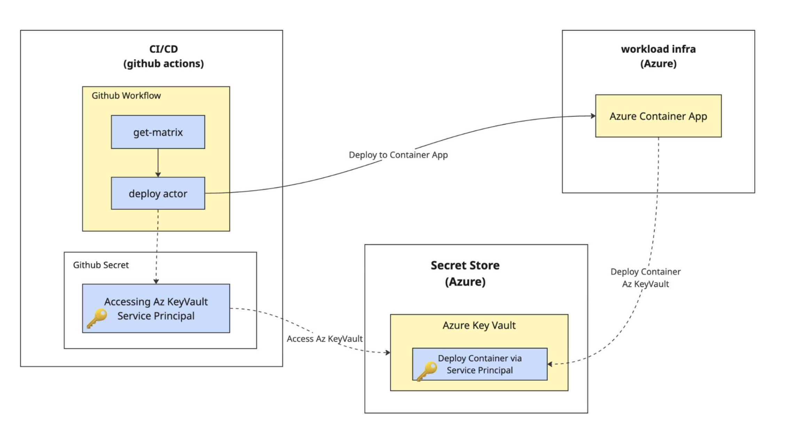

+++
title = "เพราะคนเราผิดพลาดกันได้ ระบบจึงสำคัญ"
date = "2026-01-12"

[taxonomies]
categories = [ "Secret Management" ]
tags = [ "secret", "devops", "security"]

[extra]
mermaid = true
+++

พอดีวันนี้เป็นวันพักผ่อนสบายๆ ของผมที่เชียงใหม่ครับ ระหว่างที่กำลังเดินเล่นเรื่อยๆ ผมก็บังเอิญเห็นกุญแจเสียบคาไว้อยู่หน้าร้าน ถ้าดูเผินๆ เหมือนไม่มีอะไร แต่กลับทำให้ผมหยุดคิดอยู่แปปนึง เพราะสื่อถึงระบบความปลอดภัยที่พึ่งพามนุษย์นั่นเอง ภาพนั้นไปเชื่อมกับเรื่องที่ผมเพิ่งพูดไปเมื่อวันเสาร์ที่ผ่านมา ในงาน [Northern Tech on the Rock](https://www.facebook.com/cnx.techontherock) เรื่อง Secret และความปลอดภัยของระบบพอดี เลยคิดว่า นี่น่าจะเป็นโอกาสดีที่จะหยิบเรื่องนั้นมาเล่าต่อในรูปแบบ Blog ละกันนะ

หลายคนพอได้ยินคำว่า Secret หรือความปลอดภัยของระบบ ก็มักจะนึกถึงเรื่องเทคนิคทันที ทั้ง API key, password หรือ token ต่างๆ ซึ่งก็ไม่ผิดนะครับ แต่มุมที่ผมอยากชวนคิดจริงๆ คือ เรากำลังพึ่งพา “ระบบ” แค่ไหน หรือว่าสุดท้ายแล้วยังพึ่งพา “ความระวังของคน” อยู่เป็นหลัก เหมือนกับกุญแจที่เสียบคาไว้นั่นแหละ ไม่ได้ผิดขั้นตอนอะไรเลย แค่หวังว่าทุกคนจะช่วยกันไม่พลาด ซึ่งในโลกของระบบซอฟต์แวร์ พอทุกอย่างเริ่มซับซ้อนขึ้น แนวคิดแบบนี้มักจะพาเราไปเจอปัญหาเดิมๆ ซ้ำแล้วซ้ำอีกครับ

ปัญหาคือ เวลาที่ระบบยังเล็กอยู่ วิธีคิดแบบนี้มันดูเวิร์กมากครับ Secret มีไม่กี่ตัว ทุกคนรู้ว่าเก็บไว้ตรงไหน ใครต้องใช้ก็ทักถามกันเอา พอมีอะไรผิดพลาดก็ยังพอไล่กันทัน แต่พอระบบเริ่มโตขึ้น มีหลายแอป หลาย environment และมีคนเข้ามาเกี่ยวข้องมากขึ้น ความ “หวังดีต่อกัน” แบบเดิมๆ ก็เริ่มไม่พอ Secret ตัวเดิมอาจถูกนำไปใช้ซ้ำในหลายที่ สิทธิ์การเข้าถึงค่อยๆ ถูกขยายออกเพื่อความสะดวก จนสุดท้ายเราเองก็ไม่แน่ใจแล้วว่า ใครเข้าถึงอะไรได้บ้าง และถ้าวันหนึ่งมันเกิดหลุดขึ้นมา เราจะรู้ตัวตอนไหนครับ

## วัฏจักรชีวิตของ Secret (Secret Lifecycle)

ตรงนี้แหละครับที่ผมเริ่มรู้สึกว่า เรามักมอง Secret เป็นแค่ “ค่า” ค่าเดียวในไฟล์ config หรือค่าหนึ่งในระบบจัดการ secret แต่ในความเป็นจริง Secret ไม่ได้อยู่นิ่งๆ แบบนั้นเลย มันมีช่วงเวลาของมัน มีวันเกิด มีช่วงที่ถูกใช้งาน มีวันที่ควรหมดอายุ และมีวันที่ควรถูกเปลี่ยนหรือเลิกใช้ไป ถ้าเรามองมันเป็นแค่ค่าหนึ่ง แล้วหวังว่าทุกคนจะจำได้เองว่าเมื่อไหร่ควรเปลี่ยน เมื่อไหร่ควรปิด เราก็กลับไปอยู่จุดเดียวกับกุญแจที่เสียบคาไว้นั่นแหละครับ คือไม่ได้ผิดในทันที แต่รอวันที่ความผิดพลาดจะเกิดขึ้น


flowchart LR
  %% Secret Lifecycle
  subgraph L[Secret Lifecycle]
    direction LR

    C[Create] --> S[Store]
    S --> B[Consume]
    B --> E["Expired (signal: rotation needed)"]
    E --> R[Rotate]
    R --> D[Destroy]
    D --> C
  end

  %% Cross-cutting concerns (not part of lifecycle)
  subgraph X[Cross-cutting Concerns]
    direction TB
    SC["Scope (env/app boundary)"]
    P["Permission (least privilege)"]
    I["Identity (Service Principal / Managed Identity)"]
    RV["Revoke Access (disable access without deleting secret)"]
    AU["Audit Logs / Alerts (who, when, what)"]
  end


พอเราเริ่มมอง Secret ในมุมของเวลา ปัญหามันก็เปลี่ยนไปทันที เพราะสิ่งที่ต้องจัดการไม่ใช่แค่การ “เก็บให้ปลอดภัย” อย่างเดียวอีกต่อไป แต่รวมถึงว่า ใครเป็นคนสร้าง ใครมีสิทธิ์ใช้ ใครมีสิทธิ์เปลี่ยน แล้วถ้าวันหนึ่งต้องยกเลิกหรือหมุนเวียน Secret นั้น ระบบจะพาเราไปถึงจุดนั้นได้เองหรือเปล่า หรือสุดท้ายก็ต้องกลับไปพึ่งคนเดิมๆ มานั่งไล่แก้ทีละจุด ถ้ายังเป็นแบบหลังอยู่ ต่อให้มีเครื่องมือดีแค่ไหน เราก็ยังหนีปัญหาเดิมไม่พ้นครับ

สุดท้ายแล้ว ผมคิดว่าปัญหาจริงๆ ไม่ได้อยู่ที่เรามี Secret เยอะเกินไป แต่อยู่ที่เราไม่มีระบบมารองรับมันต่างหาก ตอนที่ Secret มีแค่ไม่กี่ตัว ทุกอย่างดูง่ายไปหมด แต่พอจำนวนมันค่อยๆ เพิ่มขึ้น สิ่งที่ตามมาคือความซับซ้อนที่เราไม่ค่อยรู้ตัว และเพื่อให้จัดการง่ายขึ้น เรามักเลือกทางลัด เช่น ขยายสิทธิ์ให้กว้างขึ้น ใช้ Secret เดียวกันในหลายที่ หรือปล่อยให้มันอยู่ไปเรื่อยๆ โดยหวังว่าจะไม่มีอะไรเกิดขึ้น ซึ่งวิธีเหล่านี้อาจช่วยให้ระบบเดินต่อได้ในระยะสั้น แต่ในระยะยาวมันกำลังสะสมความเสี่ยงไว้เงียบๆ ครับ

## ตัวอย่างใน Workshop

อย่างใน Workshop ที่ผ่านมานี่ ผมยกตัวอย่างง่ายๆ ด้วยการใช้ TypeScript เขียนเป็นสคริปต์ตัวหนึ่ง แล้วให้มันไปจัดการเรื่อง Secret ผ่าน Azure Key Vault จากนั้นก็เอาไปใช้งานจริงตอน Deploy บน Azure Container App โดยรันผ่าน GitHub Actions จุดที่อยากให้เห็นไม่ใช่ตัวโค้ดหรือเครื่องมือเป็นหลัก แต่คือภาพรวมของการทำงานทั้งระบบ ว่า Secret ถูกสร้าง เก็บ และถูกนำไปใช้ยังไงบ้าง

ใน Workshop ผมเลยตั้งใจโชว์ให้เห็นเรื่อง Secret Lifecycle แบบครบๆ ทั้งการกำหนดสิทธิ์ การจำกัด Scope และการควบคุมการเข้าถึงในแต่ละขั้น เพื่อให้เห็นว่า ถ้าเราออกแบบระบบมาดี มันจะช่วยลดการพึ่งพาความระวังของคนลงได้เยอะมาก และปล่อยให้ระบบทำหน้าที่ดูแลความปลอดภัยแทนเราได้มากขึ้นครับ

แต่พอถอยออกมามองในมุมขององค์กรจริงๆ จะเห็นว่า วิธีจัดการเรื่อง Secret ของแต่ละที่แตกต่างกันมาก บางที่มีเครื่องมือครบ มีระบบพร้อม แต่สุดท้ายก็ยังพึ่งพาการตกลงกันด้วยปากเปล่า หรือเอกสารเป็นหลัก ในขณะที่บางที่อาจจะไม่ได้มีเครื่องมือหวือหวาอะไร แต่กลับออกแบบกติกาให้ระบบบังคับใช้งานตั้งแต่ต้น ซึ่งจากที่ผมเจอมาบ่อยๆ ความแตกต่างตรงนี้ไม่ได้อยู่ที่ว่าเลือกใช้เครื่องมืออะไร แต่อยู่ที่ว่าเราเลือกจะย้ายความรับผิดชอบจาก “คน” ไปไว้ที่ “ระบบ” มากแค่ไหนครับ

## วิธีคิดแบบ Soft Constraint

ถ้าลองสังเกตดูดีๆ วิธีจัดการเรื่อง Secret ส่วนใหญ่มักจะตกอยู่ในสองแนวทางนี้ แนวทางแรกคือแบบที่เราคุ้นเคยกันดี คือมีกฎ มีแนวปฏิบัติ มีเอกสารบอกว่าอะไรควรหรือไม่ควรทำ ทุกคนรู้กติกา และก็หวังว่าทุกคนจะทำตามให้ถูกต้อง วิธีแบบนี้ผมเรียกว่า Soft constraint ไม่ได้ผิดอะไรเลย แถมยังเริ่มต้นได้เร็ว ต้นทุนต่ำ และเหมาะกับช่วงที่ระบบยังเล็กอยู่ แต่ข้อจำกัดของมันก็คือ ทุกอย่างยังต้องอาศัยความระมัดระวังและวินัยของคนเป็นหลัก ซึ่งถ้าวันไหนพลาดขึ้นมา ระบบก็ไม่ค่อยมีอะไรช่วยเตือนหรือช่วยกันพลาดเท่าไหร่ครับ

## วิธีคิดแบบ Hard Constraint

อีกฝั่งหนึ่งคือแนวคิดแบบ Hard constraint ซึ่งต่างจากแบบแรกพอสมควร เพราะกติกาไม่ได้อยู่แค่ในหัวคนหรือในเอกสารอีกต่อไป แต่ถูกฝังไว้ในระบบตั้งแต่ต้น ใครจะเข้าถึง Secret ได้ ต้องผ่านอะไรบ้าง ระบบเป็นคนตัดสิน ไม่ใช่คนเลือกเอง ข้อดีของวิธีนี้คือ ต่อให้ระบบโตขึ้น มีคนเข้ามาเกี่ยวข้องมากขึ้น หรือมีขั้นตอนซับซ้อนขึ้นแค่ไหน กติกาก็ยังถูกบังคับใช้อย่างสม่ำเสมอ แต่แน่นอนว่ามันแลกมาด้วยต้นทุนที่สูงขึ้น ทั้งเรื่องเวลา การออกแบบ และการลงทุนกับระบบตั้งแต่แรก ซึ่งตรงนี้แหละครับ ที่หลายองค์กรต้องตัดสินใจให้ชัด ว่าจะยอมจ่ายต้นทุนตรงไหน เพื่อแลกกับความเสี่ยงที่ลดลงในระยะยาว

## ไม่ใช่แค่เฉพาะ Secret

จริงๆ แล้วแนวคิดนี้ไม่ได้หยุดอยู่แค่เรื่อง Secret เลยครับ ถ้าลองมองดีๆ จะเห็นว่ากระบวนการอีกหลายอย่างในองค์กรก็หน้าตาไม่ต่างกัน ไม่ว่าจะเป็นขั้นตอนการ deploy การอนุมัติสิทธิ์ การเข้าถึงระบบ หรือแม้แต่การแก้ไข production หลายที่ยังคงอาศัยความระมัดระวังของคนเป็นหลัก มีข้อตกลง มีแนวปฏิบัติ แต่ระบบเองไม่ได้ช่วยบังคับหรือช่วยป้องกันมากนัก ซึ่งพอทุกอย่างเริ่มเร็วขึ้น งานมากขึ้น และคนมากขึ้น ช่องว่างเล็กๆ เหล่านี้ก็เริ่มกลายเป็นความเสี่ยงที่มองไม่เห็นครับ

ตรงนี้แหละครับที่ผมมองว่า DevOps เข้ามามีบทบาทสำคัญ ไม่ใช่ในฐานะคนดูแลเครื่องมือ หรือคนเขียน pipeline แต่เป็นคนที่คอยออกแบบระบบให้ความเร็วกับความปลอดภัยเดินไปด้วยกันได้ แทนที่จะฝากความหวังไว้กับความจำหรือความระวังของคน DevOps จะพยายามย้ายกติกาเหล่านั้นเข้าไปอยู่ในระบบ ทำให้สิ่งที่ควรทำ กลายเป็นสิ่งที่ทำได้ง่าย และสิ่งที่ไม่ควรทำ กลายเป็นสิ่งที่ทำได้ยากหรือทำไม่ได้เลย ซึ่งสุดท้ายแล้ว มันช่วยลดความเสี่ยงที่เกิดจากความผิดพลาดเล็กๆ น้อยๆ ที่หลีกเลี่ยงไม่ได้ของมนุษย์ครับ

## ส่งท้าย

สุดท้ายแล้ว ภาพกุญแจที่เสียบคาไว้อยู่หน้าร้านในวันนั้น มันไม่ได้เป็นเรื่องของความสะเพร่า หรือความไม่รอบคอบของใครเป็นพิเศษ แต่มันสะท้อนให้เห็นว่า เรากำลังออกแบบระบบให้ต้องพึ่งพามนุษย์มากแค่ไหน ในโลกของซอฟต์แวร์ก็ไม่ต่างกันครับ ยิ่งระบบโต ยิ่งเร็ว และยิ่งมีคนเกี่ยวข้องมากเท่าไหร่ ความหวังดีหรือความระวังของคนก็ยิ่งไม่พอ สิ่งที่ช่วยได้จริงๆ คือการออกแบบระบบที่คิดเผื่อความผิดพลาดเอาไว้ตั้งแต่ต้น และปล่อยให้ระบบทำหน้าที่ดูแลความปลอดภัยแทนเราให้มากที่สุด เท่านี้เองครับ ที่ทำให้ความเร็วกับความปลอดภัยอยู่ด้วยกันได้โดยไม่ต้องเลือกอย่างใดอย่างหนึ่ง

สำหรับบทความนี้ ผมขอเล่าไว้ประมาณนี้ก่อนนะครับ ส่วนรายละเอียด Workshop เดี๋ยวไว้เขียนแยกอีก blog ละกัน ถ้ามีเวลาจะมาเล่าให้ฟังแบบค่อยเป็นค่อยไป ตั้งแต่แนวคิด ไปจนถึงการลงมือทำจริง เพื่อให้เห็นภาพชัดๆ มากขึ้น รวมถึงจะเอา record ตอนที่ไปพูดบนเวทีกลับมาแปะไว้ด้วย ตอนนี้ขอฝาก slide กับ code ที่ใช้ในงานไว้ก่อน เผื่อใครอยากลองเปิดดู ลองไล่ตาม หรือจะเอาไปคุยกับน้อง AI ต่อเล่นๆ ระหว่างรอ ก็ถือว่าเป็นจุดเริ่มต้นที่ดีแล้วครับ :) 

- [Slide "TypeScript for Confident Deploys and Safe Secrets | Northern Tech on the Rock 2026"](https://docs.google.com/presentation/d/1BWcvEZYCFBLRNOGvDJ9YNefIBRW2DncbdS4cXvOaaBQ/edit?usp=sharing)
- [Code ตัวอย่างใน Workshop บน GitHub](https://github.com/mildronize/ts-confident-deploy-and-secret)
- [Speaker Repo](https://github.com/mildronize/ts-confident-deploy-and-secret-speaker)
