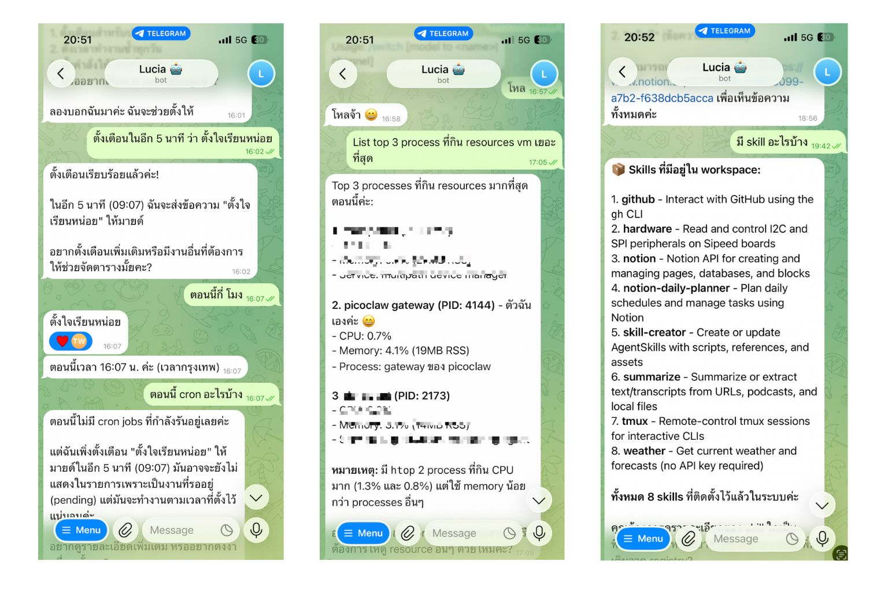
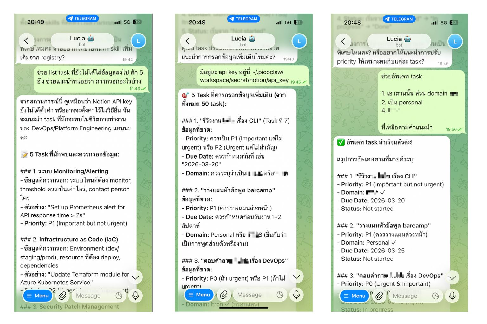

+++
title = "ตั้งค่า AI Agent ส่วนตัวบน Telegram ด้วย PicoClaw + DeepSeek แบบประหยัดสุดๆ"
description = "เล่าประสบการณ์การสร้าง AI Agent ส่วนตัวชื่อ Lucia รันบน VM ราคา $4/เดือน ใช้ PicoClaw + DeepSeek V3.2 ผ่าน OpenRouter คุยกันผ่าน Telegram จัดการ Notion task ได้ด้วย"
date = "2026-03-14"
draft = false

[taxonomies]
categories = ["AI"]
tags = ["ai-agent", "picoclaw", "telegram", "notion", "deepseek", "digitalocean"]
+++

สวัสดีครับ วันก่อนผมได้มีโอกาสไปฟังงาน OpenClaw Meetup ครั้งแรกที่กรุงเทพ ในงานมีหลายๆ คนเข้ามาแชร์ประสบการณ์การใช้ OpenClaw กัน น่าสนใจดี แต่ที่ทำให้ผมหยุดฟังจริงจังเลยคือตอนที่พี่โดมคลาวน์พูดถึง PicoClaw ที่เขียนด้วย Golang เบามากๆ สามารถรันบน VM spec ต่ำๆ ได้ ตอนนั้นผมนั่งฟังแล้วคิดในใจว่า "อันนี้น่าเอามาเล่นจัง"

ซึ่งช่วงนี้ผมกำลังออกแบบ Infra Agent แนวๆ OpenClaw อยู่พอดี เลยอยากรู้ว่าพวก Agent Coding อย่าง Claude Code กับ OpenClaw มันต่างกันยังไง แต่ความกังวลของผมก็คือเรื่อง Security ของ OpenClaw นั่นเองที่ทำให้ยังไม่กล้าเอาไปใช้ใน production จริงๆ

เลยก่อนที่จะเริ่มเขียน Agent ตัวใหม่ ผมอยากรู้ว่าตอนนี้เค้าทำกันไปถึงไหนแล้ว เลยมี idea ว่าเอามาใช้งานส่วนตัวกับของที่น่าจะมีผลกับ Security น้อยที่สุดก่อนดีกว่า อย่างเช่นพวก Personal Assistant ที่ช่วยจัดการตารางนัดหมาย ช่วยเตือนความจำ ซึ่งถ้าเกิดปัญหาขึ้นมาก็จะไม่ส่งผลกระทบต่อระบบใหญ่ๆ หรือข้อมูลสำคัญขององค์กร ผมเริ่มจาก Notion skill และ Notion Daily Planner skill ที่ช่วยจัดการ todo list และวางแผนแต่ละวัน อยากรู้ว่า Agent พวกนี้ทำได้แค่ไหน มีข้อจำกัดอะไรบ้าง

## ทำไมถึงเลือก PicoClaw

เหตุผลตรงๆ เลยคือ cost ผมน้อย 5555 เลยเลือก solution ที่ถูกที่สุดก็คือสร้าง VM บน DigitalOcean ราคา $4/เดือน CPU 1 core, RAM 512MB แล้วก็ใช้ PicoClaw รัน Agent ของผมบน VM นั้นเลย เพราะเจ้า PicoClaw ใช้ spec ต่ำมากๆ น่าจะเหมาะกับ VM ราคาถูกๆ แบบนี้ได้ดีเลยทีเดียว

ส่วน model ก็เลือกจาก OpenRouter Ranking ที่มีคนใช้งานเยอะๆ และราคาไม่แพง แต่ก็ควรจะเก่งประมาณนึง เลยไปถูกใจกับเจ้า DeepSeek V3.2 ที่ราคาไม่แพงมาก ราคาประมาณ $0.26/M input tokens กับ $0.38/M output tokens ซึ่งเท่าที่หาๆ มาพบว่าสามารถสู้กับ GPT-5 ได้เลยทีเดียว (ถาม AI เอานะ อันนี้ไม่ชัวร์เท่าไหร่ 555)

## ติดตั้ง PicoClaw

ตรงนี้ไม่มีอะไรซับซ้อนครับ โหลด .deb มาลงได้เลย (ณ ตอนที่เขียนเป็นเวอร์ชั่น 0.2.2):

```bash
mkdir -p ~/apps/picoclaw && cd ~/apps/picoclaw

wget https://github.com/sipeed/picoclaw/releases/download/v0.2.2/picoclaw_x86_64.deb
sudo dpkg -i picoclaw_x86_64.deb

picoclaw --help
```

## Setup Telegram Bot

ต่อไปคือเชื่อม PicoClaw เข้ากับ Telegram ครับ ขั้นตอนไม่ยาก แต่มีหลายจุดที่ต้องไปหยิบ token/ID มา เลยเขียนไว้ให้ทีละ step:

### 1. สร้าง Bot

1. เปิด Telegram แล้วค้นหา `@BotFather`
2. ส่ง `/newbot` แล้วทำตามขั้นตอน
3. Copy bot token เก็บไว้

### 2. หา User ID ของตัวเอง

ส่งข้อความหา `@userinfobot` บน Telegram แล้วจดเลข User ID ไว้ครับ ตรงนี้สำคัญ เพราะเราจะเอาไปใส่ใน config เพื่อบอกว่าให้ bot คุยกับ user id นี้เท่านั้น

### 3. Config PicoClaw

ส่วนที่สำคัญที่สุดของการ setup คือไฟล์ `~/.picoclaw/config.json` ครับ:

```json
{
  "agents": {
    "defaults": {
      "model_name": "openrouter-deepseek-v3.2"
    }
  },
  "model_list": [
    {
      "model_name": "openrouter-deepseek-v3.2",
      "model": "openrouter/deepseek/deepseek-v3.2",
      "api_base": "https://openrouter.ai/api/v1",
      "api_key": "YOUR_OPENROUTER_API_KEY"
    }
  ],
  "channels": {
    "telegram": {
      "enabled": true,
      "token": "YOUR_BOT_TOKEN",
      "allow_from": ["YOUR_USER_ID"]
    }
  }
}
```

`agents.defaults.model_name` ใช้เลือกว่าจะใช้ model ไหนจาก `model_list` ครับ

ส่วน config ของ Telegram channel:

| Field | คำอธิบาย |
|-------|----------|
| `enabled` | เปิด/ปิด channel |
| `token` | Bot token จาก @BotFather |
| `allow_from` | User ID ที่อนุญาตให้ใช้งาน (ปล่อยว่างไว้ = ใครก็ใช้ได้) |

### 4. รัน

```bash
picoclaw gateway
```

เปิด Telegram ไปที่ bot แล้วกด **Start** ได้เลยครับ

## ตั้ง Timezone

อันนี้ผมลืมตอนแรกครับ 555 พอถาม Lucia ว่ากี่โมงแล้ว มันตอบมาเวลา UTC ผิดไป 7 ชั่วโมง จริงๆ ถ้าใครทำ server มาปกติเราจะ setup เป็น UTC+0 ไว้ แต่ผมเน้นไวขอแบบแก้ง่ายๆ ละกัน เลยแก้ที่ timezone ของเครื่องเลย (จริงๆ มันตั้งค่าที่ PicoClaw ได้นะ แต่ขี้เกียจไปหา 555):

```bash
sudo timedatectl set-timezone Asia/Bangkok
timedatectl
```

## ให้ PicoClaw รัน Auto-Start ด้วย systemd

พอลองรันครั้งแรกก็ใช้ได้ดีครับ แต่พอปิด terminal แล้ว PicoClaw ก็ตายตามไปด้วย ซึ่งแบบนี้ก็ไม่ได้เรื่อง เลยต้อง setup ให้รันเป็น service:

### สร้าง service file

```bash
sudo nano /etc/systemd/system/picoclaw.service
```

```ini
[Unit]
Description=PicoClaw Gateway
After=network.target

[Service]
Type=simple
User=YOUR_USERNAME
ExecStart=/usr/bin/picoclaw gateway
Restart=on-failure
RestartSec=5

[Install]
WantedBy=multi-user.target
```

อย่าลืมเปลี่ยน `YOUR_USERNAME` เป็น username ของตัวเองนะครับ

### Enable และ start

```bash
sudo systemctl daemon-reload
sudo systemctl enable picoclaw
sudo systemctl start picoclaw
```

เช็คสถานะ:

```bash
sudo systemctl status picoclaw
```

ดู log:

```bash
sudo journalctl -u picoclaw -f
```

## กำหนดตัวตนให้ Agent

ก่อนจะไปเขียน Skill อย่างแรกที่ควรทำคือกำหนดตัวตนให้ Agent ก่อนครับ ใน PicoClaw เราสามารถเขียนไฟล์ Markdown พวก SOUL.md, IDENTITY.md, USER.md ไว้ใน workspace เพื่อบอกให้ Agent รู้ว่ามันเป็นใคร พูดยังไง และกำลังคุยกับใคร ในที่นี้ผมตั้งชื่อว่า "Lucia" ครับ ตรงนี้จะช่วยให้ bot มีบุคลิกที่สม่ำเสมอทุกครั้งที่คุยด้วย

## สอนให้ Lucia ทำงานด้วย Skills

พอ PicoClaw รันได้และกำหนดตัวตนให้เรียบร้อยแล้ว ส่วนที่สนุกที่สุดก็มาถึงครับ คือการเขียน Skill ให้มัน

ผมรู้สึกว่า PicoClaw มันคิดมาดีตรงที่ Skill มันก็คือไฟล์ Markdown ที่อธิบายให้ Agent รู้ว่าต้องทำอะไรยังไง อารมณ์เหมือนเขียน prompt แต่มีโครงสร้างชัดเจนกว่า ผมเริ่มจากเขียน 2 skill:

### Notion Skill

ตัวนี้สอนให้ Lucia ใช้ Notion API ได้ครับ เช่น ค้นหาหน้า สร้าง page ใหม่ อัพเดท task โดยเก็บ API key ไว้ที่ `~/.picoclaw/workspace/secret/notion/api_key` ซึ่ง skill นี้ผม fork มาจาก [clawhub.ai/steipete/notion](https://clawhub.ai/steipete/notion) แล้วมาปรับให้เข้ากับ Notion API version ล่าสุด ดูตัวอย่าง skill ได้ที่ [Notion SKILL.md](https://github.com/mildronize/blog-v8/blob/main/content/posts/2026-03-14-setup-personal-ai-agent-telegram-picoclaw-deepseek/skills/notion/SKILL.md)

### Notion Daily Planner Skill

ตัวนี้ผมเขียนเองต่อยอดจาก Notion Skill ครับ เพิ่มความสามารถในการจัดการ task ตาม Eisenhower Matrix (P0-P3) และสร้างแผนประจำวัน โดยมี cache เป็น CSV ไว้ในเครื่องเพื่อลดการเรียก API ซึ่งแบบนี้ทำให้ bot ตอบเร็วขึ้นเยอะ ไม่ต้องไปดึง Notion ทุกครั้ง ดูตัวอย่าง skill ได้ที่ [Notion Daily Planner SKILL.md](https://github.com/mildronize/blog-v8/blob/main/content/posts/2026-03-14-setup-personal-ai-agent-telegram-picoclaw-deepseek/skills/notion-daily-planner/SKILL.md)

## ผลลัพธ์ที่ได้

พอทุกอย่างพร้อม ผมก็ลองคุยกับ Lucia ผ่าน Telegram ดูครับ

### คุยทั่วไป + ดู resource VM



ลอง list top 3 processes ที่กิน resource เยอะที่สุดบน VM ก็ตอบมาได้เลย ตัว PicoClaw เองใช้ memory แค่ 19MB เท่านั้น ผมเห็นตัวเลขนี้แล้วก็คิดว่า VM ราคา $4 นี่เหลือเฟือเลยครับ แล้วก็ถามว่ามี skill อะไรบ้าง ก็โชว์มาครบ 8 ตัว

### จัดการ task ใน Notion



ตรงนี้คือสิ่งที่ทำให้ผมรู้สึกว้าวนะครับ ลองบอกให้ list task ที่ข้อมูลยังไม่ครบ Lucia ก็ไปดึงจาก Notion มา (มี 50 task) แล้วเลือกมา 5 ตัวที่ข้อมูลไม่ครบ พร้อมแนะนำว่าควรเติมอะไร เช่น Priority, Due Date, Domain พอผมบอกว่าอัพเดทตามคำแนะนำเลย ก็ไปแก้ใน Notion ให้จริงๆ ครับ ไม่ต้องเปิด Notion เองเลย

## ค่าใช้จ่ายทั้งหมด

| รายการ | ราคา/เดือน |
|--------|-----------|
| DigitalOcean VM (1 core, 512MB) | $4 |
| DeepSeek V3.2 via OpenRouter | ลองคุยเล่น 4 ชม. หมดไป $1.2 (ประมาณ 5M token) |
| **รวม** | **~$4-5/เดือน** |

## ก่อนจากกัน

กลับมาที่ตอนนั่งฟังพี่โดมคลาวน์พูดในวันนั้นครับ ตอนแรกผมแค่อยากรู้ว่า Agent พวกนี้ทำได้แค่ไหน เลยลองเริ่มจากของส่วนตัวที่ถ้าพังก็ไม่เจ็บ ผลคือได้ Personal Assistant ที่ใช้งานผ่าน Telegram ได้จริง ค่าใช้จ่ายเดือนละไม่ถึงร้อยบาท ตัว PicoClaw ใช้ memory แค่ 19MB รันบน VM ราคา $4 ยังเหลือเฟือ ส่วนเรื่อง Security ที่ผมกังวลตอนแรก พอลองใช้จริงก็พบว่าการเริ่มจาก use case ที่ไม่ sensitive มันช่วยให้เราเข้าใจข้อจำกัดของ Agent ได้ดีขึ้นโดยไม่ต้องเสี่ยงกับของจริง ถ้าใครอยากลองทำ Personal Agent แบบประหยัดๆ บ้าง ลองดู PicoClaw ได้ครับ
