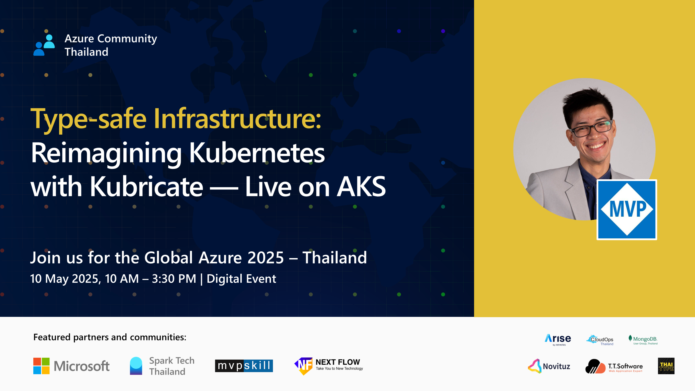

+++
title = "Type-safe Infrastructure: Reimagining Kubernetes with Kubricate — Live on AKS"
date = "2025-05-10"

[taxonomies]
categories = [ "Kubricate" ]
tags = [ "TypeScript", "Kubernetes", "kubricate", "AKS", "Azure" ]
+++

Session: Saturday, 10 May 2025 2:30 pm - 3:00 pm (30 minutes) (UTC+7)

## Cover

## Abstract

Kubernetes has become the backbone of modern infrastructure — but managing it with raw YAML and scattered secrets is still slow, brittle, and hard to scale.

In this session, we introduce Kubricate, a new open-source TypeScript framework that brings structure, type safety, and reusability to Kubernetes infrastructure. We’ll walk through how Kubricate helps you define reusable stacks, manage secrets declaratively across multiple providers, and generate production-grade manifests with full confidence — all in code.

The talk includes a live demo deploying to Azure Kubernetes Service (AKS), showcasing how Kubricate transforms the way teams build and deliver infrastructure from dev to prod.

Whether you're a DevOps engineer, developer, or SRE, this session will show you a cleaner, safer, and more scalable way to manage Kubernetes at design time — not at 2 a.m.

## Resources

- Slide: <https://docs.google.com/presentation/d/1szt7L-qjnoxHAduafruXuWA5-9NyQKrpVUoW_rKaHHE/edit?usp=sharing>
- Demo: <https://github.com/mildronize/kubricate-demo-azure-global-2025>
- Kubricate Repo: <https://github.com/thaitype/kubricate>
- Kubricate Doc Website: <https://kubricate.thaitype.dev>

---

## Event Details

Global Azure โดย Azure Community Thailand โดยการสนับสนุนของ Microsoft ☁️
ขอเชิญเพื่อน ๆ ที่ชื่นชอบในเทคโนโลยีมาเรียนรู้การสร้างโซลูชันบนเทคโนโลยีของ Microsoft Azure
- เปลี่ยนไอเดียเป็นโซลูชัน พัฒนาแอปจากทุกที่ได้เร็วกว่าที่เคยด้วย Microsoft Azure
- สร้างและจัดการแอปได้อย่างรวดเร็ว ด้วย Dev Tools และ Frameworks ที่คุณชื่นชอบ
- พัฒนาโซลูชันแบบ Hybrid ได้อย่างง่ายดาย ทั้งแบบ Multi-cloud / On-premises ภายในองค์กร / Edge บนอุปกรณ์ปลายทาง
พร้อมพบปะ พูดคุยกับผู้เชี่ยวชาญในสายงาน Cloud Computing อย่างอบอุ่นและเป็นกันเอง

---

วันที่ 10 พฤษภาคม 2568

เวลา 10:00 - 15:30 น.

รายละเอียด:
<https://global-azure-2025-thailand.sessionize.com>

ลงทะเบียน:
<https://www.eventpop.me/e/89949/global-azure-thailand-2025>

งานนี้เหมาะสำหรับนักศึกษา นักพัฒนา ผู้ดูแลระบบ และผู้ที่สนใจ Cloud Computing ทุกคน

--------------------

**เซสชั่นที่น่าสนใจ ⭐**

- Building Intelligent AI Agents with Azure AI Foundry
- Operating AI Agents with Azure AI Foundry and Pydantic AI
- Develop an AI agent with Azure AI Agent Service
- Deploy a web API with AI-powered to Linux container in Azure App Service
- Analysis Performance Metrics of Azure VMs
- AI-powered Kubernetes agent using kubectl-ai
- Type-safe Infrastructure: Reimagining Kubernetes with Kubricate — Live on AKS
- Introduction to Azure MCP Server

--------------------

ไม่พลาด Update จาก Spark Tech Thailand - Tech ใกล้ตัว

😸 เข้าร่วมกลุ่ม Spark Tech Community

😸 ติดตามพวกเราบน Twitter twitter.com/SparkTechTH

☁️ เข้าร่วมกลุ่ม Azure Community Thailand

#GlobalAzure #AzureTH
#Microsoft #SparkTechTH #LearnItAll